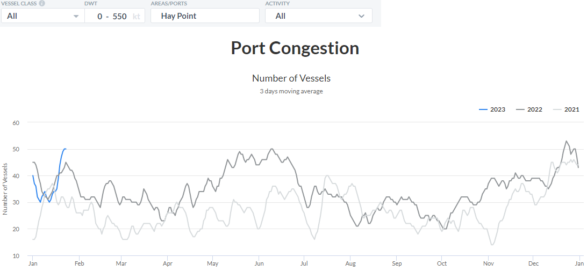
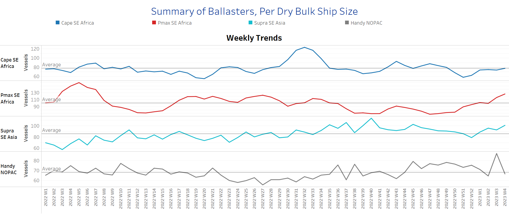
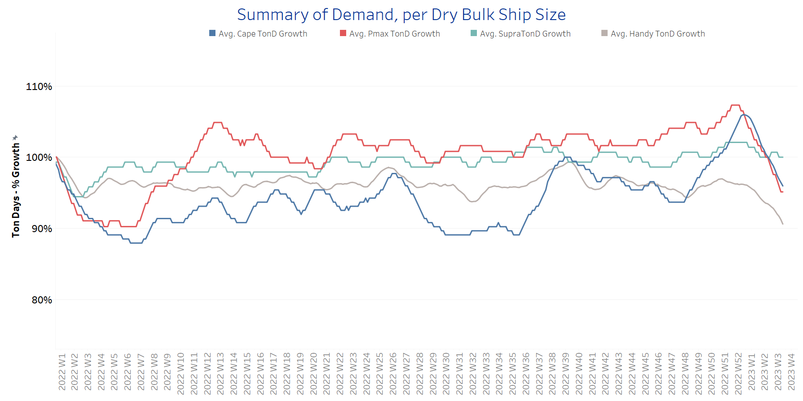
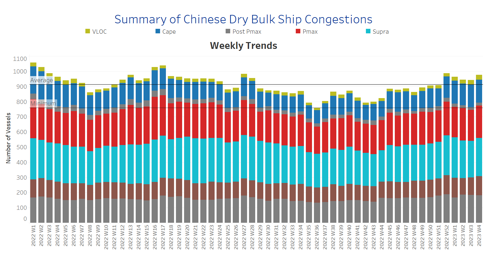

# Signal Dry Bulk Weekly Report

**Date:** January 26, 2023  
**Publisher:** Breakwave Advisors | **Category:** Market Insights  
**Original URL:** [https://www.breakwaveadvisors.com/insights/2023/1/26/signal-dry-bulk-weekly-report](https://www.breakwaveadvisors.com/insights/2023/1/26/signal-dry-bulk-weekly-report)  

---

Congestion at Australia's major Queensland ports increased in January, compared with low levels in the previous two years, 2022 and 2021, with the latest record increase reportedly due to mainly a recovery in metallurgical coal demand as China reopens. The long list of vessels now tops 50, compared to about 20 in a similar week in January 2021. The recent ship queues at Australian coal ports have helped keep Panamax freight rates stable after they fell earlier in the year.

Overall, the last days of January held the weaker outlook of freight rates seen since the start of the year, with an increasing trend in the number of ballasters and significant downward corrections in demand growth.

In the iron market, we see a significant recovery in prices from the lows reached at the end of the last quarter of 2022, as China abandons its strict zero covid measures. The price of iron ore, with a 63.5% iron ore content for delivery into Tianjin, is now reportedly above $120/tonne, approaching a seven-month high of $127/tonne. There are market expectations for the price increase to last as Chinese demand recovers in a low supply status. There are concerns about a weakness in the iron ore supply from cyclones and first-quarter maintenance in the Australian top producing country.

## Chart of the Week Dry Bulk: Australian Port Congestion

*Rising trend in January to the highest level since 2021*

> **Figure 1: Australian Port Congestion**  
> **Interactive Data & Source:** [Signal Ocean Platform](https://go.signalocean.com/e/983831/dry-dynamic-drybulkflows/2nkmh5/298760347?h=a_yy6abVdCKt3CV6MbzEhVRk7HkyYJ1H0aAx7Y4R9ws) | [Local Asset](file:///C:/Users/Dell/Github/Shipping/corpus/03-breakwave/insights/2023/assets/2023-01-26_signal-dry-bulk-weekly-report_img_australianportcongestion_aaf1a859c8b1.png)

Data Source: The Signal Ocean Platform, Port Congestion, Australian Hay Point port

## Section 1/ Freight -Market Rates ($/T) Weaker

‘The Big Picture’ - Capesize and Panamax Bulkers and Smaller Ship Sizes

> **Figure 2: Market Chart 2**  
> **Interactive Data & Source:** [Signal Ocean Platform](https://www.thesignalgroup.com/signal-ocean-platform) | [Local Asset](file:///C:/Users/Dell/Github/Shipping/corpus/03-breakwave/insights/2023/assets/2023-01-26_signal-dry-bulk-weekly-report_img_unnamed-2023-01-26t112056001_1c0b21c12865.png)

In the last week of January, the weaker trend in spot freight rates continued for all ship size classes, with signs of recovery for Supramax and Panamax.

- **Capesize**vessel freight rates fell to $17/tonne, down $3.5/tonne from the last few days of December, while today's trend continues downward toward the end of the month.
- **Panamax**vessel freight rates fromtheContinent to the Far East held levels around $35.5/tonne, since the start of the year.
- **Supramax**freight rates for the Indo-ECI route rose increased slightly to $9.7/tonne, up nearly $1/tonne from the previous week.
- **Handysize**freight rates for the NOPAC route to the Far East fell to $29/tonne in the last week of January, and there are signs of a further decline in the first week of February.

## Section 2/ Supply -Ballasters (# Vessels) Increasing

> **Figure 3: Supply Trend Lines for Key Load Areas**  
> **Interactive Data & Source:** [Signal Ocean Platform](https://www.thesignalgroup.com/signal-ocean-platform) | [Local Asset](file:///C:/Users/Dell/Github/Shipping/corpus/03-breakwave/insights/2023/assets/2023-01-26_signal-dry-bulk-weekly-report_img_unnamed-2023-01-26t112237184_1527a6db342b.png)

The number of ballast ships increased significantly in the third week of January, with the exception of the Handysize segment.

- **Capesize**SE Africa: The number of vessels is now approaching the yearly average of 78, 20 more than the low in week 51.
- **Panamax**SE Africa: The number of vessels is now at 127, 28 more than the first week of January.
- **Supramax**SE Asia: The number of ships has exceeded 100 for the first time since week 45 of last year, with a clear upward trend in the coming days of February.
- **Handysize**NOPAC: The number of vessels dropped significantly to 67, below the annual average for the first time since week 43.

## Section 3/ Demand -TonDays Decreasing

> **Figure 4: TonDays Decreasing**  
> **Interactive Data & Source:** [Signal Ocean Platform](https://www.thesignalgroup.com/signal-ocean-platform) | [Local Asset](file:///C:/Users/Dell/Github/Shipping/corpus/03-breakwave/insights/2023/assets/2023-01-26_signal-dry-bulk-weekly-report_img_unnamed-2023-01-26t112440672_40ddb46884bb.png)

Demand growth continues to slow significantly, with sharp declines in all vessel categories, with the exception of supramax vessels, where there has been strong volatility, with no actual trend of increase or decrease.

- **Capesize**demand ton-days: The downward trend observed in January fuels the pessimistic outlook for a significant recovery toward the end of the month.
- **Panamax**demand ton-days: In January, the Panamax segment continues a similar downward trend as Capesize.
- **Supramax**demand ton-days: There is strong volatility with no clear signs yet of an upward or downward trend in the coming days.
- **Handysize**demand ton-days: The decline continued throughout January, with lower percentage increases than for the other ship sizes.

## Section 4/ Port Congestion -No of Vesselsincreasing

> **Figure 5: Dry Bulk Ships Congested at Chinese Ports**  
> **Interactive Data & Source:** [Signal Ocean Platform](https://www.thesignalgroup.com/signal-ocean-platform) | [Local Asset](file:///C:/Users/Dell/Github/Shipping/corpus/03-breakwave/insights/2023/assets/2023-01-26_signal-dry-bulk-weekly-report_img_unnamed-2023-01-26t112514832_9c4d62ecc339.png)

In the January days, congestion reached a new record level, surpassing the peak of week 52 last year.

- **Capesize:**The number of vessels held is about 150, 10 more than at the end of last year.
- **Panamax:**The number of vessels has increased to 212, 7 more than at the end of week 3.
- **Supramax:**The number of congested vessels increased to 254, 13 more than the previous week.
- **Handysize**: The number of congested vessels increased to 183, 15 more than the first week of January.

Data Source:[Signal Ocean Platform](https://www.thesignalgroup.com/signal-ocean-platform)
