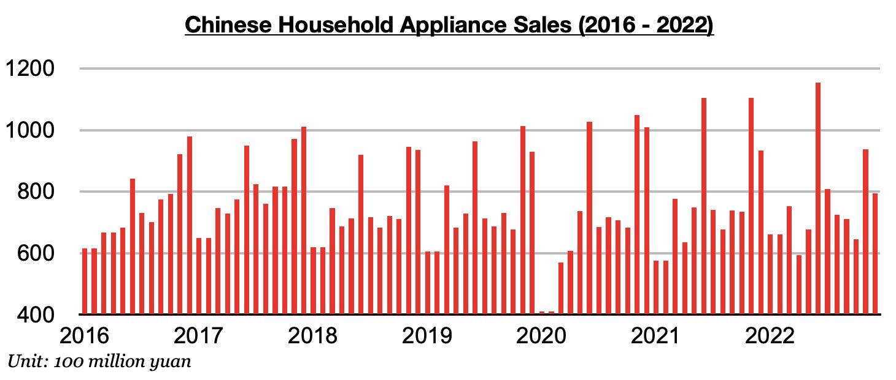
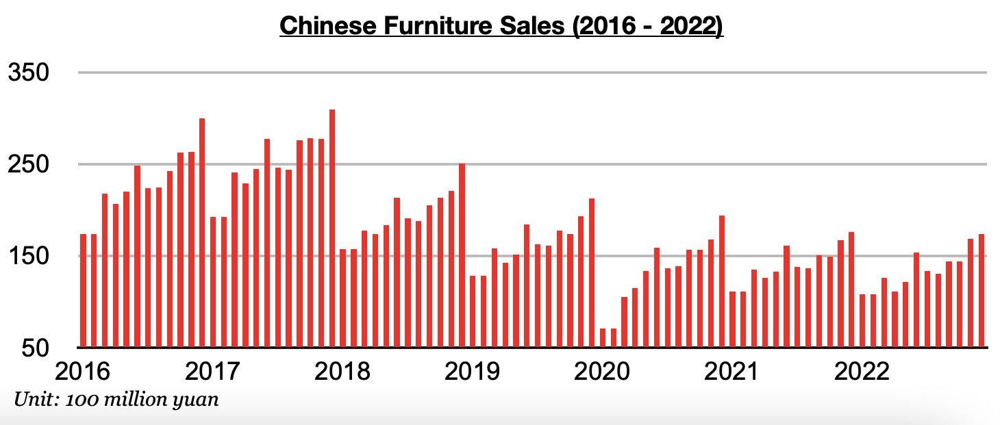
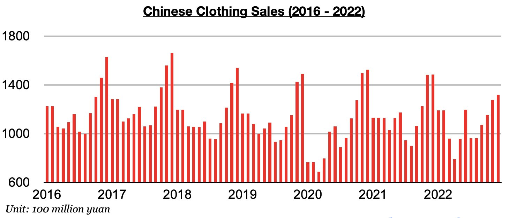

# Recent Weakness in Chinese Consumer Spending

**Date:** January 31, 2023  
**Publisher:** Breakwave Advisors | **Category:** Market Insights  
**Original URL:** [https://www.breakwaveadvisors.com/insights/2023/1/31/recent-weakness-in-chinese-consumer-spending](https://www.breakwaveadvisors.com/insights/2023/1/31/recent-weakness-in-chinese-consumer-spending)  

---

*By*[*Jeffrey Landsberg*](https://www.linkedin.com/in/jeffrey-landsberg-70ab957/)

As we discussed in our most recent Weekly China Report, December’s consumer electronics and appliance sales in China totaled only 79.4 billion yuan which marked a year-on-year contraction of 15%. This has again marked the largest contraction since March 2020 and is a fourth straight month with contraction.

> **Figure 1: Chart 1 (68)**  
> [Local Asset](file:///C:/Users/Dell/Github/Shipping/corpus/03-breakwave/insights/2023/assets/2023-01-31_recent-weakness-in-chinese-consumer-spending_img_chart1286829_db2761cf59ef.jpg)

Furniture sales totaled 17.4 billion yuan, which marked a year-on-year contraction of 1%. Furniture sales have now contracted on a year-on-year basis during sixteen of the last seventeen months.

> **Figure 2: Chart 2 (59)**  
> [Local Asset](file:///C:/Users/Dell/Github/Shipping/corpus/03-breakwave/insights/2023/assets/2023-01-31_recent-weakness-in-chinese-consumer-spending_img_chart2285929_730d6497d7c1.jpg)

Clothing sales (which includes garments, footwear, hats, and knitwear) totaled 132.1 billion yuan, which marked a year-on-year contraction of 11%. Clothing sales have contracted on a year-on-year basis for three straight months after previously increasing on a year-on-year basis for four straight months.

> **Figure 3: Chart 3 (44)**  
> [Local Asset](file:///C:/Users/Dell/Github/Shipping/corpus/03-breakwave/insights/2023/assets/2023-01-31_recent-weakness-in-chinese-consumer-spending_img_chart3284429_731e5f1a3f71.jpg)

Also of note is that last month marked the fourth straight month where inflation in China exceeded total retail sales growth. Inflation grew year-on-year by 1.8% and retail sales fell year-on-year by 1.8%. As we have continued to stress in our weekly reports and client updates, consumers in China are still not actually buying more goods compared to a year ago. They are only paying more.
