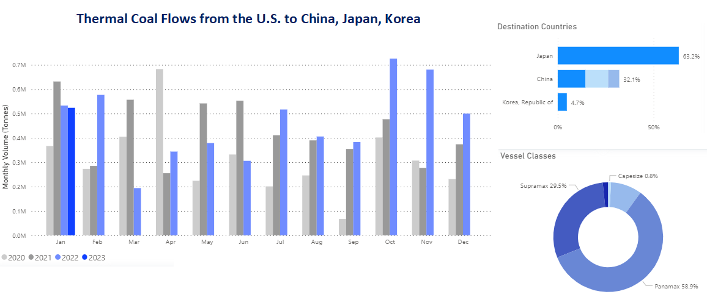
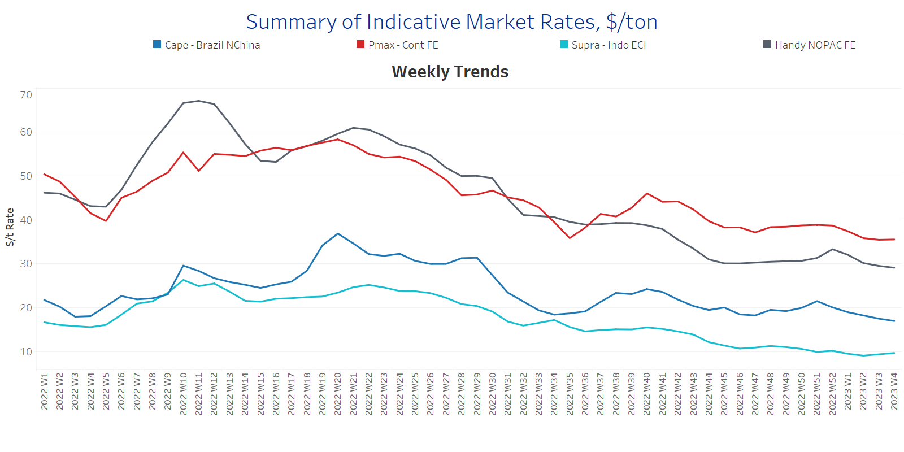
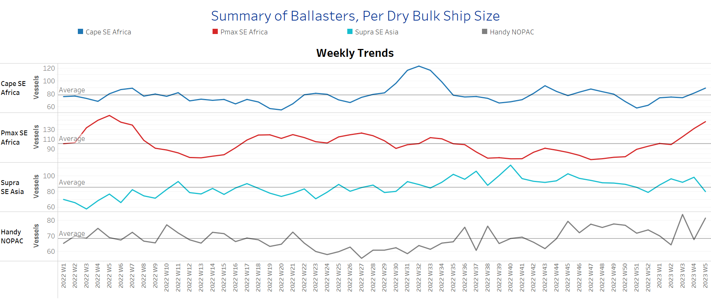
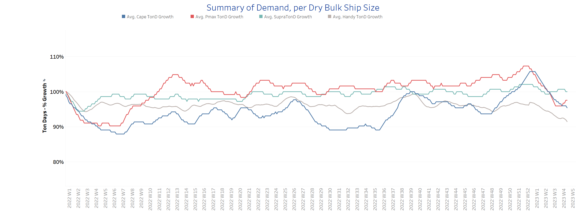
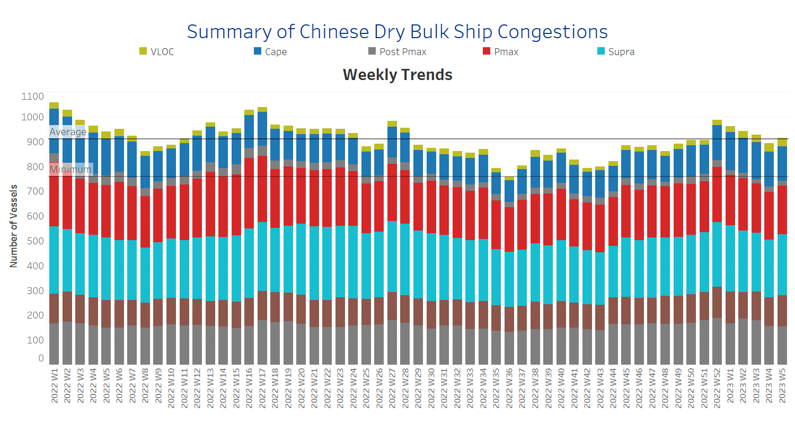

# Signal Dry Bulk Weekly Report

**Date:** February 02, 2023  
**Publisher:** Breakwave Advisors | **Category:** Market Insights  
**Original URL:** [https://www.breakwaveadvisors.com/insights/2023/2/2/signal-dry-bulk-weekly-report](https://www.breakwaveadvisors.com/insights/2023/2/2/signal-dry-bulk-weekly-report)  

---

The first few days of February seem to provide a somewhat firmer outlook for freight rates, although the number of ballasters has increased in all ship size classes except the Supramax segment. As far as demand growth is concerned, there is no firm upswing yet to be seen for the next few days of February, even though demand for Panamax vessels has started to show higher percentage growth than in the first days of January. It is interesting to note the increasing dynamics of monthly volumes of thermal coal from the U.S. for the main importers China, Japan and Korea (see image below).

In the iron ore market, Dalian iron ore futures prices extended gains after Lunar New Year holiday in China. The most-traded May iron ore contract on China's Dalian Commodity Exchange reportedly hit a high of 890 yuan ($131.77) per tonne on Monday, and the price is expected to rise further as the Chinese economy gets back on track.

## Chart of the Week Dry Bulk: Thermal Coal Flows From the U.s.

*Rising trend in January with the recent peak of one of the highest levels since the end of the 4th quarter of 2022*

> **Figure 1: Market Chart 1**  
> **Interactive Data & Source:** [Signal Ocean Platform](https://go.signalocean.com/e/983831/dry-dynamic-drybulkflows/2nl8ky/299943724?h=NgU40zOsHxEAvlL_ZCf3dwCk1S9HjUgml7lSOp33kYA) | [Local Asset](file:///C:/Users/Dell/Github/Shipping/corpus/03-breakwave/insights/2023/assets/2023-02-02_signal-dry-bulk-weekly-report_img_unnamed-2023-02-02t111022545_c291c4157b78.png)

Data Source: The Signal Ocean Platform, Dry Bulk Coal Flows from the U.S.

[Signal Ocean Platform](https://go.signalocean.com/e/983831/dry-dynamic-drybulkflows/2nl8ky/299943724?h=NgU40zOsHxEAvlL_ZCf3dwCk1S9HjUgml7lSOp33kYA)​​​​

## Section 1/ Freight -Market Rates ($/T) Firmer

‘The Big Picture’ - Capesize and Panamax Bulkers and Smaller Ship Sizes

> **Figure 2: Market Chart 2**  
> **Interactive Data & Source:** [Signal Ocean Platform](https://www.thesignalgroup.com/signal-ocean-platform) | [Local Asset](file:///C:/Users/Dell/Github/Shipping/corpus/03-breakwave/insights/2023/assets/2023-02-02_signal-dry-bulk-weekly-report_img_unnamed-2023-02-02t111111729_1c0b21c12865.png)

January ended with slight signs of a gradual recovery in freight rates, which, however, still show a weakening momentum compared to the recent peak at the end of last year.

- **Capesize**vessel freight rates are still approaching the $17/tonne mark, down $3.5/tonne from the last few days of December.
- **Panamax**vessel freight rates fromtheContinent to the Far East held levels held steady around $35/tonne, with the overall outlook unchanged in January.
- **Supramax**freight rates for the Indo-ECI route rose to $9.9/tonne, with signs of further firming in the first few days of February.
- **Handysize**freight rates for the NOPAC route to the Far East rose to $29.7/tonne in the last days of January, while the declining trend of the previous days now seems to be smoothing out.

## Section 2/ Supply -Ballasters (# Vessels) Increasing

> **Figure 3: Supply Trend Lines for Key Load Areas**  
> **Interactive Data & Source:** [Signal Ocean Platform](https://www.thesignalgroup.com/signal-ocean-platform) | [Local Asset](file:///C:/Users/Dell/Github/Shipping/corpus/03-breakwave/insights/2023/assets/2023-02-02_signal-dry-bulk-weekly-report_img_unnamed-2023-02-02t111147814_cd82e54e58d3.png)

The number of ballast ships increased significantly at the end of January, with the surprising upward trend accelerating in the Panamax and Handysize segments.

- **Capesize**SE Africa: The number of vessels now stands at 89, which is 11 more than the average for the year and 53% more than the lowest level in week 51.
- **Panamax**SE Africa: The number of vessels is now 147, 100% higher than in week 50.
- **Supramax**SE Asia: The number of ships fell to 80, a similar low level to week 52, with signs of a decline in the coming days of February.
- **Handysize**NOPAC: The number of vessels increased significantly to 82, 20 above the annual average, which is the second highest for the year after week 2.

## Section 3/ Demand -TonDays Decreasing

> **Figure 4: TonDays Decreasing**  
> **Interactive Data & Source:** [Signal Ocean Platform](https://www.thesignalgroup.com/signal-ocean-platform) | [Local Asset](file:///C:/Users/Dell/Github/Shipping/corpus/03-breakwave/insights/2023/assets/2023-02-02_signal-dry-bulk-weekly-report_img_unnamed-2023-02-02t111226291_50ada2ed44f5.png)

Demand growth continues to slow significantly, with early signs of a slight upward trend in the Panamax segment, while the decline in the Handysize and Capesize segments is very strong.

- **Capesize**demand ton-days: The downward trend observed in January does not seem to change dramatically in February, but it is likely to continue to decline at a slower pace.
- **Panamax**demand ton-days: In January, the downward trend in the Panamax segment continued in January, while it gradually turned into an upward trend in February.
- **Supramax**demand ton-days: Volatility remains and there are no clear signs yet of an upward or downward trend in the coming days.
- **Handysize**demand ton-days: The decline continues, with a lower percentage increase than other vessel sizes.

## Section 4/ Port Congestion -No of Vesselsincreasing

> **Figure 5: Dry Bulk Ships Congested at Chinese Ports**  
> **Interactive Data & Source:** [Signal Ocean Platform](https://www.thesignalgroup.com/signal-ocean-platform) | [Local Asset](file:///C:/Users/Dell/Github/Shipping/corpus/03-breakwave/insights/2023/assets/2023-02-02_signal-dry-bulk-weekly-report_img_unnamed-2023-02-02t111303199_cb1b852de256.png)

Demand growth continues to slow significantly, with early signs of a slight upward trend in the Panamax segment, while the decline in the Handysize and Capesize segments is very strong.

- **Capesize**demand ton-days: The downward trend observed in January does not seem to change dramatically in February, but it is likely to continue to decline at a slower pace.
- **Panamax**demand ton-days: In January, the downward trend in the Panamax segment continued in January, while it gradually turned into an upward trend in February.
- **Supramax**demand ton-days: Volatility remains and there are no clear signs yet of an upward or downward trend in the coming days.
- **Handysize**demand ton-days: The decline continues, with a lower percentage increase than other vessel sizes.

## Section 4/ Port Congestion -No of Vesselsincreasing

> **Figure 6: Market Chart 6**  
> **Interactive Data & Source:** [Signal Ocean Platform](https://www.thesignalgroup.com/signal-ocean-platform) | [Local Asset](file:///C:/Users/Dell/Github/Shipping/corpus/03-breakwave/insights/2023/assets/2023-02-02_signal-dry-bulk-weekly-report_img_unnamed-2023-02-02t111303199_cb1b852de256.png)

In the last days of January, congestion continued to increase but remained below the peak of week 52 last year.

- **Capesize:**The number of vesselss is about 140, 14 less than at the end of week 1, and the trend of increase is slower than the last highs at the end of week 52.
- **Panamax:**The number of congested vessels rose to 197, 4 more than last week and 25 fewer than in week 52.
- **Supramax:**The number of congested vessels increased to 246, 15 more than the previous week.
- **Handysize**: The number of congested vessels has dropped to 155, 31 lower than the last peak in week 2.

Data Source:[Signal Ocean Platform](https://www.thesignalgroup.com/signal-ocean-platform)
