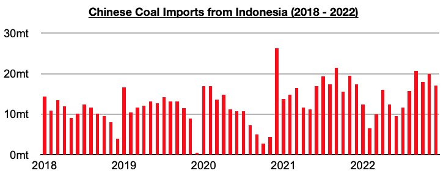
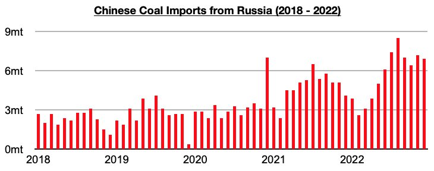
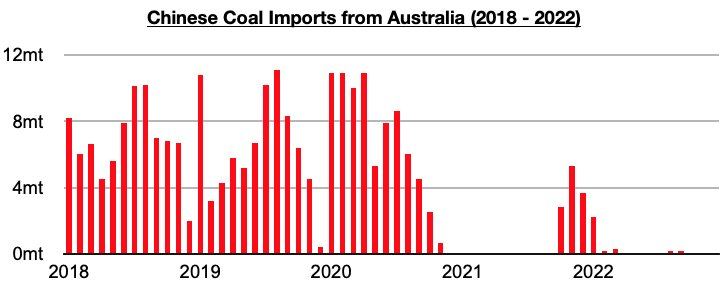

# China's Coal Imports From Russia Jumped By 19% Last Year

**Date:** February 03, 2023  
**Publisher:** Breakwave Advisors | **Category:** Market Insights  
**Original URL:** [https://www.breakwaveadvisors.com/insights/2023/2/3/chinas-coal-imports-from-russia-jumped-by-19-last-year](https://www.breakwaveadvisors.com/insights/2023/2/3/chinas-coal-imports-from-russia-jumped-by-19-last-year)  

---

*By*[*Jeffrey Landsberg*](https://www.linkedin.com/in/jeffrey-landsberg-70ab957/)

Coal import data for December by origin has been released and shows that imports from Indonesia have remained China’s primary source and Russia the second largest source. Imports from Indonesia totaled 17.1 million tons, which is down from November by 2.9 million tons (-15%) and down year-on-year by 300,000 tons (-2%).

> **Figure 1: Chart 1 (70)**  
> [Local Asset](file:///C:/Users/Dell/Github/Shipping/corpus/03-breakwave/insights/2023/assets/2023-02-03_chinas-coal-imports-from-russia-jumped-by-19-last-year_img_chart1287029_62d04c80d21f.jpg)

Imports from Russia totaled 6.9 million tons, which is down from November by 300,000 tons (-4%) but up year-on-year by 2.8 million tons (68%). As we stressed right before the war started last year in our Weekly China Reports, Russia and China signed coal cooperation agreements last year. Notable is that while China’s coal imports from Indonesia contracted year-on-year by a total of 25.4 million tons (-13%), last year ended up seeing coal imports from Russia increase year-on-year by 11 million tons (19%).

> **Figure 2: Chart 2 (60)**  
> [Local Asset](file:///C:/Users/Dell/Github/Shipping/corpus/03-breakwave/insights/2023/assets/2023-02-03_chinas-coal-imports-from-russia-jumped-by-19-last-year_img_chart2286029_95c6924ab9a0.jpg)

No coal was imported from Australia again last month. The last time that more than 100,000 tons of coal was imported from Australia was back in March.

> **Figure 3: Chart 3 (45)**  
> [Local Asset](file:///C:/Users/Dell/Github/Shipping/corpus/03-breakwave/insights/2023/assets/2023-02-03_chinas-coal-imports-from-russia-jumped-by-19-last-year_img_chart3284529_fb525c10bd32.jpg)
