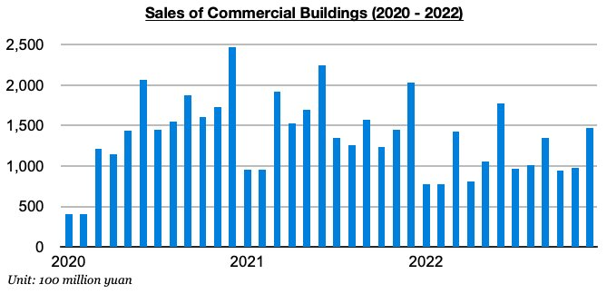
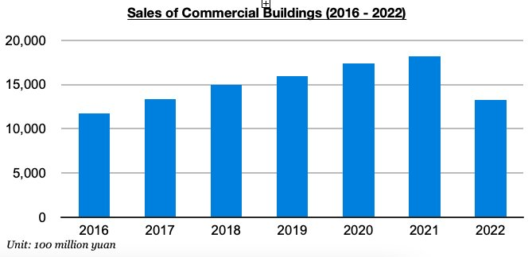
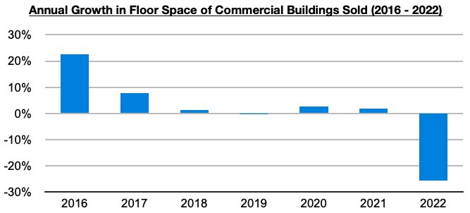

# China's Housing Market Has Long Been Slowing

**Date:** February 08, 2023  
**Publisher:** Breakwave Advisors | **Category:** Market Insights  
**Original URL:** [https://www.breakwaveadvisors.com/insights/2023/2/8/chinas-housing-market-has-long-been-slowing](https://www.breakwaveadvisors.com/insights/2023/2/8/chinas-housing-market-has-long-been-slowing)  

---

*By*[*Jeffrey Landsberg*](https://www.linkedin.com/in/jeffrey-landsberg-70ab957/)

Remaining a significant issue in China is that the housing market continues to deteriorate. Some positive sentiment was spreading in the dry bulk market a few weeks ago regarding recent improvement in Chinese excavator sales and robust savings among Chinese citizens, but there still is a grim likelihood that existing housing supply far exceeds both current demand and also any higher level of demand that could come this year. The latest data shows that sales of commercial buildings in China (the vast majority of which are residential homes) came in at only 1.46 trillion yuan in December. While up month-on-month by 49%, this has marked a year-on-year contraction of 28%. Housing sales always jump in December, but the contraction nevertheless remains in full effect. Sales have contracted for eighteen consecutive months.

> **Figure 1: Chart 1 (68)**  
> [Local Asset](file:///C:/Users/Dell/Github/Shipping/corpus/03-breakwave/insights/2023/assets/2023-02-08_chinas-housing-market-has-long-been-slowing_img_chart1286829_d5f2870b992f.jpg)

Sales of commercial buildings in China ended up totaling only 13.3 trillion yuan last year. This is not only down year-on-year by 27%, it also marks the lowest total since 2016.

> **Figure 2: Chart 2 (59)**  
> [Local Asset](file:///C:/Users/Dell/Github/Shipping/corpus/03-breakwave/insights/2023/assets/2023-02-08_chinas-housing-market-has-long-been-slowing_img_chart2285929_cd13f91203e1.jpg)

The sales total is designated in yuan, which is of course affected by inflation, and looking at actual floor space data shows that the floor space of commercial buildings sold last year came in at the lowest level since 2015 and contracted year-on-year by 26%.

> **Figure 3: Chart 3 (44)**  
> [Local Asset](file:///C:/Users/Dell/Github/Shipping/corpus/03-breakwave/insights/2023/assets/2023-02-08_chinas-housing-market-has-long-been-slowing_img_chart3284429_24a3e98bb671.jpg)

**The last time that floor space of commercial buildings sold grew in double digits was back in 2016**. Also of note is that last year ended with 564 million square meters of floor space in commercial buildings available, which marks the**largest amount of floor space available since 2017**. Overall, China’s housing market has been facing headwinds for years, and the coronavirus pandemic has only exasperated the issue. If the pandemic and restrictions do finally come to an end this year, significant oversupply in housing is still set to remain a problem for the market. This is an issue that continues to be analyzed more extensively in Commodore Research's Weekly Dry Bulk Reports and Weekly China Reports.
