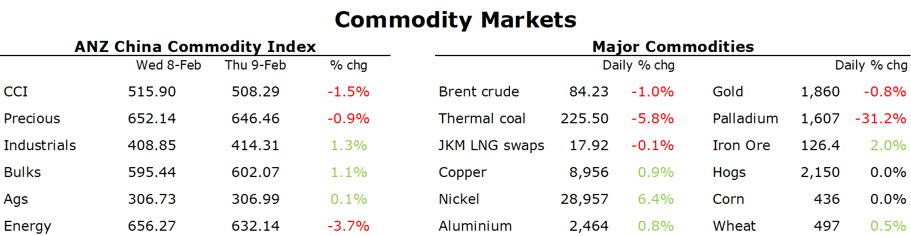

# Crude oil falls despite ongoing supply side issues

**Date:** February 10, 2023  
**Publisher:** Breakwave Advisors | **Category:** Market Insights  
**Original URL:** [https://www.breakwaveadvisors.com/insights/2023/2/10/crude-oil-falls-despite-ongoing-supply-side-issues](https://www.breakwaveadvisors.com/insights/2023/2/10/crude-oil-falls-despite-ongoing-supply-side-issues)  

---

*By*[*Daniel Hynes*](https://www.linkedin.com/in/dahynes/)

Markets were mixed as traders balanced stronger demand in China against the prospects of weaker economic growth in the US.

> **Figure 1: 1675976438371**  
> [Local Asset](file:///C:/Users/Dell/Github/Shipping/corpus/03-breakwave/insights/2023/assets/2023-02-10_crude-oil-falls-despite-ongoing-supply-side-issues_img_1675976438371_80eaa69f6ace.png)

**Crude oil**edged lower amid concerns that weakness in the US market would offset strong Chinese demand. The large build in inventories over recent weeks has hurt confidence in oil demand, as the Federal Reserve looks to continue raising rates. This offset further supply disruptions. Export of Azerbaijan oil from Turkey is unlikely to resume until late next week. The halt has halted about 600kb/d of shipments. Kazakh crude output has been curtailed by about 200kb/d due to unplanned maintenance. This points to a broader issue with supply.[**Sources of growth in supply to meet higher demand from China look limited**](../pdfs/2023-02-10_crude-oil-falls-despite-ongoing-supply-side-issues_commodity-call-supply-mirage_0ad0a84247d8.pdf). The Iran nuclear deal looks highly unlikely, removing 1.5mb/d that was expected to hit the market. OPEC has limited spare capacity. Over half of expected growth in supply this year is coming from US shale. But the fall in price has seen drilling activity fall. With most producers maintaining a cautious approach on investment, there is a significant risk that US supply will fail to meet expectations. A tight market and high prices look increasingly likely.

**European natural gas**extended declines as prospects of milder weather weigh on demand. Temperatures in the north and northeast are set to be above normal, according to Maxar Technologies. Even so, the reliance on the LNG market will remain high this year as it looks to rebuild inventories. That could be more difficult amid signs that China is ramping up efforts to secure LNG cargo. State-owned CNOOC is looking to purchase shipments from June 2023 to June 2024. The nation’s LNG imports slumped 20% last year amid virus restrictions. That renewed interest failed to push**North Asian LNG**prices higher, with buyers from Japan and South Korea sitting on the sidelines amid plentiful inventories.

Sentiment across the**base metal**complex was more bullish, helping push the sector higher. Expectations of an economic recovery in China have buoyed the outlook for demand.**Copper**was additionally supported on ongoing supply side issues. Chile has been beset by setbacks at mines, including declining ore quality and water restrictions. In Peru, MMG halted operations last week due to road blockades that have prevented supplies reaching its site.**Aluminium**stabilised after a six-day selloff. Reports of ongoing constraints on Chinese output outweighed concerns of Russian metal being dumped onto the LME.

**Gold**erased earlier gains after data showed the US labour market remains strong. This could see the Fed maintaining aggressive rate hikes. The losses were limited amid safe haven buying as the bond market continues to flash recessionary signals.

Data source:[Commodities Wrap](https://www.linkedin.com/newsletters/commodities-wrap-6692196755876012032/?fbclid=IwAR3kiXJqZdxmp9ZcRwBNI7FsBySI-XSC0pfPur1qzjt7OZp7PTE59Tsl1QI)
