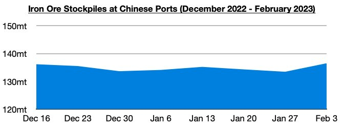
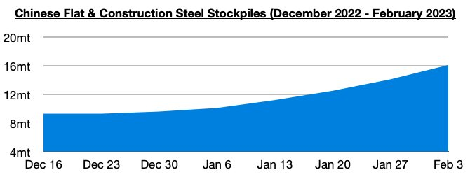
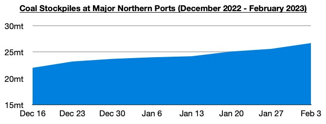

# Ongoing Climb in Chinese Commodity Stockpiles

**Date:** February 10, 2023  
**Publisher:** Breakwave Advisors | **Category:** Market Insights  
**Original URL:** [https://www.breakwaveadvisors.com/insights/2023/2/10/ongoing-climb-in-chinese-commodity-stockpiles](https://www.breakwaveadvisors.com/insights/2023/2/10/ongoing-climb-in-chinese-commodity-stockpiles)  

---

*By*[*Jeffrey Landsberg*](https://www.linkedin.com/in/jeffrey-landsberg-70ab957/)

As we have highlighted most recently in this week's Weekly Dry Bulk Report and Weekly China Report, China's commodity stockpiles have been rising. 136.5 million tons of iron ore is now stockpiled at Chinese ports, which is 3.1 million tons (2%) more than was stockpiled a week ago. Previously, stockpiles had decreased for two straight weeks. On a year-on-year basis, they are down by 18.9 million tons (-12%).

> **Figure 1: Chart 1 (70)**  
> [Local Asset](file:///C:/Users/Dell/Github/Shipping/corpus/03-breakwave/insights/2023/assets/2023-02-10_ongoing-climb-in-chinese-commodity-stockpiles_img_chart1287029_17b3c1d8e549.jpg)

Stockpiles of flat and construction steel products at warehouses in major cities in China ended last week at approximately 16.1 million tons. This is 2 million tons (14%) more than a week ago and up year-on-year by 1.7 million tons (12%). Stockpiles have increased during each of the last six weeks.

> **Figure 2: Chart 2 (60)**  
> [Local Asset](file:///C:/Users/Dell/Github/Shipping/corpus/03-breakwave/insights/2023/assets/2023-02-10_ongoing-climb-in-chinese-commodity-stockpiles_img_chart2286029_42348484070f.jpg)

The amount of coal stockpiled at major northern ports in China now stands at 26.7 million tons. This is up week-on-week by 1.1 million tons (4%) and is up year-on-year by 11.6 million tons (-77%). Stockpiles have now increased during each of the last seven weeks.

> **Figure 3: Chart 3 (45)**  
> [Local Asset](file:///C:/Users/Dell/Github/Shipping/corpus/03-breakwave/insights/2023/assets/2023-02-10_ongoing-climb-in-chinese-commodity-stockpiles_img_chart3284529_985922d75d80.jpg)
