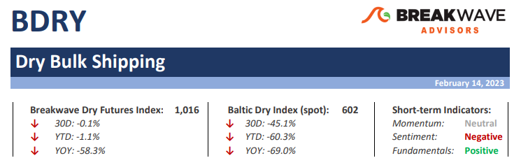
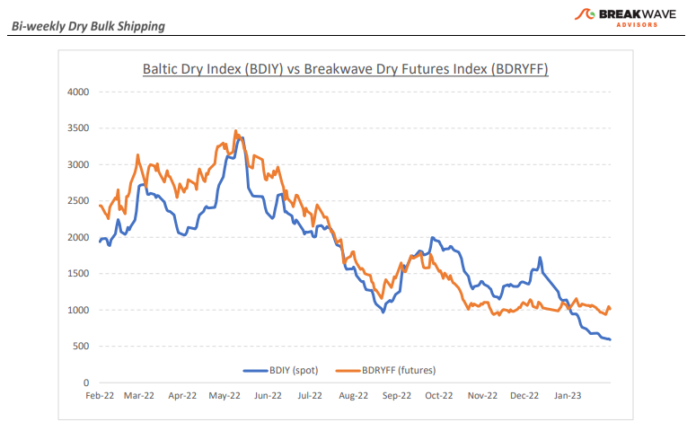
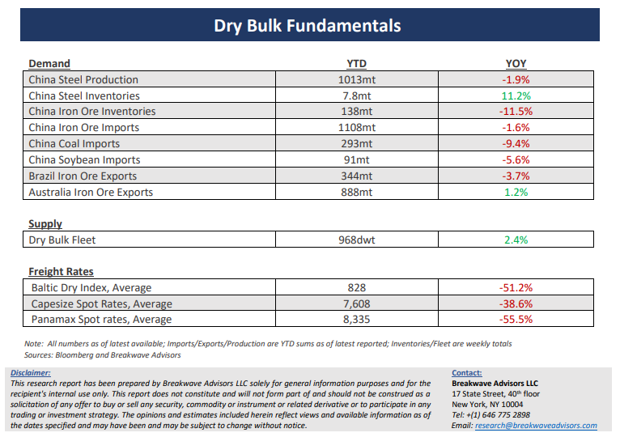

# Breakwave Bi-Weekly Dry Bulk Report - February 14, 2023

**Date:** February 14, 2023  
**Publisher:** Breakwave Advisors | **Category:** Market Insights  
**Original URL:** [https://www.breakwaveadvisors.com/insights/2023/2/13/breakwave-bi-weekly-dry-bulk-report-february-14-2023](https://www.breakwaveadvisors.com/insights/2023/2/13/breakwave-bi-weekly-dry-bulk-report-february-14-2023)  

---

> **Figure 1: Dbreporttop**  
> **Interactive Data & Source:** [Breakwave Advisors Market Insights](https://www.breakwaveadvisors.com/publications) | [Local Asset](file:///C:/Users/Dell/Github/Shipping/corpus/03-breakwave/insights/2023/assets/2023-02-14_breakwave-bi-weekly-dry-bulk-report-february-14-2023_img_dbreporttop_825ee8fd1096.png)

**·****Volatility increasing as Capesize rates look for a bottom –**A dearth of cargo flow, especially out of Brazil, has driven Capesize rates to almost zero as seasonal weakness is now in full swing. Although the increasing West African bauxite exports over the last few years have managed to absorb a significant number of vessels, the Atlantic basin remains oversupplied, and it will take some time for the balance to be restored. As a result, owners prefer to stay in the Pacific instead of taking the expensive ballasting path, which in turn has also driven timecharter rates in that part of the world to multi-year lows. Over the last week or so, however, owners have resisted further erosion in spot rates, which is understandable given that real spot rates have reached almost zero. On the other hand, futures have now begun to price a recovery in spot rates, and the significant contango in the forward month is a testament of such optimism for the development of market balance as we enter the spring months. The dry bulk market has been in similar situations many times in the past, and time and again market balance has been restored quite swiftly, at least most of the time. Could it be different this time? There are a number of positives that lead us to believe a recovery in spot rates might be around the corner. China has been communicating its willingness to restore high growth rates, something that implies significant infrastructure spending and some normalization in its ailing real estate sector. In addition, global economic growth ex-China also looks healthier versus a few months ago, and recession calls are now slowly turning into a “soft landing” type of scenarios in most parts of the world. Dry bulk shipping should benefit from such an economic setup, and we see no reason why the current weakness is not just a seasonal phenomenon which has been widely anticipated by most market participants for months now.

**· Real time economic indicators from China point to increasing activity –**As China continues to move away from its strict Covid-related policies, economic activity gradually returns to normal, albeit at a slow pace. The most recent relaxation of travel restrictions is a great example of such trend, and although similar to the western world’s reopening it will take time for activity to reach pre-pandemic levels, the restoration of normality is a positive development for the commodities and shipping sectors. Although commodity prices had already moved higher in anticipation of such developments, we believe the optimism has been premature, as demand driven cycles take a long time to develop and translate to real underlying demand for raw materials. Evident of that is the recent softening in bulk commodity prices reflecting disappointment by market participants of the post CNY demand.

**·****Dry bulk focus shifts back to fundamentals –**Following a period of high uncertainty and significant disruptions across the commodity spectrum, the gradual normalization of trade is shifting the market’s attention back to the traditional demand and supply dynamics that have shaped dry bulk profitability for decades. As effective fleet supply growth for the next few years looks marginal, demand will be the main determinant of spot freight rates with China returning back to the driver’s seat as the dominant force of bulk imports and thus shipping demand.

[Subscribe - Bi-weekly Dry Bulk Report](https://www.breakwaveadvisors.com/publications)

> **Figure 2: Dbreportchart**  
> [Local Asset](file:///C:/Users/Dell/Github/Shipping/corpus/03-breakwave/insights/2023/assets/2023-02-14_breakwave-bi-weekly-dry-bulk-report-february-14-2023_img_dbreportchart_7905daa999cd.png)

> **Figure 3: Dbreportbottom**  
> [Local Asset](file:///C:/Users/Dell/Github/Shipping/corpus/03-breakwave/insights/2023/assets/2023-02-14_breakwave-bi-weekly-dry-bulk-report-february-14-2023_img_dbreportbottom_9d121b9b819e.png)
