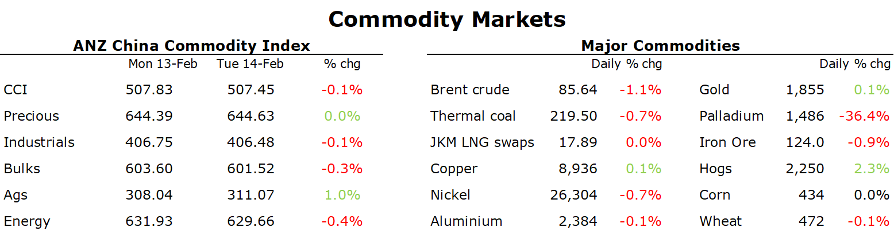

# Oil falls as US releases more from strategic reserve

**Date:** February 15, 2023  
**Publisher:** Breakwave Advisors | **Category:** Market Insights  
**Original URL:** [https://www.breakwaveadvisors.com/insights/2023/2/15/oil-falls-as-us-releases-more-from-strategic-reserve](https://www.breakwaveadvisors.com/insights/2023/2/15/oil-falls-as-us-releases-more-from-strategic-reserve)  

---

*By*[*Daniel Hynes*](https://www.linkedin.com/in/dahynes/)

Increased market expectations of US monetary policy staying tighter for longer weighed on commodity prices.

> **Figure 1: 1676409749138**  
> **Interactive Data & Source:** [Linkedin](https://www.linkedin.com/newsletters/commodities-wrap-6692196755876012032/?fbclid=IwAR3kiXJqZdxmp9ZcRwBNI7FsBySI-XSC0pfPur1qzjt7OZp7PTE59Tsl1QI) | [Local Asset](file:///C:/Users/Dell/Github/Shipping/corpus/03-breakwave/insights/2023/assets/2023-02-15_oil-falls-as-us-releases-more-from-strategic-reserve_img_1676409749138_1730a73eefb0.png)

**Crude oil**prices fell after the US announced it would release 26mb oil from the Strategic Petroleum Reserve (SPR). This is in addition to a record sale of 180mb oil last year. There was a consideration to cancel the sale as reserves are already depleted, but it requires congress approval. Stronger than expected US inflation was not a help either. The market shrugged off supply issues as Russia announced an output cut of 500kb/d for the next month in retaliation to the western sanctions. The OPEC downgraded its non-OPEC supply estimates by 150kb/d for 2023 in its latest monthly report. While increased demand projections by 100kb/d as China reopens increases demand prospects for 2023. The IEA is due to release its monthly oil report today. A confirmation on tightening market balance should lend support to oil prices.

**European natural gas**hit a 17-month low as supply looks comfortable. Europe gas storage level remains at 66%, well above the 5-year average of 46%. Milder weather, strong LNG imports and demand rationing helped the region to compensate for Russian pipeline gas supply losses. Restart of US Freeport export terminal will also add to the global LNG supply. While**North Asia LNG**prices moved in tandem with European gas, lower prices are incentivising purchases in price sensitive Asian countries. Fresh purchase of LNG cargoes is coming from India, Bangladesh, and Thailand.

**Copper**eked out a marginal gain, with strong US inflation print triggering some sell-off during late hours. Renewed mine supply issues are still protecting the downside for copper prices.**Aluminium**pared back its early gains as LME inventories rose to a three-month high. This is despite some supportive developments in the market. Nord Hydro said that there is little hope for European smelting plants to restart despite recent drop in energy prices. The company raised concerns of closing another 600kt capacity if energy price rises again. Further, hydro power shortage is raising risk for China’s aluminium smelters. Zinc traded lower as well at USD3082/t, while the market remained in backwardation.**Iron ore**price fell marginally as investors remain cautious on steel demand strength. Key property market indicators have continued to disappoint, while steel profitability remains subdued.

**Gold**prices plunged below USD1850/oz after the release of stronger than expected US inflation number. However, prices pared back losses later. After strong US labour data, the elevated inflation is reasserting that the Fed needs to stay hawkish for longer. According to news sources, Turkey will suspend gold imports as part of emergency plan after an earthquake hit the country this week. Turkish central bank was the largest buyer of gold last year buying 150t.

Data source:[Commodities Wrap](https://www.linkedin.com/newsletters/commodities-wrap-6692196755876012032/?fbclid=IwAR3kiXJqZdxmp9ZcRwBNI7FsBySI-XSC0pfPur1qzjt7OZp7PTE59Tsl1QI)
