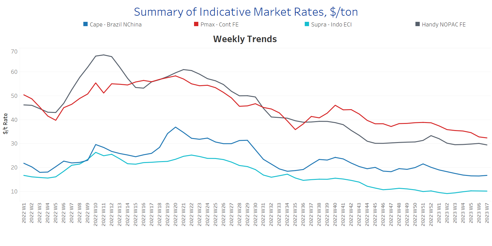
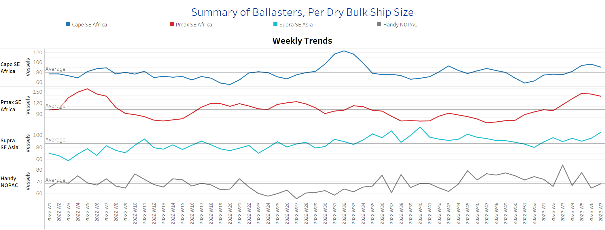
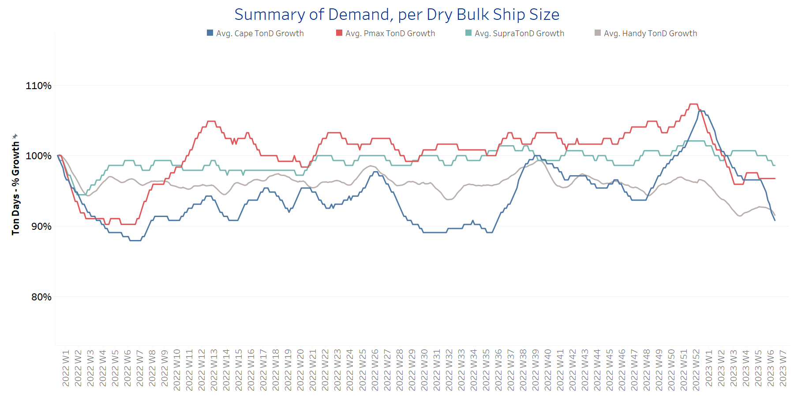
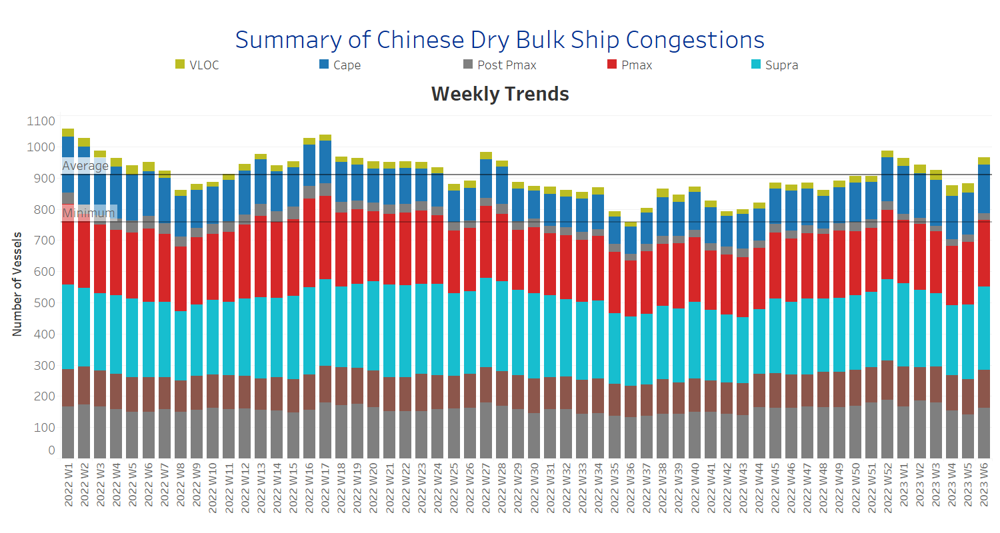

# Signal Dry Bulk Weekly Report

**Date:** February 16, 2023  
**Publisher:** Breakwave Advisors | **Category:** Market Insights  
**Original URL:** [https://www.breakwaveadvisors.com/insights/2023/2/16/signal-dry-bulk-weekly-report](https://www.breakwaveadvisors.com/insights/2023/2/16/signal-dry-bulk-weekly-report)  

---

In the second half of February, the weaker market sentiment in freight rates does not seem to change, while the oversupply of tonnage struggles to be met by employment opportunities, with a steady increase in the number of ballast vessels. Demand growth has yet to show stronger signs of a near-term upturn, while all vessel size classes are trying to find new available cargoes for either spot or period business.

In the iron market, the Chinese economy does not appear to be providing support for higher capesize vessel revenues this quarter, as the level of imports from all countries continues to decline. (See image below with data from The Signal Ocean Platform). Meanwhile, iron ore prices fell Monday as growing steel inventories and rising iron ore stocks at ports pointed to a slow recovery in demand from China. According to[mining.com](http://mining.com/), the price of 62% Fe iron ore imported into northern China fell 2.82% to $122/tonne, the lowest in a month. However, according to Trading Economics, the current price is 13.4% lower than at this time last year. In March 2022, the iron ore price peaked for the year at around $160/tonne. According to some reports in the Australian news, analysts expect iron ore prices to fall to $100/tonne as the risk of a downturn in the real estate market remains high.

Data Source: The Signal Ocean Platform, Chinese iron ore imports, 25d Moving Average

[Signal Ocean Platform](https://go.signalocean.com/e/983831/dry-dynamic-drybulkflows/2nmvdr/302402377?h=5kXQfU_8JOWMH2LjzRSBv0tyXQGhLebqRIeVQ3sJ2V4)

​

## Section 1/ Freight -Market Rates ($/T) Weaker

‘The Big Picture’ - Capesize and Panamax Bulkers and Smaller Ship Sizes

> **Figure 1: Market Chart 1**  
> **Interactive Data & Source:** [Signal Ocean Platform](https://www.thesignalgroup.com/signal-ocean-platform) | [Local Asset](file:///C:/Users/Dell/Github/Shipping/corpus/03-breakwave/insights/2023/assets/2023-02-16_signal-dry-bulk-weekly-report_img_unnamed-2023-02-16t105002835_585ceb5c83a1.png)

The third week of February does not change the weaker sentiment of the previous days, while prices remain under downward pressure and the outlook for the coming days is almost unchanged.

- **Capesize**vessel freight rates are now at $16.7/tonne, with sentiment still weaker than the highs of weeks 51 and 52 last year.
- **Panamax**vessel freight rates fromtheContinent to the Far East fell to about $32/tonne, a $7/tonne decline from the end of last year, with the general trend weakening in February.
- **Supramax**freight rates for the Indo-ECI route held steady at the previous week's level of over $10/tonne, though the picture appears to be slowly firming as grain shipments struggle to find a firmer rhythm this quarter.
- **Handysize**freight rates for the NOPAC route to the Far East approached $32/tonne, and despite signs of weaker momentum, rates appeared to be gradually recovering from the steady decline in January.

## Section 2/ Supply -Ballasters (# Vessels) Increasing

> **Figure 2: Supply Trend Lines for Key Load Areas**  
> **Interactive Data & Source:** [Signal Ocean Platform](https://www.thesignalgroup.com/signal-ocean-platform) | [Local Asset](file:///C:/Users/Dell/Github/Shipping/corpus/03-breakwave/insights/2023/assets/2023-02-16_signal-dry-bulk-weekly-report_img_unnamed-2023-02-16t105043355_447b21d1bea4.png)

The number of ballast ships continued to increase significantly, while it accelerated for the large ship classes.​​​​​​

- ​**Capesize**SE Africa: The number of vessels now stands at 90, which is 12 more than the average for the year and 55% more than the lowest level in week 51.
- **Panamax**SE Africa: The number of vessels is now 138, 90% higher than in week 50.
- **Supramax**SE Asia: The number of vessels increased to 104, 14 more than the week 5 and 30% above the year-end 2022 low.
- **Handysize**NOPAC: The number of ships reached 68, the lowest level since the end of week 2, and it remains to be seen if there will be a further decline in the coming days.

## Section 3/ Demand -TonDays Decreasing

> **Figure 3: TonDays Decreasing**  
> **Interactive Data & Source:** [Signal Ocean Platform](https://www.thesignalgroup.com/signal-ocean-platform) | [Local Asset](file:///C:/Users/Dell/Github/Shipping/corpus/03-breakwave/insights/2023/assets/2023-02-16_signal-dry-bulk-weekly-report_img_unnamed-2023-02-16t105145915_ff1476bab3be.png)

In the second half of February, the significant decline in demand growth continues, with the Capesize segment showing the strongest downward trend.

- **Capesize**demand ton-days: The downward trend remained as strong as in previous days, with weak expectations for an upturn.
- **Panamax**demand ton-days: There seems to be a flattening trend of the trend at a fairly recovered level compared to the lows of late January.
- **Supramax**demand ton-days: Volatility remains and there are no clear signs yet of an upward or downward trend in the next days of February.
- **Handysize**demand ton-days: The decline continues, with a lower percentage increase than other vessel sizes.

## Section 4/ Port Congestion -No of Vesselsincreasing

> **Figure 4: Dry Bulk Ships Congested at Chinese Ports**  
> **Interactive Data & Source:** [Signal Ocean Platform](https://www.thesignalgroup.com/signal-ocean-platform) | [Local Asset](file:///C:/Users/Dell/Github/Shipping/corpus/03-breakwave/insights/2023/assets/2023-02-16_signal-dry-bulk-weekly-report_img_unnamed-2023-02-16t105218150_939c8f5f5779.png)

Congestion reached a new second high in the third week of February, followed by a firm increase last week.

- **Capesize:**The number of ships is 149, only 2 less than the previous week, with an upward trend towards the end of February.
- **Panamax:**The number of congested vessels remained high at 210, 10 more than the first week.
- **Supramax:**The number of congested vessels is now at 244, a similar level to week 2.
- **Handysize**: The number of congested vessels increased to 171, 24 more than the previous week, with a tendency of further increase in the coming days.

Data Source:[Signal Ocean Platform](https://www.thesignalgroup.com/signal-ocean-platform)
