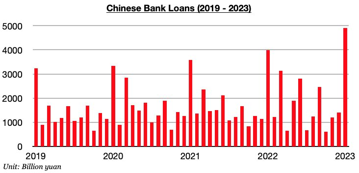
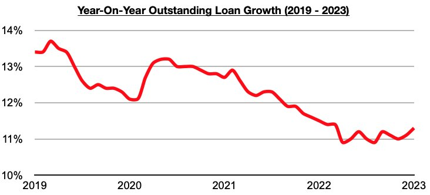

# China's New Loans Set Record Last Month

**Date:** February 21, 2023  
**Publisher:** Breakwave Advisors | **Category:** Market Insights  
**Original URL:** [https://www.breakwaveadvisors.com/insights/2023/2/21/chinas-new-loans-set-record-last-month](https://www.breakwaveadvisors.com/insights/2023/2/21/chinas-new-loans-set-record-last-month)  

---

*By*[*Jeffrey Landsberg*](https://www.linkedin.com/in/jeffrey-landsberg-70ab957/)

Chinese banks issued a record 4.9 trillion yuan in new loans in January. This marks a month-on-month increase of 3.5 trillion yuan (250%) and a year-on-year increase of 920 billion yuan (23%). The surge has not come as a surprise as lending was expected to set a record.

> **Figure 1: Chart 1 (70)**  
> [Local Asset](file:///C:/Users/Dell/Github/Shipping/corpus/03-breakwave/insights/2023/assets/2023-02-21_chinas-new-loans-set-record-last-month_img_chart1287029_b35b1aeb2261.jpg)

Overall, it is normal for new loans to set a record every January. Also quite interesting is that just a few months ago, new loans came in at the lowest level in over five years. As we discussed in our Weekly China Reports last year, new loans totaled only 615 billion yuan in October which marked the lowest monthly total seen during any month since December 2017. The central government is working to support the economy, but it still remains to be seen if any massive stimulus packages will be announced. Our expectation at Commodore is still that massive stimulus measures like seen in past decades will not be carried out this year. We remain of our view that consumers being able to go out and spend and travel on their own is a natural stimulus of sorts that is already baked into China reopening.

Also of note is that outstanding loan growth has increased further. Outstanding loan growth last month came in at 11.3%. Growth has now increased during each of the last two months and has climbed to the highest level seen since March.

> **Figure 2: Chart 2 (59)**  
> [Local Asset](file:///C:/Users/Dell/Github/Shipping/corpus/03-breakwave/insights/2023/assets/2023-02-21_chinas-new-loans-set-record-last-month_img_chart2285929_fedcc5a840e9.jpg)
