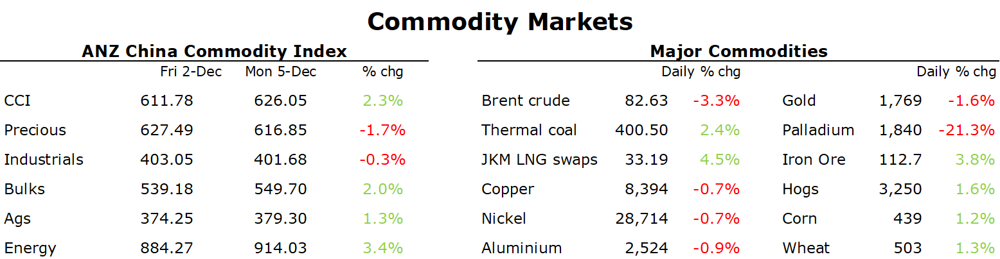

# Iron ore gains amid signs of stronger demand

**Date:** February 22, 2023  
**Publisher:** Breakwave Advisors | **Category:** Market Insights  
**Original URL:** [https://www.breakwaveadvisors.com/insights/2023/2/22/iron-ore-gains-amid-signs-of-stronger-demand](https://www.breakwaveadvisors.com/insights/2023/2/22/iron-ore-gains-amid-signs-of-stronger-demand)  

---

*By*[*Daniel Hynes*](https://www.linkedin.com/in/dahynes/)

A risk-off tone across markets weighed on sentiment in key commodities. Ongoing supply side issues helped mitigate the losses.

> **Figure 1: 1677015418080**  
> **Interactive Data & Source:** [Linkedin](https://www.linkedin.com/newsletters/commodities-wrap-6692196755876012032/?fbclid=IwAR3kiXJqZdxmp9ZcRwBNI7FsBySI-XSC0pfPur1qzjt7OZp7PTE59Tsl1QI) | [Local Asset](file:///C:/Users/Dell/Github/Shipping/corpus/03-breakwave/insights/2023/assets/2023-02-22_iron-ore-gains-amid-signs-of-stronger-demand_img_1677015418080_d3dd4e0db658.png)

**Crude oil**gained early in the session amid signs of improving Chinese demand. Refiners in China continue to ramp up purchases. Companies including PetroChina and Unipec have hired at least 10 supertankers to carry shipments from the US next month. This equates to around 20mbbl of crude oil. Road congestion in major cities is also the worst since the start of 2022, according to Baidu data. The number of people using public transport is also back to or above pre-pandemic levels. However, oil prices came under pressure later in the session as weak economic data raised concerns about demand in advanced economies. Sales of previously owned homes in the US fell for the 12th straight month. This comes ahead of the release of minutes from the Fed’s last meeting. Further rate hikes could dampen oil demand.

**European natural gas**extended losses amid the prospect of tepid industrial demand. Despite rising business activity, industrial users are reluctant to ramp up operations that could boost gas demand. The European Steel Association said that a high level of uncertainty persists for medium-term price levels, hindering the visibility of company planning. Dutch front month futures ended the session down 2.7% to EUR48.64/MWh.**North Asia LNG**prices fell sharply as supply side issues eased. Freeport is expected to deliver its first cargo to Europe next week since it closed due to a blast last year.

Participants in the**European carbon**market took a glass half full approach to the impact of lower gas prices. EUAs hit EUR100/t for the first time in anticipation of stronger demand for carbon permits from industrial companies. The improving economic backdrop across the bloc, driven by the lower gas prices, should see increased carbon emissions. This comes as policy makers are due to vote on a deal that would further limit the supply of carbon allowances from next year.**Australian carbon credit units**extended recent gains amid increased interest from industry.

**Iron ore**gained after BHP talked of green shoots in China. CEO Mike Henry said that pent up demand was being unleashed in China following extended lockdowns. This was aided by supply side issues. Anglo America said rail and port bottlenecks are constraining exports of iron ore. Nearly 8mt of ore is sitting in stockpiles at its mines and ports, more than 3.5mt higher than normal.

The**base metals**sector edged higher despite macro headwinds. A stronger USD and signs of stagnation in the European manufacturing sector kept the gains in check. However, prospects of improving Chinese demand continue to dominate sentiment. This is aided by low inventories and ongoing supply side issues. Reports are that China’s Yunnan province is cutting more capacity at its**aluminium**smelters due to an ongoing shortfall in energy supplies. Antofagasta’s profit fell 26% due to a slump in**copper**production.

Data source:[Commodities Wrap](https://www.linkedin.com/newsletters/commodities-wrap-6692196755876012032/?fbclid=IwAR3kiXJqZdxmp9ZcRwBNI7FsBySI-XSC0pfPur1qzjt7OZp7PTE59Tsl1QI)
