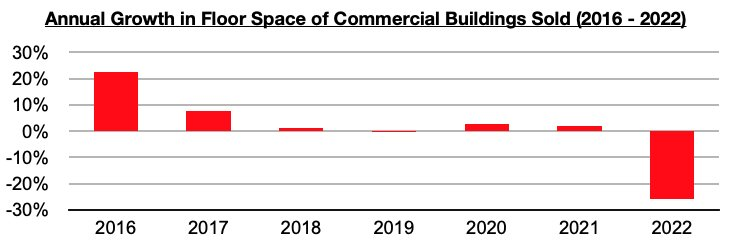
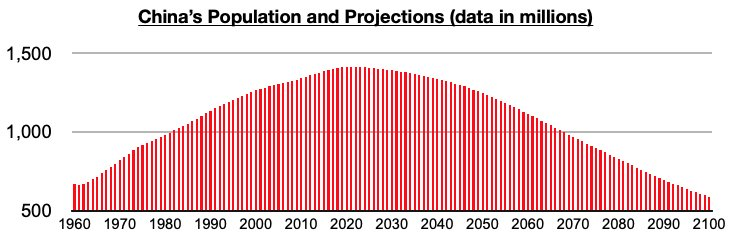

# China's Population Decline Latest Structural Problem

**Date:** February 24, 2023  
**Publisher:** Breakwave Advisors | **Category:** Market Insights  
**Original URL:** [https://www.breakwaveadvisors.com/insights/2023/2/24/chinas-population-decline-latest-structural-problem](https://www.breakwaveadvisors.com/insights/2023/2/24/chinas-population-decline-latest-structural-problem)  

---

*By*[*Jeffrey Landsberg*](https://www.linkedin.com/in/jeffrey-landsberg-70ab957/)

As we have been discussing in Commodore's Weekly Dry Bulk Reports and Weekly China Reports, inflation has been exceeding retail sales growth in China and around the world. Taking into account inflation when examining retail sales sheds much more light on how consumers are actually faring. Often, it is only retail sales data that is discussed by major media outlets and research providers, but retail sales are measured in currency and not goods. It is very helpful to know if purchases of goods are actually declining or rising.

One data point that is published in China measuring actual goods purchased (rather than currency spent) is vehicle sales. Important to note is that monthly vehicle sales sold in China peaked back in 2016. We have long been discussing how the sales of other goods, including furniture, peaked many years ago as well. Overall, this is not the first time we have harkened back to 2016 and viewed it as a final extremely bullish year when analyzing an aspect of the Chinese economy. As we discussed back in our January 23rd Weekly Dry Bulk Report, the last time that floor space of commercial buildings sold in China (the vast majority of which are residential homes) grew in double digits was back in 2016.

> **Figure 1: Chart 1 (71)**  
> [Local Asset](file:///C:/Users/Dell/Github/Shipping/corpus/03-breakwave/insights/2023/assets/2023-02-24_chinas-population-decline-latest-structural-problem_img_chart1287129_7cb588095281.jpg)

Our report stressed that China’s housing market had been slowing well before the coronavirus outbreak began. 2016 was the last year of very robust strength in China’s housing market, just as 2016 was the last year that Chinese consumers bought more vehicles than ever before. 2016 was also the last year that retail sales growth (which, again, is measured in currency and therefore includes inflation) grew year-on-year every month by at least 10%. The days of epic growth in the consumer market remain a relic of the past, and in many ways 2016 was a last hurrah. Also problematic is that China’s population is contracting. China’s population fell last year for the first time since 1961, and it is also expected to decline further as the years and decades progress.

> **Figure 2: Chart 2 (60)**  
> [Local Asset](file:///C:/Users/Dell/Github/Shipping/corpus/03-breakwave/insights/2023/assets/2023-02-24_chinas-population-decline-latest-structural-problem_img_chart2286029_894c0c64e2d5.jpg)
