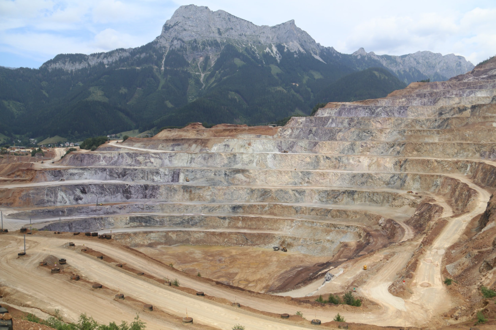

# Weekly Insights Review

**Date:** February 26, 2023  
**Publisher:** Breakwave Advisors | **Category:** Market Insights  
**Original URL:** [https://www.breakwaveadvisors.com/insights/2023/2/26/weekly-insights-review](https://www.breakwaveadvisors.com/insights/2023/2/26/weekly-insights-review)  

---

## Welcome to Our Weekly Insights Review

## Read Here Everything You Need to Know

> **Figure 1: Unsplash Image D Iuzogwch0**  
> **Interactive Data & Source:** [Breakwave Advisors Market Insights](https://www.breakwaveadvisors.com/insights/2023/2/20/shipping-decarbonization-weekly-insights) | [Local Asset](file:///C:/Users/Dell/Github/Shipping/corpus/03-breakwave/insights/2023/assets/2023-02-26_weekly-insights-review_img_unsplash-image-d-iuzogwch0_7124f1bad48c.jpg)

## Shipping Decarbonization Weekly Insights

## Latest Trends on Fuel Transition, Shipyard Actions, Government, Ports, Financing and Industry Players

Today, shipping companies should look at carbon strategies – compulsory and voluntary – as impactful legislation is fast approaching.
[Read More](https://www.breakwaveadvisors.com/insights/2023/2/20/shipping-decarbonization-weekly-insights)

> **Figure 2: Unsplash Image 6jfulovcdpi**  
> **Interactive Data & Source:** [Breakwave Advisors Market Insights](https://www.breakwaveadvisors.com/insights/2023/2/20/doric-weekly-market-insight) | [Local Asset](file:///C:/Users/Dell/Github/Shipping/corpus/03-breakwave/insights/2023/assets/2023-02-26_weekly-insights-review_img_unsplash-image-6jfulovcdpi_c44b3a410f67.jpg)

## Doric Weekly Market Insight

## "Taste of Spring"

Wintertime in Greece, much like in the spot market, can be harsher than expected, with low temperatures and cloudy skies.
[Read More](https://www.breakwaveadvisors.com/insights/2023/2/20/doric-weekly-market-insight)

## Mazars Comment: The Next Five Bull Markets

## Best Candidates to Lead the Next Bull Market

Last week saw more persistent than expected inflation and very strong January retail sales in the US.
[Read More](https://www.breakwaveadvisors.com/insights/2023/2/21/mazars-comment-the-next-five-bull-markets)

> **Figure 3: Unsplash Image Wn57csq7vzi**  
> **Interactive Data & Source:** [Breakwave Advisors Market Insights](https://www.breakwaveadvisors.com/insights/2023/2/21/chinas-new-loans-set-record-last-month) | [Local Asset](file:///C:/Users/Dell/Github/Shipping/corpus/03-breakwave/insights/2023/assets/2023-02-26_weekly-insights-review_img_unsplash-image-wn57csq7vzi_20622599f695.jpg)

## China's New Loans Set Record Last Month

## Not a Surprise

Chinese banks issued a record 4.9 trillion yuan in new loans in January.
[Read More](https://www.breakwaveadvisors.com/insights/2023/2/21/chinas-new-loans-set-record-last-month)

> **Figure 4: Unsplash Image Zgjbiukp A**  
> **Interactive Data & Source:** [Breakwave Advisors Market Insights](https://www.breakwaveadvisors.com/insights/2023/2/23/signal-dry-bulk-weekly-report) | [Local Asset](file:///C:/Users/Dell/Github/Shipping/corpus/03-breakwave/insights/2023/assets/2023-02-26_weekly-insights-review_img_unsplash-image-zgjbiukp-a_f9ccf3a9e105.jpg)

## Signal Dry Bulk Weekly Report

## Snapshot of Spot Freight Rates, Supply-Demand Trends, Port Congestions

The freight market is not yet showing signs of firmness, as demand growth in both the large and smaller ship segments is down significantly.
[Read More](https://www.breakwaveadvisors.com/insights/2023/2/23/signal-dry-bulk-weekly-report)

> **Figure 5: Unsplash Image Sydg3joyzk8**  
> **Interactive Data & Source:** [Breakwave Advisors Market Insights](https://www.breakwaveadvisors.com/insights/2023/2/22/opec-11-crude-loadings-climb-in-february-preventing-dip-in-global-seaborne-supply) | [Local Asset](file:///C:/Users/Dell/Github/Shipping/corpus/03-breakwave/insights/2023/assets/2023-02-26_weekly-insights-review_img_unsplash-image-sydg3joyzk8_8749370db32a.jpg)

> **Figure 6: Unsplash Image Guadzpf9pdi (1)**  
> **Interactive Data & Source:** [Breakwave Advisors Market Insights](https://www.breakwaveadvisors.com/insights/2023/2/22/opec-11-crude-loadings-climb-in-february-preventing-dip-in-global-seaborne-supply) | [Local Asset](file:///C:/Users/Dell/Github/Shipping/corpus/03-breakwave/insights/2023/assets/2023-02-26_weekly-insights-review_img_unsplash-image-guadzpf9pdi28129_8fbc8c28a887.jpg)

## OPEC-11 Crude Loadings Climb in February Preventing Dip in Global Seaborne Supply

## OPEC Loading Activity Highlights Divergence Between Members

In this insight, we investigate the different trends emerging in crude/condensate loadings from key producers and the impact on global supplies.
[Read More](https://www.breakwaveadvisors.com/insights/2023/2/22/opec-11-crude-loadings-climb-in-february-preventing-dip-in-global-seaborne-supply)

## Iron Ore Gains Amid Signs of Stronger Demand

## Ongoing Supply Side Issues Helped Mitigate the Losses

A risk-off tone across markets weighed on sentiment in key commodities.
[Read More](https://www.breakwaveadvisors.com/insights/2023/2/22/iron-ore-gains-amid-signs-of-stronger-demand)

> **Figure 7: Unsplash Image 6lnv5bmyuvi**  
> **Interactive Data & Source:** [Breakwave Advisors Market Insights](https://www.breakwaveadvisors.com/insights/2023/2/23/gibsons-tanker-market-report) | [Local Asset](file:///C:/Users/Dell/Github/Shipping/corpus/03-breakwave/insights/2023/assets/2023-02-26_weekly-insights-review_img_unsplash-image-6lnv5bmyuvi_edf3ad652a40.jpg)

## Gibson's Tanker Market Report

## Driving Force

China’s dramatic shift away from its strict zero covid policy at the end of 2022 defied expectations of a gradual reopening over the course of 2023.
[Read More](https://www.breakwaveadvisors.com/insights/2023/2/23/gibsons-tanker-market-report)

> **Figure 8: Unsplash Image U13zbf4r56a**  
> **Interactive Data & Source:** [Breakwave Advisors Market Insights](https://www.breakwaveadvisors.com/insights/2023/2/24/chinas-population-decline-latest-structural-problem) | [Local Asset](file:///C:/Users/Dell/Github/Shipping/corpus/03-breakwave/insights/2023/assets/2023-02-26_weekly-insights-review_img_unsplash-image-u13zbf4r56a_9367128d094f.jpg)

## China's Population Decline Latest Structural Problem

## Ιnflation Has Been Exceeding Retail Sales Growth in China and Around the World

As we have been discussing in Commodore's Weekly Dry Bulk Reports and Weekly China Reports, inflation has been exceeding retail sales growth in China and around the world.
[Read More](https://www.breakwaveadvisors.com/insights/2023/2/24/chinas-population-decline-latest-structural-problem)

> **Figure 9: Unsplash Image Biec4yk2mta**  
> [Local Asset](file:///C:/Users/Dell/Github/Shipping/corpus/03-breakwave/insights/2023/assets/2023-02-26_weekly-insights-review_img_unsplash-image-biec4yk2mta_adab900e132b.jpg)
