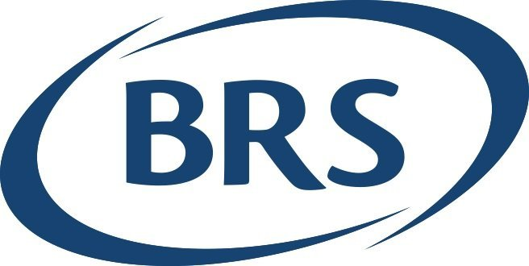
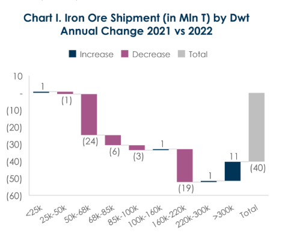
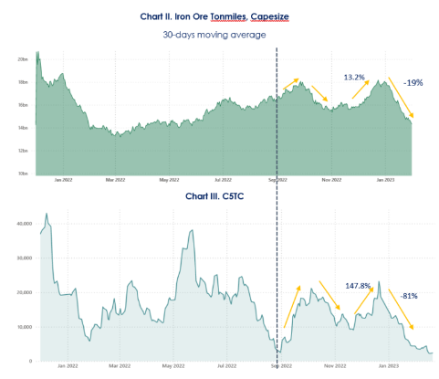
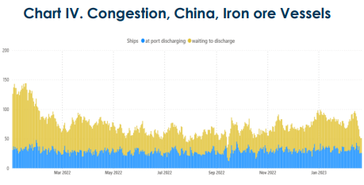
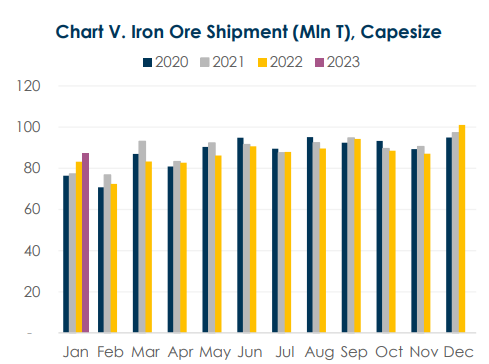
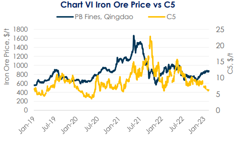
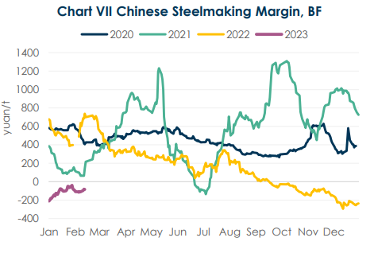

# BRS Dry Bulk Weekly Newsletter

**Date:** February 27, 2023  
**Publisher:** Breakwave Advisors | **Category:** Market Insights  
**Original URL:** [https://www.breakwaveadvisors.com/insights/2023/2/24/brs-dry-bulk-weekly-newsletter](https://www.breakwaveadvisors.com/insights/2023/2/24/brs-dry-bulk-weekly-newsletter)  

---

> **Figure 1: Logo Brs+ +Without+group**  
> [Local Asset](file:///C:/Users/Dell/Github/Shipping/corpus/03-breakwave/insights/2023/assets/2023-02-27_brs-dry-bulk-weekly-newsletter_img_logo-brs2b-2bwithout2bgroup_63f45dbe9867.jpg)

## The Beckoning of Capesize Rates?

Iron ore shipments recorded a slump of 40 million tons in 2022. This was primarily driven by losses in the Capesize (160k dwt~220k dwt), Supramax (50k dwt~68k dwt) and Panamax (68k dwt~85k dwt) categories, which saw reductions of 19 million tons, 24 million tons, and 6 million tons, respectively.

> **Figure 2: 1 (3)**  
> [Local Asset](file:///C:/Users/Dell/Github/Shipping/corpus/03-breakwave/insights/2023/assets/2023-02-27_brs-dry-bulk-weekly-newsletter_img_128329_7c2024520baa.png)

In the beginning of 2023, iron ore seaborne market showed signs of recovery, achieving a historical high of 128.5 million tons of shipments for the January, which is 4.2% higher than that in January 2022. This is because major miners raise shipments to China in anticipation of a strong demand recovery since China scraped its ‘Zero-Covid’ policy. However, it was inadequate to prevent Capesize rates from further decline. C5TC slid sharply from $13,561/day on Jan.3rd to $2,246/day on Feb.17th. Breaking down the iron ore exports by vessel size, a 3.9 million tons of y-o-y increment in Capesize shipments in January was also contrary to market’s intuition of a subdued iron ore market.

As the measurement to quantify the amount of cargo that is transported over a given distance, tonmile can be used as an approximation of demand for shipping capacity.

From the Chart II&III (Quoting from AXS), it indicates a positive correlation between C5TC and tonmile of iron ore transported by Capesize vessels, with both variables moving in the same direction since September 2022.

However, while the correlation between the two variables has become more positive over time, the magnitude of the changes in C5TC is way larger than the changes in tonmile. From Nov. 21st to Dec. 21st, Tonmile increased by 13.2% while C5TC surged by 147.8%. Later, from Dec.21st 2022 to Jan.31st 2023, Tonmile fell by 19% whilst C5TC plunged by 81%.

Compared to the volatility of demand, freight rates display much more pronounced fluctuations during the same period, as we need to include supply side considerations such as congestion (as seen in Chart IV). More than 140 iron ore ships were waiting to be discharged at Chinese port in Jan-2022, while in 2023, the number of waiting iron ore ships fell to around 80 due to the ease of port congestion.

> **Figure 3: 1 (4)**  
> [Local Asset](file:///C:/Users/Dell/Github/Shipping/corpus/03-breakwave/insights/2023/assets/2023-02-27_brs-dry-bulk-weekly-newsletter_img_128429_bbaa535de65e.png)

Therefore, despite a year-on-year growth in iron ore shipment volumes, C5TC was heavily impacted by a monthon-month dip in congestion (Chart V) and ton-miles. Capesize iron ore intakes contracted to 87.1 million tons in Jan. 2023, as compared to 101.1 million tons in Dec. 2022. This contraction appears to follow a seasonality pattern that Australian and Brazilian miners tend to peak sales at the end of the fourth quarter to window dress the financial reports and lower shipments in January and February due to frequent tropical cyclones in west Australia as well as rainy season in Brazil. This regular seasonal retreat, however, was amplified by bearish market sentiments and a drop in congestion this year.

Demand for Capesize capacity is expected to return (modestly) in the second quarter thanks to the revival of the steel industry in China, as 78% of its iron ore imports are transported by Capesize vessels. Steelmaking in China is starting to recover after the Chinese New Year with a steady rise in liquid iron output. Rebound in steel demand is…

> **Figure 4: 1 (8)**  
> [Local Asset](file:///C:/Users/Dell/Github/Shipping/corpus/03-breakwave/insights/2023/assets/2023-02-27_brs-dry-bulk-weekly-newsletter_img_128829_b9ea5cbd8747.png)

> **Figure 5: 1 (9)**  
> [Local Asset](file:///C:/Users/Dell/Github/Shipping/corpus/03-breakwave/insights/2023/assets/2023-02-27_brs-dry-bulk-weekly-newsletter_img_128929_e341740f2357.png)

..expected to be first seen in infrastructure construction. In January, 11,635 projects begun construction, with a total investment of 9381.92 billion yuan. This represents a substantial increase of 244% month-over-month, or 93% year-over-year, according to Mysteel statistics. China's positive fiscal policy and steady monetary policy are providing sufficient funds to accelerate infrastructure activities without restrictions related to Covid-19.

> **Figure 6: 1 (10)**  
> [Local Asset](file:///C:/Users/Dell/Github/Shipping/corpus/03-breakwave/insights/2023/assets/2023-02-27_brs-dry-bulk-weekly-newsletter_img_1281029_3083283da081.png)

In the meanwhile, downside macro risks (like inflation) and uncertainties associated with steel demand still exist, especially in Japan, South Korea, and European Union. But overall speaking, the easing of semiconductor shortage on the manufacturing industries of automobiles and electronics hopefully can offset the pressure on the steel industry in Japan and South Korea.

What needs to be noticed is that a rebound in India’s iron ore exports should have limited impact on Capesize freight rates because 70%~80% of its exports are shipped by Supramax (50k~68k dwt) vessels. India reduced about 19 million tons of iron ore exports in 2022, owing to export tariff was imposed in May 2022, leading to a 17 million tons shrinkage in Supramax intakes. India authorities have reversed export duties on low-grade iron ore to zero in Nov 2022, which have provided a significant boost to India’s iron ore exports. Iron ore Tonmiles of Supramax doubled between Nov 22 and Jan 23. In short term, India may choose to use more Capesize vessels to ship low-grade iron ore to China, as it may be more cost-effective compared to Supramax given current freight rates. But in the long run, Supramax would still dominate its iron ore exports.

Besides demand and supply, commodity prices could also affect freight rates fluctuations. Theoretically, there is a positive correlation between iron ore prices and freight rates. But it is worth noting that, for the Capesize market, freight rates may rise following iron ore prices with a lag of three or four months, as displayed in the chart VI. Thus, a rally in iron ore price since Nov. 2022 may not immediately boost freight rate. Instead, the proportion of freight rate to iron ore price may bottom out in the first half February, based on historical data from the past seven years.

However, since Chinese steelmakers have long been suffering negative margins for more than half a year, it may take longer to raise freight rates this year.

> **Figure 7: 1 (11)**  
> [Local Asset](file:///C:/Users/Dell/Github/Shipping/corpus/03-breakwave/insights/2023/assets/2023-02-27_brs-dry-bulk-weekly-newsletter_img_1281129_cd94ff3973ed.png)
