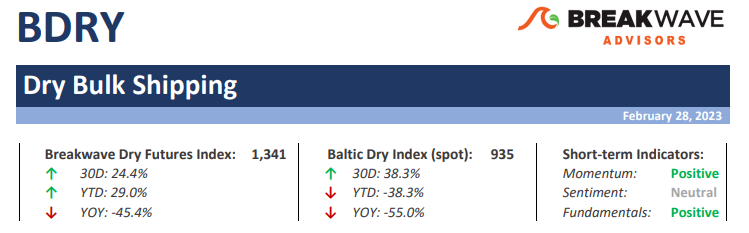
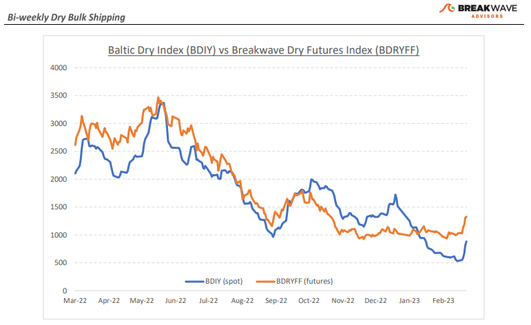
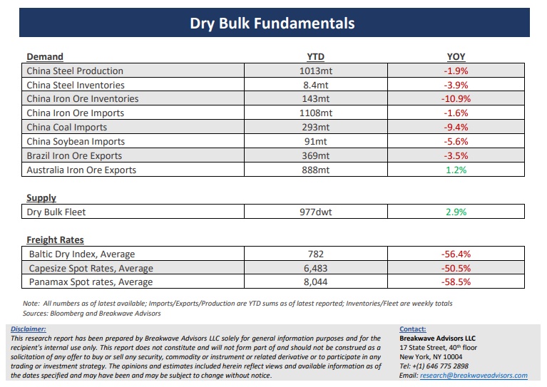

# Breakwave Bi-Weekly Dry Bulk Report - February 28, 2023

**Date:** February 28, 2023  
**Publisher:** Breakwave Advisors | **Category:** Market Insights  
**Original URL:** [https://www.breakwaveadvisors.com/insights/2023/2/27/breakwave-bi-weekly-dry-bulk-report-february-28-2023](https://www.breakwaveadvisors.com/insights/2023/2/27/breakwave-bi-weekly-dry-bulk-report-february-28-2023)  

---

> **Figure 1: Dbreporttop**  
> **Interactive Data & Source:** [Breakwave Advisors Market Insights](https://www.breakwaveadvisors.com/publications) | [Local Asset](file:///C:/Users/Dell/Github/Shipping/corpus/03-breakwave/insights/2023/assets/2023-02-28_breakwave-bi-weekly-dry-bulk-report-february-28-2023_img_dbreporttop_c2d617e8ec12.png)

**•Bottom is in, slope of recovery remains debatable**– Following a long period of dreadful market conditions, the dry bulk market seems to have finally found a bottom. The recent steep rally in rates appears impressive in percentage terms, but in actual dollars the improvement has been marginal. After all, across vessel classes, the increase in spot rates from recent lows has been less than $5,000/day. If indeed we hit bottom, what would the progression of spot rates look like from here? Futures remain optimistic that, by the end of March, Capesize spot rates will barely be in double-digit territory. Yet, history says that such a forecast might be conservative as Capesize rates tend to move in larger increments than a few hundred dollars at a time. For now, market participants remain cautious and not willing to price-in a meaningful recovery just yet, and rightfully so, as China’s appetite for iron ore has been anything but impressive. However, looking forward, if construction activity is expected to push steel prices higher, thus improving profitability for the numerous steel mills in China, then iron ore imports should drive demand for transportation. We remain optimistic about the near-term direction of spot rates and given the major progress that spot rates for smaller asset classes have achieved lately, we would not be surprised to see Capesize rates reaching the high teens by the end of March. Such optimism should be tempered by the fact that inclement weather in Brazil remains a major obstacle for higher iron ore export volumes near term, and although we assume that this is temporary, it might take longer to resolve than we anticipate.

**•One step forward, two steps back when it comes to China’s economic activity**– The anticipation of better demand for industrial commodities out of China can be felt across the markets, but no concrete evidence so far exists to validate such a scenario. Covid restrictions have been lifted, trillions of Yuan have been pumped into the economy and significant fiscal loosening has already taken place. Yet, the world’s second largest economy remains relatively steady, something that is evident by stagnant commodity prices. The early year rally in China-focused investments anticipating China’s reopening is all but gone and investors are left looking for hints of changing patterns in industrial activity. It will take months for last year’s shocking deceleration to be digested and for confidence to return to that part of the world. Shipping is a leading indicator when it comes to China, and we expect that it will also be an early beneficiary this time around. It is impossible to time turning points in such an uncertain world, but we remain of the opinion that the odds point to higher activity for the months to come.

**•Dry bulk focus shifts back to fundamentals**– Following a period of high uncertainty and significant disruptions across the commodity spectrum, the gradual normalization of trade is shifting the market’s attention back to the traditional demand and supply dynamics that have shaped dry bulk profitability for decades. As effective fleet supply growth for the next few years looks marginal, demand will be the main determinant of spot freight rates with China returning back to the driver’s seat as the dominant force of bulk imports and thus shipping demand.

[Subscribe: Bi-Weekly Dry Bulk Report](https://www.breakwaveadvisors.com/publications)

> **Figure 2: Dbreportchart**  
> [Local Asset](file:///C:/Users/Dell/Github/Shipping/corpus/03-breakwave/insights/2023/assets/2023-02-28_breakwave-bi-weekly-dry-bulk-report-february-28-2023_img_dbreportchart_70a540ae9dd0.png)

> **Figure 3: Dbreportbottom**  
> [Local Asset](file:///C:/Users/Dell/Github/Shipping/corpus/03-breakwave/insights/2023/assets/2023-02-28_breakwave-bi-weekly-dry-bulk-report-february-28-2023_img_dbreportbottom_a218b2a4d5c3.png)
