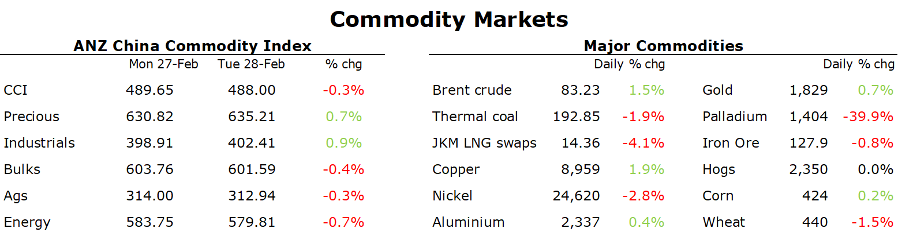

# Oil gains as disruptions to Russian supply mounts

**Date:** March 01, 2023  
**Publisher:** Breakwave Advisors | **Category:** Market Insights  
**Original URL:** [https://www.breakwaveadvisors.com/insights/2023/3/1/oil-gains-as-disruptions-to-russian-supply-mounts](https://www.breakwaveadvisors.com/insights/2023/3/1/oil-gains-as-disruptions-to-russian-supply-mounts)  

---

*By*[*Daniel Hynes*](https://www.linkedin.com/in/dahynes/)

Another positive session for risk appetite saw commodity markets edge higher. This was aided by further supply side issues across energy and metal markets.

> **Figure 1: 1677618071697**  
> **Interactive Data & Source:** [Publications Anz](https://publications.anz.com/SingletrackCMS__DownloadDocument?docRef=8a54490c-e509-4473-9213-703f18e792ea&uid=bd219b92-f5cc-400e-9646-4178791864b7&jobRef=cf22bad3-e45d-430c-bf5d-2634a627ea7f) | [Local Asset](file:///C:/Users/Dell/Github/Shipping/corpus/03-breakwave/insights/2023/assets/2023-03-01_oil-gains-as-disruptions-to-russian-supply-mounts_img_1677618071697_2246531a4625.png)

**Crude oil**jumped amid fears of further disruptions to Russian supply. Poland announced it is winding down its purchases of Russian oil in February and March. India, which ramped up purchases of Russian crude over the past 12 months, is now facing increasing headwinds to those trade flows. Onerous demands from prospective buyers wary of breaching sanctions are slowing down transactions. As much as 1.9mbbl of Russian processed diesel is also currently in floating storage, as buyers are increasingly shunning the sanctioned fuel. This comes after Russia warned it will reduce output by 500kb/d, outside of the lower quotas that the OPEC+ allowance agreed to late last year. Growth in shale oil output in the US could also disappoint. The Federal Reserve Bank of Dallas warned that growth could be as low as 300kb/d this year amid labour shortages and supply chain bottlenecks.

**European gas**extended recent losses as the end of the heating season approaches. Demand is likely to remain limited as temperatures in the northwest of the continent are set to rise to normal levels by mid-March. The spectre of additional LNG shipments in the Atlantic market is also hanging over the market. Freeport has sought permission for commercial operations of the remaining LNG train at its export terminal. However, the IEA warned supply shortages may not be over. The reopening of China could see its imports surge as much as 35% in 2023. This could spark fierce competition for LNG and could see prices return to unsustainable levels. This is an issue[**we raised last week**](https://publications.anz.com/SingletrackCMS__DownloadDocument?docRef=8a54490c-e509-4473-9213-703f18e792ea&uid=bd219b92-f5cc-400e-9646-4178791864b7&jobRef=cf22bad3-e45d-430c-bf5d-2634a627ea7f). The restart of Freeport also weighed on**North Asian LNG**prices. With the end of winter approaching, Asia buyers were also reluctant to dip into the spot market amid plentiful inventories.

The positive risk appetite across markets helped push the**base metals**sector higher. Copper gained, as did aluminium and zinc. This helped offset easing supply side concerns. Freeport-McMoRan announced it would be restarting its giant Grasberg copper mine after a landslide triggered an outage last month. In aluminium, London Metal Exchange warehouses have experienced a series of big inflows of metal. Spot**lithium**prices in China fell as concerns of supply disruption eased. Operations in China’s Yichun province had been ordered to halt work indefinitely, potentially impacting between 8-13% of global supply. However, mines with valid permits are now allowed to restart, according to local media.

**Iron ore**futures managed to edge higher amid expectations of a recovery in demand ahead of the peak construction period. New home sales in Guangzhou and Shenzhen rose in the week ending 27 February. Investors are also expecting further support for the sector at this week’s Two Sessions meeting in Beijing

Data source:[Commodities Wrap](https://www.linkedin.com/newsletters/commodities-wrap-6692196755876012032/?fbclid=IwAR3kiXJqZdxmp9ZcRwBNI7FsBySI-XSC0pfPur1qzjt7OZp7PTE59Tsl1QI)
