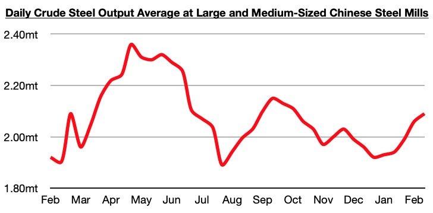
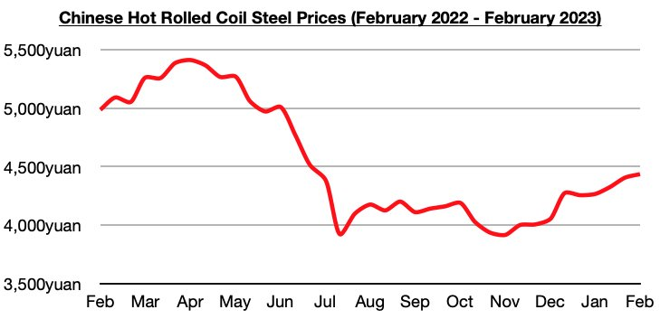
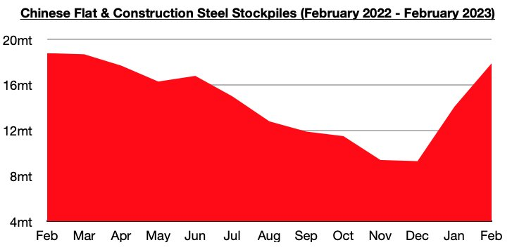

# Ongoing Improvement in China's Steel Market

**Date:** March 02, 2023  
**Publisher:** Breakwave Advisors | **Category:** Market Insights  
**Original URL:** [https://www.breakwaveadvisors.com/insights/2023/3/2/ongoing-improvement-in-chinas-steel-market](https://www.breakwaveadvisors.com/insights/2023/3/2/ongoing-improvement-in-chinas-steel-market)  

---

*By*[*Jeffrey Landsberg*](https://www.linkedin.com/in/jeffrey-landsberg-70ab957/)

Newly released data shows that daily crude steel production at large and medium-sized mills in China averaged 2.09 million tons during February 11 - 20. This is 1% more than was seen during early February and is up year-on-year by 10%. Prior to this month, the last time that production at large and medium-sized mills was up on a year-on-year basis was back in the middle of December.

> **Figure 1: Chart 1 (72)**  
> [Local Asset](file:///C:/Users/Dell/Github/Shipping/corpus/03-breakwave/insights/2023/assets/2023-03-02_ongoing-improvement-in-chinas-steel-market_img_chart1287229_32fc4cd2fe30.jpg)

Steel production has continued to climb in China in recent weeks and has now climbed to the highest level seen since early October. Overall, it is encouraging that steel prices in China have also continued to climb while steel production has been increasing. Steel prices in China have now increased during fourteen of the last sixteen weeks and are at the highest level since July. Also encouraging is that steel stockpiles remain down on a year-on-year basis. While it remains to be seen just how high steel production will climb, we continue to stress that China's steel production is not exceeding demand. It remains very encouraging that both steel prices and steel production are rising.

> **Figure 2: Chart 2 (61)**  
> [Local Asset](file:///C:/Users/Dell/Github/Shipping/corpus/03-breakwave/insights/2023/assets/2023-03-02_ongoing-improvement-in-chinas-steel-market_img_chart2286129_0fbd0d9d316a.jpg)

Stockpiles of flat and construction steel products in China have continued to rise, but the climb is very seasonal and occurs throughout the first quarter of every year. Remaining significant is that stockpiles are down on a year-on-year basis and that the gap between last year’s stockpiles also continues to widen. Stockpiles ended last week at approximately 17.9 million tons and are now down year-on-year by 900,000 tons (-5%).

> **Figure 3: Chart 3 (44)**  
> [Local Asset](file:///C:/Users/Dell/Github/Shipping/corpus/03-breakwave/insights/2023/assets/2023-03-02_ongoing-improvement-in-chinas-steel-market_img_chart3284429_fd5595df8da5.jpg)
