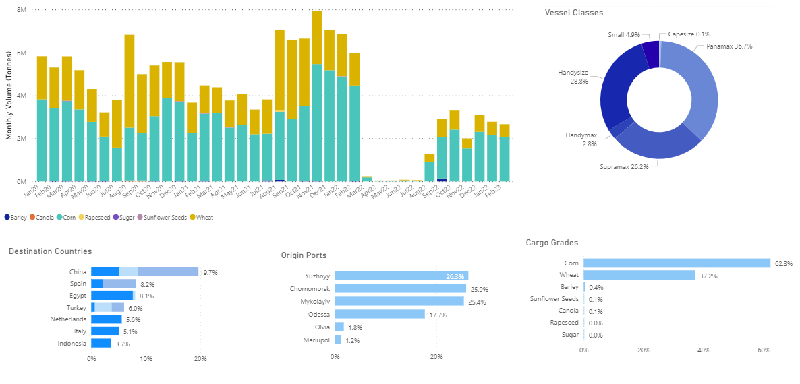
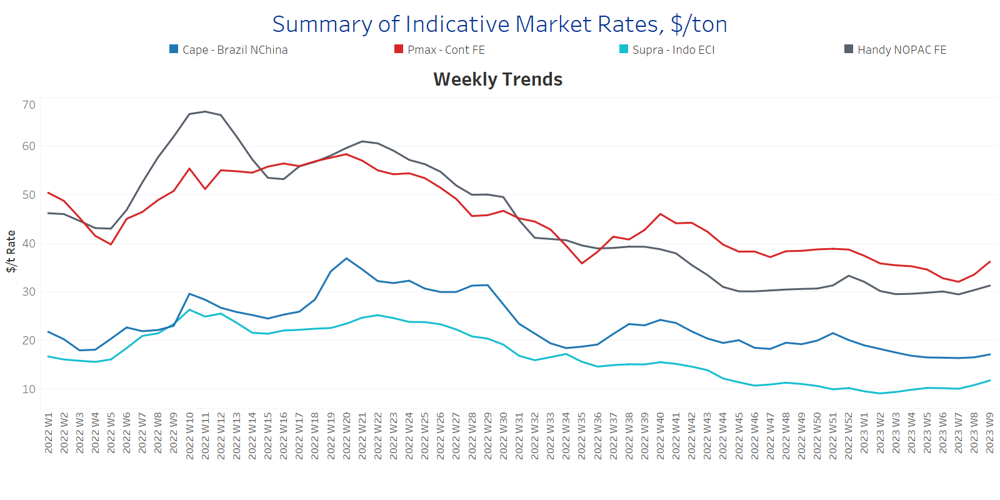
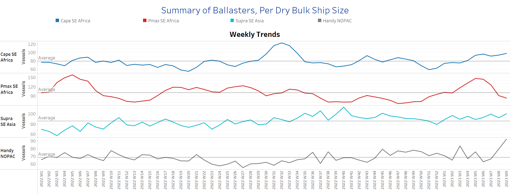
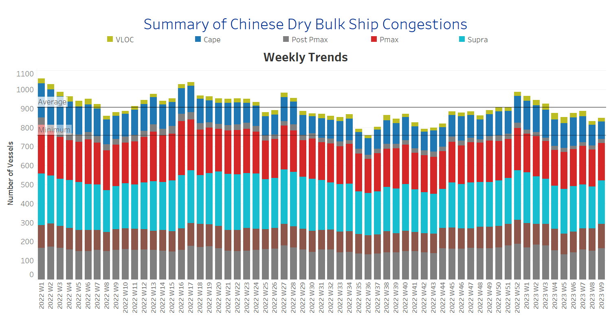

# Signal Dry Bulk Weekly Report

**Date:** March 03, 2023  
**Publisher:** Breakwave Advisors | **Category:** Market Insights  
**Original URL:** [https://www.breakwaveadvisors.com/insights/2023/3/3/signal-dry-bulk-weekly-report](https://www.breakwaveadvisors.com/insights/2023/3/3/signal-dry-bulk-weekly-report)  

---

## Chart of the Week Dry Bulk: Ukrainian Bulk Exports Gradually Increase in 1st Quarter

> **Figure 1: Market Chart 1**  
> **Interactive Data & Source:** [Signal Ocean Platform](https://go.signalocean.com/e/983831/dry-dynamic-drybulkflows/2npkhv/305114794?h=pAy9le8rkB7u7QkG-yJ3us2a-FAIQ4YNM8wz7C5l2xk) | [Local Asset](file:///C:/Users/Dell/Github/Shipping/corpus/03-breakwave/insights/2023/assets/2023-03-03_signal-dry-bulk-weekly-report_img_unnamed-2023-03-03t123834089_6942e7607bb3.png)

Data Source: The Signal Ocean Platform, Dry bulk flows

[Signal Ocean Platform](https://go.signalocean.com/e/983831/dry-dynamic-drybulkflows/2npkhv/305114794?h=pAy9le8rkB7u7QkG-yJ3us2a-FAIQ4YNM8wz7C5l2xk)​​​​

The first days of March brought positive momentum in freight rates for the smaller and larger vessel segments, with clear signs of an increase in demand in the Capesize segment fueling expectations for stronger momentum towards the end of the first quarter. In the grain segment, we have also seen a gradual smoothing of export flows for dry bulk from Ukraine to all destinations, with the Supramax and Panamax segment gaining momentum of rates in the beginning of the year. However, the continuation of Ukrainian export flows remains uncertain, as Ukraine has appealed to UN and Turkey to begin negotiations on extending a grain export agreement, but has received no response, Reuters reports. It remains to be seen whether an extension will happen, as Russia has said it will agree to extend the agreement only if it is in Moscow's interest to export grain from Ukraine's Black Sea ports, the Russian Foreign Ministry said in a March 1 statement.

For more information on this week's trends, see the analysis sections below: Freight Market, Supply, Demand and Port Congestion

## Section 1/ Freight -Market Rates ($/T) Firmer

‘The Big Picture’ - Capesize and Panamax Bulkers and Smaller Ship Sizes

> **Figure 2: Market Chart 2**  
> **Interactive Data & Source:** [Signal Ocean Platform](https://www.thesignalgroup.com/signal-ocean-platform) | [Local Asset](file:///C:/Users/Dell/Github/Shipping/corpus/03-breakwave/insights/2023/assets/2023-03-03_signal-dry-bulk-weekly-report_img_unnamed-2023-03-03t123936288_915af3eb17f5.png)

February ended with stronger momentum in rates, having previously declined on a weekly basis, with clear signs of an upturn in the Panamax segment.

- **Capesize**vessel freight rates are now at $17/tonne, trending above $17/tonne for the first time since the end of the third week.
- **Panamax**vessel freight rates fromtheContinent to the Far East are over $36/tonne, $4/tonne more than two weeks ago.
- **Supramax**freight rates for the Indo-ECI route held above $11/tonne, with signs of further firming in early March.
- **Handysize**freight rates for the NOPAC route to the Far East are now at $31/tonne, with slight signs of slow recovery for early March.

## Section 2/ Supply -Ballasters (# Vessels) Increasing

> **Figure 3: Supply Trend Lines for Key Load Areas**  
> **Interactive Data & Source:** [Signal Ocean Platform](https://www.thesignalgroup.com/signal-ocean-platform) | [Local Asset](file:///C:/Users/Dell/Github/Shipping/corpus/03-breakwave/insights/2023/assets/2023-03-03_signal-dry-bulk-weekly-report_img_unnamed-2023-03-03t124013250_ac2f12e1c1d3.png)

The number of ballast vessels continued to increase significantly in the Handysize segment, with an upward trend in all size classes, with the exception of Panamax vessels, which saw a downward trend for two consecutive weeks.

- **Capesize**SE Africa: The number of vessels now stands at 93, which is 14 more than the average for the year and 57% more than the lowest level in week 51.
- **Panamax**SE Africa: The number of vessels has fallen to 83, 18 below the annual average and 43% below the level of week 5.
- **Supramax**SE Asia: The number of vessels increased to 97, 8 more than week 5 and 23% above the year-end 2022 low.
- **Handysize**NOPAC: The number of ships has risen to over 90 in the last three weeks, with a tendency for another sharp increase in the first days of March.

## Section 3/ Demand -TonDays Increasing

> **Figure 4: TonDays Increasing**  
> **Interactive Data & Source:** [Signal Ocean Platform](https://www.thesignalgroup.com/signal-ocean-platform) | [Local Asset](file:///C:/Users/Dell/Github/Shipping/corpus/03-breakwave/insights/2023/assets/2023-03-03_signal-dry-bulk-weekly-report_img_unnamed-2023-03-03t124113980_35b9b0217622.png)

February ended with a lower trend in the number of ship congestions, compared to the last peak in week 2, but early March seems to be trending up, with the Supramax and Handysize segments leading the increase.

- **Capesize:**The number of vessels is 94, down 16 from the previous week, with a downward trend in early March.
- **Panamax:**The number of vessels decreased to 191, 3 less than the previous week.
- **Supramax:**The number of vessels is now at 236, 14 more than the previous week.
- **Handysize**: The number of congested vessels has risen to 169, 10 more than in the previous two weeks, with a trend towards new highs after the last highs in week 2.

Data Source:[Signal Ocean Platform](https://www.thesignalgroup.com/signal-ocean-platform)
