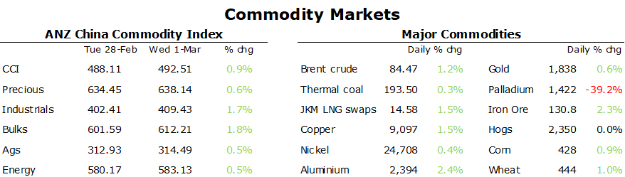

# Strong economic data in China boosts sentiment

**Date:** March 03, 2023  
**Publisher:** Breakwave Advisors | **Category:** Market Insights  
**Original URL:** [https://www.breakwaveadvisors.com/insights/2023/3/3/strong-economic-data-in-china-boosts-sentiment](https://www.breakwaveadvisors.com/insights/2023/3/3/strong-economic-data-in-china-boosts-sentiment)  

---

*By*[*Daniel Hynes*](https://www.linkedin.com/in/dahynes/)

Better than expected economic data in China saw commodities rally across the board as hopes of a rebound in demand rose. This was aided by signs of stronger demand in other parts of Asia.

> **Figure 1: 1677703977520**  
> **Interactive Data & Source:** [Linkedin](https://www.linkedin.com/newsletters/commodities-wrap-6692196755876012032/?fbclid=IwAR3kiXJqZdxmp9ZcRwBNI7FsBySI-XSC0pfPur1qzjt7OZp7PTE59Tsl1QI) | [Local Asset](file:///C:/Users/Dell/Github/Shipping/corpus/03-breakwave/insights/2023/assets/2023-03-03_strong-economic-data-in-china-boosts-sentiment_img_1677703977520_1aaa2ff6c8df.png)

**Base metals**rallied. Economic data highlight a stronger recovery in demand is imminent. China’s Purchasing Manufacturers Index for February hit its highest level since 2012, beating most estimates, as factory’s reopened after the Lunar New Year holiday. This was the first set of comprehensive data released since COVID-19 restrictions ended late last year. It comes ahead of next week’s National People’s Congress where a new growth target will be disclosed. Expectations of lower demand from the electric vehicle sector may need to be reset, after Deputy Finance Minister Xu said China will extend the sales-tax exemption for new energy vehicles and is looking at new policies to further support the sector. The Ministry of Commerce is also looking at measures to expand consumption.

**Iron ore**futures were also up sharply after home sales by major developers rose in February for the first time in 20 months, aided by positive signs of demand in the steel sector. Almost two-thirds of steel companies expect sales to improve this month, according to Mysteel. Data released yesterday revealed how weak the sector was in 2022, with total output falling 1.7% to 1.018bn tonnes.

**Crude oil**edged higher amid signs of stronger demand in Asia and Europe. US commercial crude oil inventories gained less than expected last week, rising only 1,166kbbl. However, US exports of crude hit a record high of 5,629kbbl last week (+22.4% w/w). Apparent demand subsequently rose, driven by strong gains in gasoline and jet fuel oil. This help offset concerns that the US economy is slipping into recession. Federal Reserve officials said interest rates will need to increase further and stay elevated into next year to curb inflation. Supply side issues also lent some support. Bloomberg tanker tracker data showed large drops in oil exports from Brazil, Iraq and Russia last month. Shipments from Qatar also hit a three-month high. Russia said it will take a pragmatic approach when deciding on potential cuts in oil output beyond March, said Deputy Energy Minister, Pavel Sorokin. Russia announced last month that it will reduce output by 500kb/d, outside of the lower quotas that the OPEC+ allowance agreed late last year.

**European gas**ended the session higher on forecasts of a cold snap before the end of the heating season. Temperatures are forecast to be below normal across most of the continent with chances of snow early in the month, according to Maxar Technologies. The industry is also facing the challenge of refilling storage. April marks the summer gas season when storage facilities are replenished. The market remains concerned that Russia will once again reduce supplies to Europe just as demand rises in China.**North Asian LNG**prices were steady as India ramped up interest in the spot market.

Data source:[Commodities Wrap](https://www.linkedin.com/newsletters/commodities-wrap-6692196755876012032/?fbclid=IwAR3kiXJqZdxmp9ZcRwBNI7FsBySI-XSC0pfPur1qzjt7OZp7PTE59Tsl1QI)
