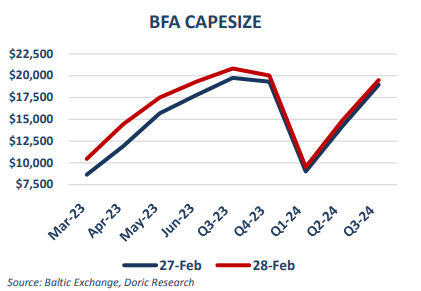
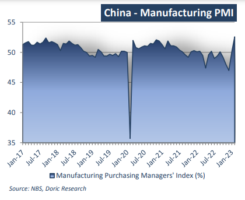

# Doric Weekly Market Insight

**Date:** March 06, 2023  
**Publisher:** Breakwave Advisors | **Category:** Market Insights  
**Original URL:** [https://www.breakwaveadvisors.com/insights/2023/3/6/doric-weekly-market-insight](https://www.breakwaveadvisors.com/insights/2023/3/6/doric-weekly-market-insight)  

---

## “With the Effect of the Holidays... and the Repercussions of the Epidemic Fading Away, the Recovery of Production by Manufacturing Companies Accelerated and Demand Continued to Rise”

*By*[*Michalis Voutsinas*](https://www.linkedin.com/in/michalis-voutsinas-587544163/)

The ninth trading week started with Asian shares landing at two-month lows, as markets were forced to price in ever-loftier peaks for US and European interest rates. In sync, Dalian and Singapore iron ore futures extended losses on Monday on concerns over short-term weaker demand. On Saturday, steel production hub Tangshan was required to shutter some capacity in response to heavy pollution, negatively affecting trading activity on the early side of the week. Conversely, signs of increased import demand from India have arrested the decline in price of the thermal coal. As the peak summer period approaches, a possible electricity shortfall has prompted utilities in the world’s second largest coal consumer to increase their appetite for Indonesian cargoes.

Whilst a rather mixed feeling in the commodity markets has become apparent on the early side of the week, the spot and forward markets of the dry bulk sector didn’t seem to have second thoughts. On Tuesday, FFAs continued to move up into new highs, with the front end of the Capesize curve reporting double-digit percentage gains. Shaping a steep Contango part in the front end of the Capesize curve, May and June contracts concluded materially higher on Tuesday’s closing at $14,436 and $17,493 daily respectively. On the same wavelength, the rest of the pack followed closely, with prompt months shifting upwards.

> **Figure 1: 1 (4)**  
> **Interactive Data & Source:** [Doric](https://www.doric.gr/) | [Local Asset](file:///C:/Users/Dell/Github/Shipping/corpus/03-breakwave/insights/2023/assets/2023-03-06_doric-weekly-market-insight_img_128429_3825ec67b5c8.png)

Adding fuel to the flames, on Wednesday, China’s national bureau of statistics reported that the domestic manufacturing sector expanded at its fastest pace in more than a decade last month, in one of the clearest signs that the world’s second-largest economy is steering clear of the effects of a nationwide Covid-19 outbreak. In fact, the official manufacturing sector purchasing managers’ index balanced at 52.6 points last month, up from January’s reading of 50.1 and well above economists’ expectations of 50.5 points. Indicative of the positive development is that the aforementioned levels are the highest since April 2012. Among the five sub-indices that constitute the manufacturing PMI, the production index, new order index, employee index and supplier delivery time index were all higher than the threshold. On the other hand, the raw material inventory index was lingering below the threshold of 50 points. In particular, the production index came at 56.7 percent, indicating that manufacturing production activities have accelerated significantly. The new order index lay at 54.1 percent, pointing to an increasing demand in the manufacturing industry. The raw material inventory index was 49.8 percent, indicating that the inventory of major raw materials in the manufacturing industry continued to narrow.

> **Figure 2: 1 (5)**  
> **Interactive Data & Source:** [Doric](https://www.doric.gr/) | [Local Asset](file:///C:/Users/Dell/Github/Shipping/corpus/03-breakwave/insights/2023/assets/2023-03-06_doric-weekly-market-insight_img_128529_8193a6a9fed1.png)

For the steel industry in North China’s Hebei province in specific, the Purchasing Managers' Index strengthened for a third consecutive month during February to touch afresh a five-year high of 60.7 points, jumping by another 9.6 basis points on month, according to the latest data released by the Hebei Metallurgical Industry Association. Although the global economy is under pressure and steel consumption growth has slowed, Chinese steel exports still found some upward momentum on the back of improved global supply-chain conditions, the Association stressed in a statement. This caused the sub-index for new export orders in February to rise 4.5 basis points on month to 46.2 points, yet still remaining below the 50-point threshold that separates expansion from contraction.

“With the effect of the holidays... and the repercussions of the epidemic fading away, the recovery of production by manufacturing companies accelerated and demand continued to rise,” according to the senior statistician of the National Bureau of Statistics Zhao Qinghe. Riding this wave, the Baltic Dry Index has been on a rise the last couple of weeks, stepping into the four-digit territory and concluding today at 1211 points.

Data source:[Doric](https://www.doric.gr/)
