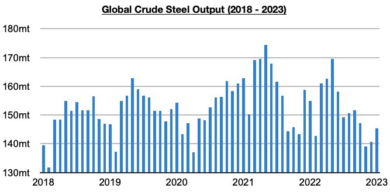
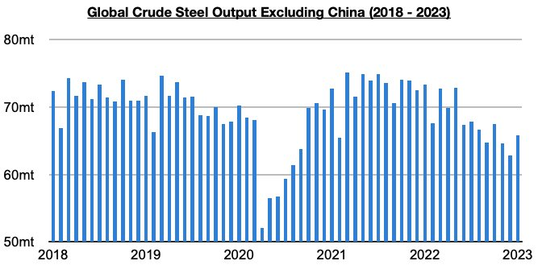

# Ongoing Steel Production Contraction Outside of China

**Date:** March 07, 2023  
**Publisher:** Breakwave Advisors | **Category:** Market Insights  
**Original URL:** [https://www.breakwaveadvisors.com/insights/2023/3/7/ongoing-steel-production-contraction-outside-of-china](https://www.breakwaveadvisors.com/insights/2023/3/7/ongoing-steel-production-contraction-outside-of-china)  

---

*By*[*Jeffrey Landsberg*](https://www.linkedin.com/in/jeffrey-landsberg-70ab957/)

Global crude steel production totaled 145.3 million tons in January. This is up month-on-month by 4.6 million tons (3%) but is 9.7 million tons (-6%) less than was reported last year for January 2022’s production. Global crude steel production has now contracted on a year-on-year basis for three straight months and during fifteen of the last seventeen months. It is very rare for global steel production to contract for such a long period, and the contraction recently has been entirely outside of China. China’s crude steel production increased on a year-on-year basis last month by 500,000 tons (1%).

> **Figure 1: Chart 1 (73)**  
> [Local Asset](file:///C:/Users/Dell/Github/Shipping/corpus/03-breakwave/insights/2023/assets/2023-03-07_ongoing-steel-production-contraction-outside-of-china_img_chart1287329_9f5c35828314.jpg)

Global crude steel production outside of China totaled 65.8 million tons last month. This is up month-on-month by 3 million tons (5%) but is 7.5 million tons (-10%) less than was reported last year for January 2022’s production. Concerning is that global crude steel production outside of China has now contracted on a year-on-year basis for eleven straight months. It remains clear that the world outside of China is undergoing very significant economic distress. Problems remain on both the retail and industrial sides.

> **Figure 2: Chart 2 (62)**  
> [Local Asset](file:///C:/Users/Dell/Github/Shipping/corpus/03-breakwave/insights/2023/assets/2023-03-07_ongoing-steel-production-contraction-outside-of-china_img_chart2286229_d0fd7f6c2ec1.jpg)
