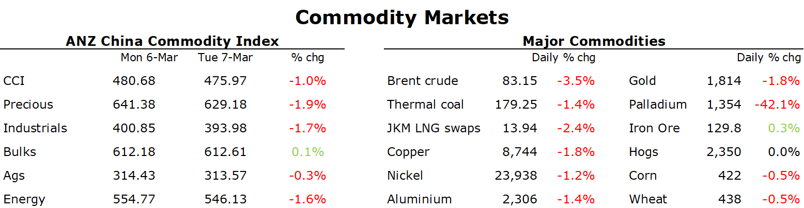

# Sentiment dented by hawkish comments from Fed

**Date:** March 08, 2023  
**Publisher:** Breakwave Advisors | **Category:** Market Insights  
**Original URL:** [https://www.breakwaveadvisors.com/insights/2023/3/8/sentiment-dented-by-hawkish-comments-from-fed](https://www.breakwaveadvisors.com/insights/2023/3/8/sentiment-dented-by-hawkish-comments-from-fed)  

---

*By*[*Daniel Hynes*](https://www.linkedin.com/in/dahynes/)

Hawkish comments from central bankers weighed on sentiment across markets. The subsequent risk off tone saw commodities come under pressure.

> **Figure 1: 1678224961481**  
> **Interactive Data & Source:** [Linkedin](https://www.linkedin.com/newsletters/commodities-wrap-6692196755876012032/?fbclid=IwAR3kiXJqZdxmp9ZcRwBNI7FsBySI-XSC0pfPur1qzjt7OZp7PTE59Tsl1QI) | [Local Asset](file:///C:/Users/Dell/Github/Shipping/corpus/03-breakwave/insights/2023/assets/2023-03-08_sentiment-dented-by-hawkish-comments-from-fed_img_1678224961481_687d71bb8f0d.png)

**Crude oil**extended losses after Fed Chair Jerome Powell warned that the central bank may need to raise rates faster than expected, and to a higher endpoint. This raised concerns of weaker demand in the US. Inventories have been rising sharply in recent weeks, while EIA’s measure of apparent demand for gasoline remains at a two-year low. This offset any optimism of stronger demand from China. Earlier in the week, the tone at CERAWeek was positive. Saudi Aramco CEO Amin Nasser said demand from China is very strong, a view global trader Trafigura also supports. The focus has also been on supply. OPEC Chief Haitham Al-Ghais met with US shale bosses on the sidelines of the conference. EIA lowered its crude oil production forecasts for US supply for both this year and next amid signs of subdued growth and higher costs.

**European gas**rebounded as the region faces a prolonged cold spell that could push demand higher. The UK is facing snow and ice throughout the week as the arctic blast moves across the country. Britain’s grid operator was forced to call on a back-up coal plant to make up for the energy shortfall. Concerns of disruption to LNG supply also emerged. French LNG import terminals were shut on Tuesday amid widespread strikes across the country. In the US, energy regulators continue to delay the full restart of the Freeport LNG export terminal. North Asian LNG prices were steady, with buyers remaining on the sidelines.

**Gold**fell sharply following the hawkish comments from the Fed Chair. The USD rallied and Treasury yields advanced, which weighed on investor appetite for the precious metal. This was despite signs that central banks remain strong buyers. Data on Tuesday showed that China increased its gold reserves for a fourth month in February, joining other Asian nations in raising holdings as the USD’s strength waned.

**Base metals**headed lower amid mixed signals from China. Imports of key commodities for the first two months of the year showed an uneven recovery in demand. Mined**copper**ore imports increase but inflows of refined copper declined. Supply side issues could also ease. The Peruvian government expects shipments of copper and zinc will normalise with days, following months of social unrest prompted by the impeachment of former President Pedro Castillo. MMG Ltd’s Las Bambas copper mines could restart shipments by the end of the week.

**Iron ore**futures gained amid optimism steel demand is picking up ahead of China’s peak construction period. Rio Tinto said it is seeing good demand from China as COVID-19 restrictions are eased. Imports of iron ore rose 7.3% y/y in Jan-Feb, as steel mills look to restock as warmer weather encourages construction work.

Data source:[Commodities Wrap](https://www.linkedin.com/newsletters/commodities-wrap-6692196755876012032/?fbclid=IwAR3kiXJqZdxmp9ZcRwBNI7FsBySI-XSC0pfPur1qzjt7OZp7PTE59Tsl1QI)
