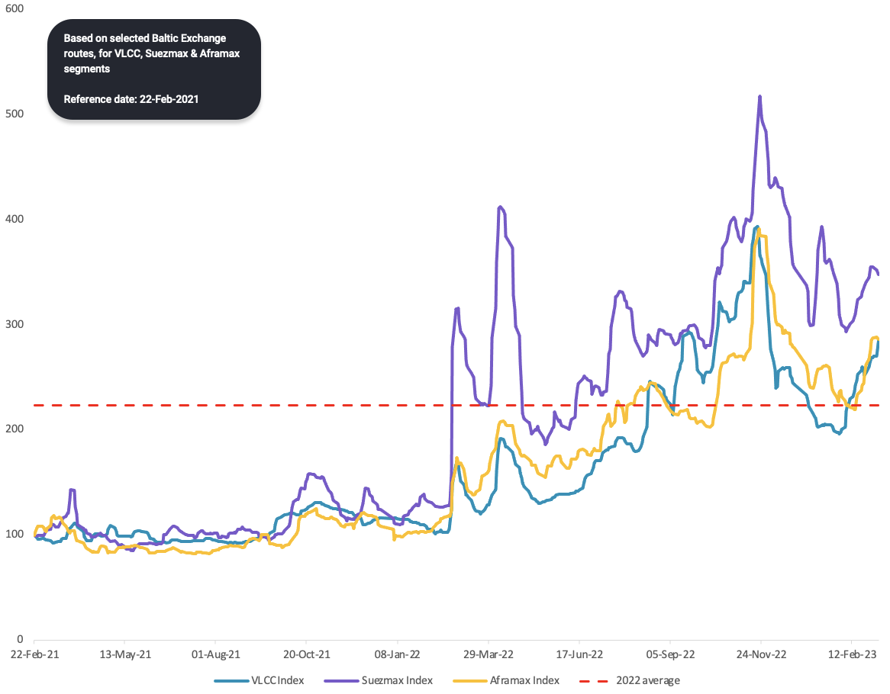
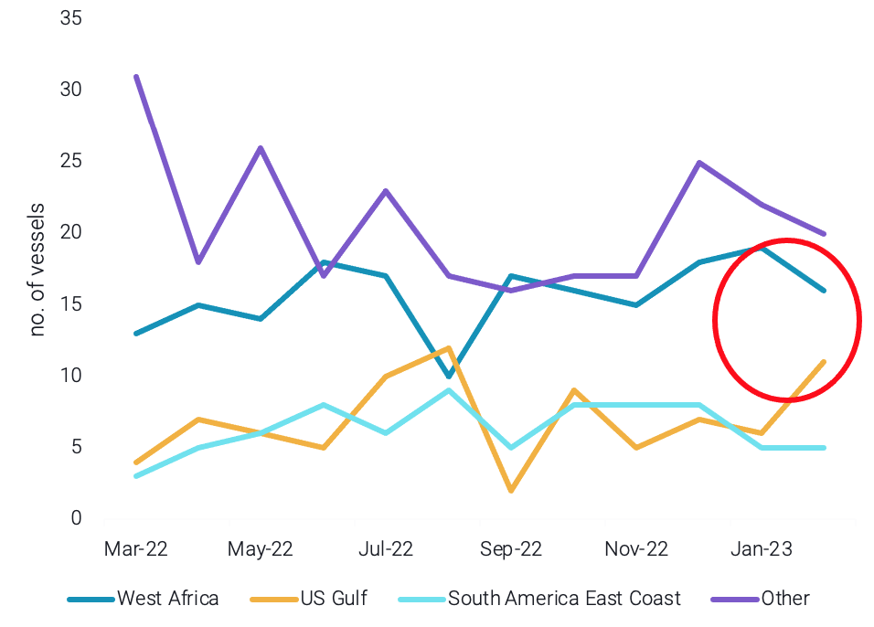

# Vortexa Freight Weekly

**Date:** March 10, 2023  
**Publisher:** Breakwave Advisors | **Category:** Market Insights  
**Original URL:** [https://www.breakwaveadvisors.com/insights/2023/3/9/vortexa-freight-weekly](https://www.breakwaveadvisors.com/insights/2023/3/9/vortexa-freight-weekly)  

---

## Vlccs in the Driver’s Seat || West African Suezmaxes Pick Up

By[Dylan Simpson](https://www.linkedin.com/search/results/all/?fetchDeterministicClustersOnly=false&heroEntityKey=urn%3Ali%3Afsd_profile%3AACoAACDtdn0BzHNR8syu_G8WxL-JXL-9PRT5AP4&keywords=dylan%20simpson&origin=RICH_QUERY_SUGGESTION&position=0&searchId=55ecee69-a408-47b2-8686-68f172e21af1&sid=mVl)

> **Figure 1: Vlccs in the Driver’s Seat in Latest Crude Freight Rate Increase**  
> **Interactive Data & Source:** [Marketingmail Vortexa](https://marketingmail.vortexa.com/ODM3LU1aRS01NzgAAAGKYOGJ2LKnmLfDwwcdJb1KwjdyH8dU-GMogGrNL3vEJOnRM09lrx4G1GuUwhDw0OP4gy3RhwM=) | [Local Asset](file:///C:/Users/Dell/Github/Shipping/corpus/03-breakwave/insights/2023/assets/2023-03-10_vortexa-freight-weekly_img_unnamed-2023-03-09t132659146_013b83bd86d8.png)

- Crude freight rates have stabilised and rebounded above the average level for 2022. This is in line with a general upward trend in crude tonne-miles across all the major vessel classes.[VLCCs](https://marketingmail.vortexa.com/ODM3LU1aRS01NzgAAAGKYOGJ2LKnmLfDwwcdJb1KwjdyH8dU-GMogGrNL3vEJOnRM09lrx4G1GuUwhDw0OP4gy3RhwM=)show the strongest upside in tonne-miles, followed by[Aframaxes](https://marketingmail.vortexa.com/ODM3LU1aRS01NzgAAAGKYOGJ2tFOn6B60UKiacdJBYo2ChmSaOkrvd4OY_crpoBPubTjsancWeiEe7-0ZKpGelUlosg=).[Suezmax](https://marketingmail.vortexa.com/ODM3LU1aRS01NzgAAAGKYOGJ2auDnZecB-jND8yfbkHwEI-k2E-8WrdSvSZN8wEE0zhFy1-JBw8FIWmi0x3USL437KE=)tonne-miles are not increasing, but remain flat overall. On the supply side, there is tightness in the crude tanker market, with more laden than ballast vessels in the VLCC and Suezmax segments.

- VLCC fundamentals are clearly the most supportive, driving the increase in rates, as were the first to stabilise due to increased Chinese buying. Other tanker classes followed suit with somewhat supportive fundamentals and market sentiment in their favour.
- Looking ahead, crude buying from China could be sustained in March as domestic demand continues to increase. Additionally, China’s[crude inventories](https://marketingmail.vortexa.com/ODM3LU1aRS01NzgAAAGKYOGJ2dnrlCB4pnfC3RuN8G0NWrk9j7rDEFiwh6H2jXl_QcN2GGa8YivegnychgscApxUa6k=)showed a draw last month, indicating increased domestic refining demand. This could support VLCCs towards China and continue to support crude freight rates in March.

## West Africa Suezmax Rates Pick Up in a Tight Tanker Market, But Fundamentals Provide Mixed Signals

> **Figure 2: Suezmax Ballasters After Discharging West African Crude Per**  
> *Suezmax ballasters after discharging West African crude per destination region*  
> **Interactive Data & Source:** [Marketingmail Vortexa](https://marketingmail.vortexa.com/ODM3LU1aRS01NzgAAAGKYOGJ2cXBKNZ4VtFqg8UFbPYQ5gov-pX_usIagXFWdQulCsjhl85VPWOOVw_9rbv7nMgzHMQ=) | [Local Asset](file:///C:/Users/Dell/Github/Shipping/corpus/03-breakwave/insights/2023/assets/2023-03-10_vortexa-freight-weekly_img_unnamed-2023-03-09t132929531_7b6b4136744d.png)

- Suezmax rates out of West Africa, like the West Africa-to-UK Cont ([TD20](https://marketingmail.vortexa.com/ODM3LU1aRS01NzgAAAGKYOGJ2cXBKNZ4VtFqg8UFbPYQ5gov-pX_usIagXFWdQulCsjhl85VPWOOVw_9rbv7nMgzHMQ=)) have performed a mini-rally rising by around 30% over the past one month. This is not a product of demand as tonne-mile out of the region remains stagnant.
- It has to do with a tighter supply side, as more Suezmaxes are ballasting towards the US instead of West Africa after discharging West African crude (see graph) where rates also recently increased or employed in the Russia trades. Nevertheless, in the short-term freight rates could remain stagnant as[Suezmax availability](https://marketingmail.vortexa.com/ODM3LU1aRS01NzgAAAGKYOGJ2HqsWhM_8jujccsUkMDxqmEynsnyHVeoT_jWAnPW2EgH6-WBlXm79Qw4GJ9M9-pLnyM=)in West Africa is building up (up 10% w-o-w).
- To counter this however, a recent announcement of diesel tax cut in India, could incentivise refineries to ramp up the number of enquiries, thus providing support to the West Africa - India route.

Data Source:[Vortexa](https://www.vortexa.com//oil-gas-data-traders-analysts-data-scientists?gclid=Cj0KCQjw8_qRBhCXARIsAE2AtRZKOvMnbilZ_6_91d7huSFFy71pWLrnPwGwOHVzXsmsG-1a1mZnQw8aAt89EALw_wcB&hsa_acc=1782073842&hsa_ad=548425387665&hsa_cam=14746637662&hsa_grp=125038601902&hsa_kw=&hsa_mt=&hsa_net=adwords&hsa_src=g&hsa_tgt=dsa-1431852288425&hsa_ver=3&utm_campaign=%5BCD%5D%20-%20DSA%20-%20EMEA&utm_medium=cpc&utm_medium=ppc&utm_source=google&utm_source=adwords&utm_term=)
