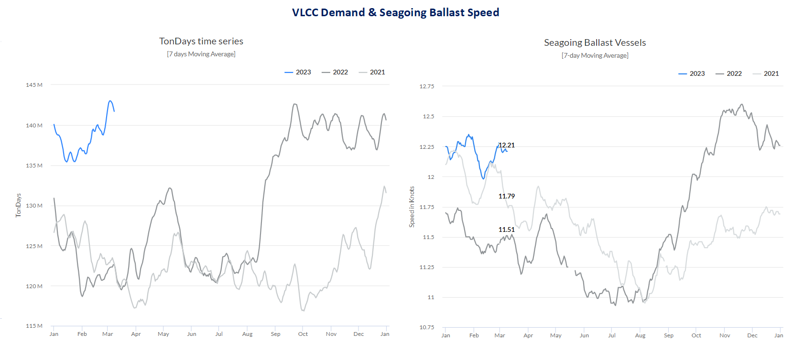
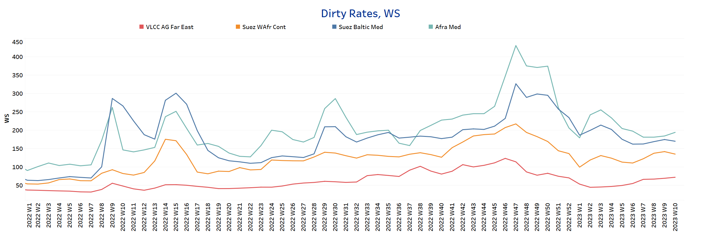
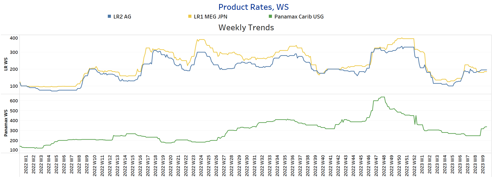
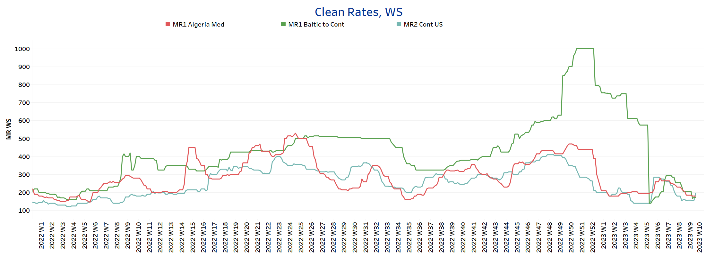
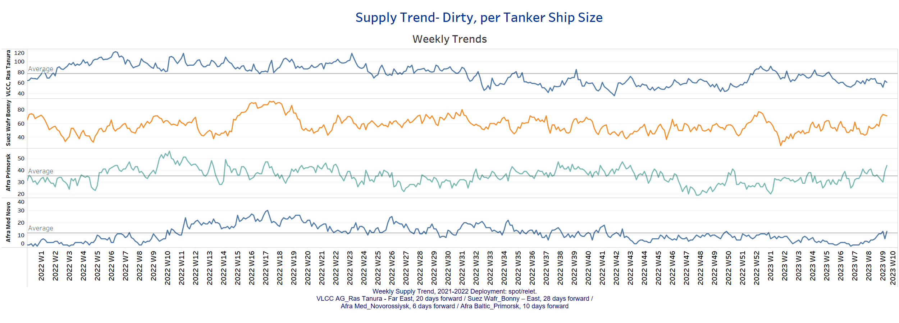
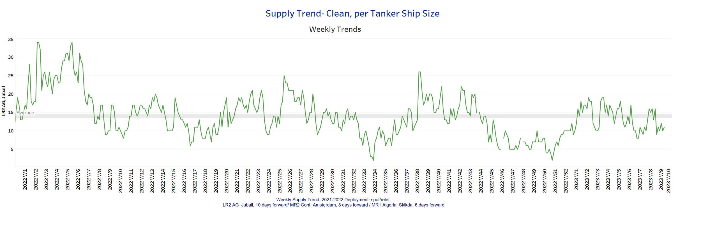
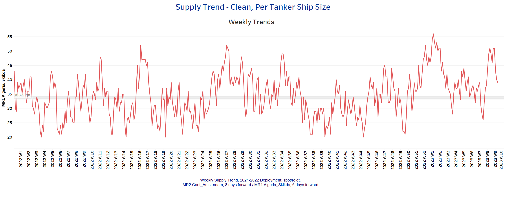
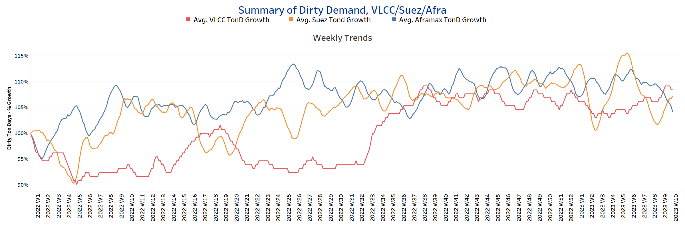
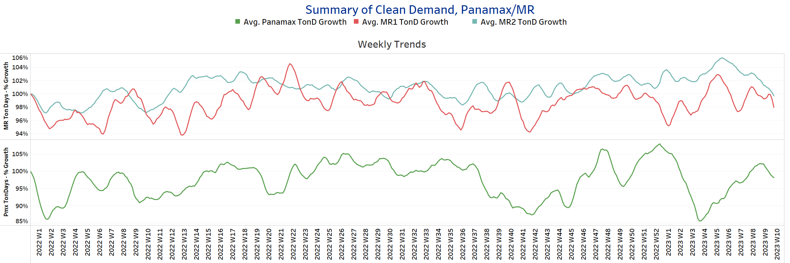

# Signal Tanker Weekly Report

**Date:** March 11, 2023  
**Publisher:** Breakwave Advisors | **Category:** Market Insights  
**Original URL:** [https://www.breakwaveadvisors.com/insights/2023/3/10/signal-tanker-weekly-report](https://www.breakwaveadvisors.com/insights/2023/3/10/signal-tanker-weekly-report)  

---

> **Figure 1: Market Chart 1**  
> **Interactive Data & Source:** [Signal Ocean Platform](https://go.signalocean.com/e/983831/tanker-reports-toncharts-trade/2nq6bx/306623343?h=peUdQrUawvxIYaF--sijeEvPracsW6atxQ4ADWeuSJQ) | [Local Asset](file:///C:/Users/Dell/Github/Shipping/corpus/03-breakwave/insights/2023/assets/2023-03-11_signal-tanker-weekly-report_img_unnamed-2023-03-10t175700958_9aa03037365f.png)

Data Source: The Signal Ocean Platform, Toncharts - Demand
[Signal Ocean Platform](https://go.signalocean.com/e/983831/tanker-reports-toncharts-trade/2nq6bx/306623343?h=peUdQrUawvxIYaF--sijeEvPracsW6atxQ4ADWeuSJQ)
[Signal Ocean Platform](https://go.signalocean.com/e/983831/tanker-reports-vesselSpeeds/2nq6c4/306623343?h=peUdQrUawvxIYaF--sijeEvPracsW6atxQ4ADWeuSJQ)

The second week of March confirmed stronger momentum in VLCC rates, with demand growth paving the way for further optimism as supply also follows a declining trend.

Overall, the first two months of the year saw a surprising increase in VLCC demand (see image above) in tonne-days, consistent with stronger economic signs in China and expectations for an upward trend in oil imports from the world's second-largest country this year. In response to the recent upturn, the ballast speed of VLCC tankers surpassed the levels of the previous two years and is now above 12 knots, with a similar increase on the horizon for the first quarter in the coming days.

For more information on this week's trends, see the analysis sections below:
Freight Market, Supply and Demand

## Section 1/ Freight - Market Rates (WS)

## ‘Dirty’ VLCC , Suezmax, Aframax-Firmer

> **Figure 2: Firmer**  
> **Interactive Data & Source:** [Signal Ocean Platform](https://www.thesignalgroup.com/signal-ocean-platform) | [Local Asset](file:///C:/Users/Dell/Github/Shipping/corpus/03-breakwave/insights/2023/assets/2023-03-11_signal-tanker-weekly-report_img_unnamed-2023-03-10t175742984_6c5e97a2c082.png)

- Crude oil freight rate sentiment improved in the second week of March with a steady increase in the VLCC and Aframax segments.

- **VLCC**AG-FE freight rates were at WS72, almost 27 points higher than at the end of the second week.
- **Suezmax**freight rates from West Africa to continental Europe are now at 135 WS, nearly 20 points higher than two weeks ago and nearly 36 points higher than earlier this year.
- **Aframax**Med freight rates surpassed WS 190, 14 points higher than week 7.

## ‘Product’ LR2 - Firmer | LR1 -Weaker

> **Figure 3: Weaker**  
> **Interactive Data & Source:** [Signal Ocean Platform](https://www.thesignalgroup.com/signal-ocean-platform) | [Local Asset](file:///C:/Users/Dell/Github/Shipping/corpus/03-breakwave/insights/2023/assets/2023-03-11_signal-tanker-weekly-report_img_unnamed-2023-03-10t175942308_b4eb7735a591.png)

- **LR2**AG freight rates rose to WS195, 20 points higher than two weeks ago.

- **LR1**MEG -to-Japan freight rates posted a weaker trend, falling below WS190 in the first two weeks of March.

## ‘Product’ Panamax -Firmer

- **Panamax**Carib-to-USG rates rose steadily in the first days of March to about 338 WS, with a tendency to continue rising through the end of the week.

## ‘Clean’ MR2, MR1 - Weaker

> **Figure 4: Clean**  
> **Interactive Data & Source:** [Signal Ocean Platform](https://www.thesignalgroup.com/signal-ocean-platform) | [Local Asset](file:///C:/Users/Dell/Github/Shipping/corpus/03-breakwave/insights/2023/assets/2023-03-11_signal-tanker-weekly-report_img_unnamed-2023-03-10t180017084_544bc73811ea.png)

- **MR1**rates Algeria-to-Med are now at WS180, 30 points lower than at the end of February.

- **MR1**rates Baltic-to-Cont are now at WS173 and have dropped to levels similar to mid-February.
- **MR2**rates Cont-to-US are now at WS195, indicating stronger momentum in the second week of March, following a decline to around WS160 in the days before

## Section 2/ Supply -(# Vessels)

## ‘Dirty’ Supply Trend Lines for Key Load Areas

> **Figure 5: VLCC - Decreasing | Suezmax - Aframax - Increasing**  
> **Interactive Data & Source:** [Signal Ocean Platform](https://www.thesignalgroup.com/signal-ocean-platform) | [Local Asset](file:///C:/Users/Dell/Github/Shipping/corpus/03-breakwave/insights/2023/assets/2023-03-11_signal-tanker-weekly-report_img_unnamed-2023-03-10t180139706_b1553aa10738.png)

- The supply of crude oil tankers has increased significantly in the Suezmax and Aframax segments, while the number of vessels in the VLCC segment is still below the annual average.

- **VLCC Ras Tanura**: The number of vessels is now around 60, 17 less than the annual average.
- **Suezmax Wafr Bonny**: The number of vessels now stands at 71, 28 more than the previous week.
- **Aframax Primorsk**: The number of vessels is now 44, which is 7 above the annual average.
- **Aframax Med Novo**: The number of ships increased to the annual average of 12, which is 10 more than two weeks ago.

## ‘Clean’ Supply Trend Lines for Key Load Areas |LR2| Increasing

> **Figure 6: Market Chart 6**  
> **Interactive Data & Source:** [Signal Ocean Platform](https://www.thesignalgroup.com/signal-ocean-platform) | [Local Asset](file:///C:/Users/Dell/Github/Shipping/corpus/03-breakwave/insights/2023/assets/2023-03-11_signal-tanker-weekly-report_img_unnamed-2023-03-10t180215235_a7c8960cbc5e.png)

## ‘Clean’ Supply Trend Lines for Key Load Areas |MR1| Decreasing

> **Figure 7: Market Chart 7**  
> **Interactive Data & Source:** [Signal Ocean Platform](https://www.thesignalgroup.com/signal-ocean-platform) | [Local Asset](file:///C:/Users/Dell/Github/Shipping/corpus/03-breakwave/insights/2023/assets/2023-03-11_signal-tanker-weekly-report_img_unnamed-2023-03-10t180259630_2463263f27ae.png)

- **Clean LR2 AG Jubail:**The number of vessels held at a level around 11, with an increasing trend in the next days of March, but still not above the annual average of 13.

- **Clean MR1 Algeria Skikda:**The number of vessels decreased to 39, 12 less than the previous week and 4 above the annual average.

## Section 3 - Demand - Ton Days

## ‘Dirty’ |VLCC - Suezmax - Increasing | Aframax -Decreasing

> **Figure 8: Decreasing**  
> **Interactive Data & Source:** [Signal Ocean Platform](https://www.thesignalgroup.com/signal-ocean-platform) | [Local Asset](file:///C:/Users/Dell/Github/Shipping/corpus/03-breakwave/insights/2023/assets/2023-03-11_signal-tanker-weekly-report_img_unnamed-2023-03-10t180334910_20fddcdef7f2.png)

## ‘Clean’ |Panamax - Decreasing | MR2 - MR1 -Decreasing

> **Figure 9: Market Chart 9**  
> **Interactive Data & Source:** [Signal Ocean Platform](https://www.thesignalgroup.com/signal-ocean-platform) | [Local Asset](file:///C:/Users/Dell/Github/Shipping/corpus/03-breakwave/insights/2023/assets/2023-03-11_signal-tanker-weekly-report_img_unnamed-2023-03-10t180407000_d61e199b025d.png)

- **Dirty**demand ton-days: March began with slowing momentum in the crude oil tanker segment for Aframax vessels but with significant strength in the VLCC and Suezmax segments.

- demand ton-days / Panamax demand: After several consecutive increases in the second half of February, there was a sharp decline with a tendency for a further decline in the coming days.
- MR: The growth of MR follows a downward trend, with the last peak in week 5, and it remains to be seen whether the decline will continue at a similar pace until the end of the month.

Data Source:[Signal Ocean Platform](https://www.thesignalgroup.com/signal-ocean-platform)
