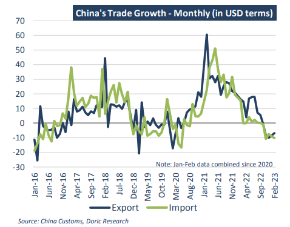
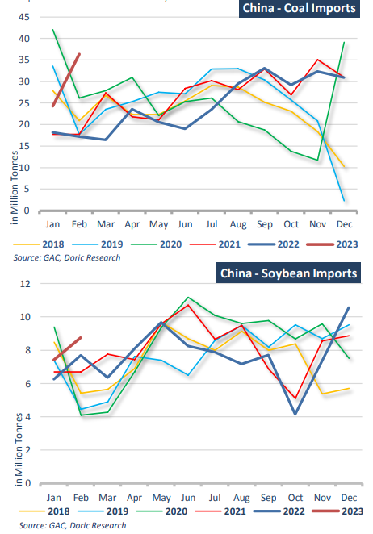

# Doric Weekly Market Insight

**Date:** March 13, 2023  
**Publisher:** Breakwave Advisors | **Category:** Market Insights  
**Original URL:** [https://www.breakwaveadvisors.com/insights/2023/3/13/doric-weekly-market-insight](https://www.breakwaveadvisors.com/insights/2023/3/13/doric-weekly-market-insight)  

---

## “At the Same Time As Chinese Congress Renewed Its Faith to Xi Jinping, Dry Bulk Forward Curves Were Demonstrating Market’s Credence for a Positive Outlook for the Months to Come in the Ever-Challenging Spot Arena.”

*By*[*Michalis Voutsinas*](https://www.linkedin.com/in/michalis-voutsinas-587544163/)

Releasing the first major economic indicator since fully relaxing its zero-Covid policy, China reconfirmed this week what the dry bulk and container sectors were feeling during the first couple of trading months. Pointing to a slowdown in the recovery of the world’s second largest economy, customs data emerged showing China’s exports in the January-February period fell considerably from a year earlier. In tandem, imports also decreased, at an even faster rate, reflecting a decelerating global economy and weak domestic demand. In particular, China’s exports fell as much as 6.8 percent year-on-year to USD 506.3 billion in combined figures for January and February. Falling by 10.2 percent from a year earlier to USD 389.4 billion, imports also trended downwards.

> **Figure 1: 1 (2)**  
> **Interactive Data & Source:** [Doric](https://www.doric.gr/) | [Local Asset](file:///C:/Users/Dell/Github/Shipping/corpus/03-breakwave/insights/2023/assets/2023-03-13_doric-weekly-market-insight_img_128229_2a05896d8fe7.png)

China's trade figures for the first two trading months are combined to smooth out the impact of the Lunar New Year holiday, which falls at different times within those months each year. However, the aforementioned steep fall in dollar terms of the international sector of the Chinese economy was indicative of two other developments during this period. Firstly, Beijing has faced challenges on lifting Chinese economy after almost three years of strict Covid-19 measures. Additionally, a slowdown in the global economy has had a negative bearing on China’s international trading activity. “Downward pressure on the global economy is being compounded by the effects of protectionism, growth of global trade is slowing down, and competition in the international market is intensifying, which has made it more difficult for China to maintain stable export growth,” the National Development and Reform Commission stressed on Sunday.

In volume terms, Chinese imports of dry bulk commodities reported strong gains for a year earlier, albeit from a low base. Surging by 73 percent year-on-year, China’s coal imports stood at 60.64 million tonnes during January and February, up from 35.39 million tonnes in the same period last year, customs data showed this week. However increased inventories at Chinese ports and utilities amid a slowerthan-anticipated recovery in demand poses concerns for the continuation of the aforementioned trend. As far as iron ore goes, the world’s largest consumer brought in 194 million tonnes of the steel-making ingredient in January and February, up 7.3 percent yearon-year. From the perspective of overseas supply, mines increased shipments in December 2022 in order to reach their annual targets. Large part of these shipments arrived in China in January and February 2023. Imported iron ore stocks at China's major 45 ports, under Mysteel's weekly survey, thinned for the second consecutive week to 137.7 million tonnes during March 3-9, down by another 2.3 million tonnes or 1.6 percent week-on-week. In March, an advancement of real estate and infrastructure construction is expected to support downstream demand and thus to push iron ore port stocks further down. In reference to the staple grain trades, the world’s top oilseed buyer, imported a record volume of 16.17 million tonnes of soybeans for the first two months of the year. Following the end of its pandemic restrictions, China’s appetite for grain imports seems to be anything but light. With South America peak season ahead of us, exports from Brazil are expected to gather pace, in spite of the slow start to the year.

> **Figure 2: 1 (3)**  
> **Interactive Data & Source:** [Doric](https://www.doric.gr/) | [Local Asset](file:///C:/Users/Dell/Github/Shipping/corpus/03-breakwave/insights/2023/assets/2023-03-13_doric-weekly-market-insight_img_128329_3ad89802f7a6.png)

In this economic juncture, Xi Jinping was unanimously elected president of the People's Republic of China and chairman of the Central Military Commission of the PRC on Friday at the ongoing session of the 14th National People's Congress. At the same time as Chinese Congress renewed its faith to Xi Jinping, dry bulk forward curves were demonstrating market’s credence for a positive outlook for the months to come in the ever-challenging spot arena.

Data source:[Doric](https://www.doric.gr/)
