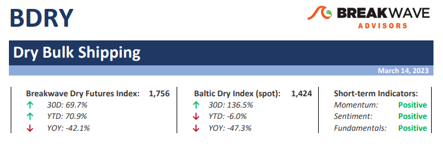
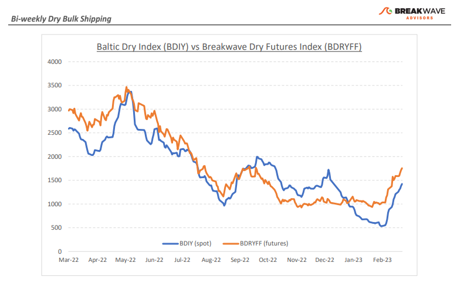
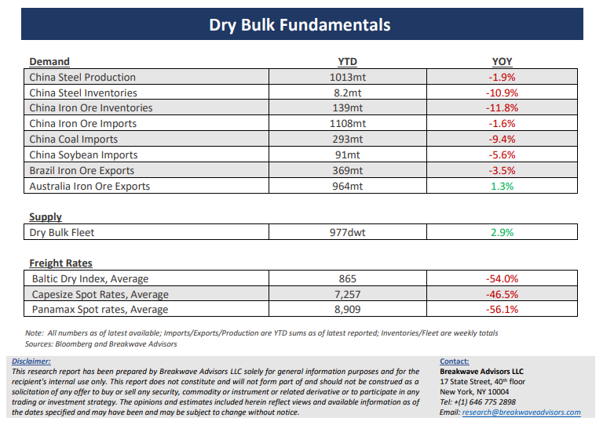

# Breakwave Bi-Weekly Dry Bulk Report - March 14, 2023

**Date:** March 14, 2023  
**Publisher:** Breakwave Advisors | **Category:** Market Insights  
**Original URL:** [https://www.breakwaveadvisors.com/insights/2023/3/13/breakwave-bi-weekly-dry-bulk-report-march-14-2023](https://www.breakwaveadvisors.com/insights/2023/3/13/breakwave-bi-weekly-dry-bulk-report-march-14-2023)  

---

> **Figure 1: Dbreporttop**  
> **Interactive Data & Source:** [Breakwave Advisors Market Insights](https://www.breakwaveadvisors.com/publications) | [Local Asset](file:///C:/Users/Dell/Github/Shipping/corpus/03-breakwave/insights/2023/assets/2023-03-14_breakwave-bi-weekly-dry-bulk-report-march-14-2023_img_dbreporttop_c56a8c2f6d5e.png)

**•Time for a breather to digest recent gains**– It was only a month ago that market participants were faced with almost zero spot Capesize rates and dark clouds were gathering over the dry bulk market outlook. Whispers of negative spot rates and zero-strike put options were making the rounds and even the hint of positive talk regarding the future was immediately thrown out as wishful thinking. Fast forward to today, and optimism is abundant. The futures curve is pointing to further gains for the spot market, while current prices are already at relatively decent levels to begin with. Such major “mood swings” are not unusual in shipping, and only by looking at the larger picture can one distinguish between noise and trend direction. When the Capesize Index was hovering close to zero, the risk-reward was clearly tilted towards more upside (albeit with some time-decaying risk). Now, 15,000 points later for the Capesize Index, the risk-reward seems more balanced. That doesn’t mean there is no more upside for dry bulk. On the contrary, fundamentals remain favorable for the sector with expected strong demand growth from China and limited fleet growth. However, nothing moves in straight lines and a period of consolidation might lie ahead. Profit taking and position reshuffling will then set the stage for another leg-up as we enter the summer months, in line with the sector’s seasonal trend. Shipping is a tradable market, and as such, opportunities for either long or short trades, aiming at uncorrelated medium-term returns, are always ample throughout the cycles.

**•China’s path to growth not as optimistic as market previously thought**– China set a modest economic growth target for 2023 of about 5%, disappointing market observers that were looking for a more aggressive goal given all the recent stimulus announcements. On the other hand, the recent Chinese PMI numbers reached levels not seen since 2011, complicating the near-term outlook. We think that both signals point to significant potential for infrastructure spending, and although the process might be a longer one, there is potential for increasing bulk commodity demand. A great indicator of the above is the price of iron ore, which, despite all the macro uncertainty in recent weeks that has negatively affected a lot of different markets, remains at multi-month highs. China is the most important market when it comes to bulk commodities, and although the western world is currently dealing with the effects of high inflation and rising interest rates, China is set to provide some much-needed growth for those industries. For the rest of the year, we remain optimistic for incremental demand growth for bulk commodities which in turn should have a positive impact on dry bulk shipping.

**•Dry bulk focus shifts back to fundamentals**– Following a period of high uncertainty and significant disruptions across the commodity spectrum, the gradual normalization of trade is shifting the market’s attention back to the traditional demand and supply dynamics that have shaped dry bulk profitability for decades. As effective fleet supply growth for the next few years looks marginal, demand will be the main determinant of spot freight rates with China returning back to the driver’s seat as the dominant force of bulk imports and thus shipping demand.

[Subscribe: Bi-Weekly Dry bulk report](https://www.breakwaveadvisors.com/publications)

> **Figure 2: Dbreportchart**  
> [Local Asset](file:///C:/Users/Dell/Github/Shipping/corpus/03-breakwave/insights/2023/assets/2023-03-14_breakwave-bi-weekly-dry-bulk-report-march-14-2023_img_dbreportchart_df1a7348522a.png)

> **Figure 3: Dbreportbottom**  
> [Local Asset](file:///C:/Users/Dell/Github/Shipping/corpus/03-breakwave/insights/2023/assets/2023-03-14_breakwave-bi-weekly-dry-bulk-report-march-14-2023_img_dbreportbottom_0f40728cd0bc.png)
