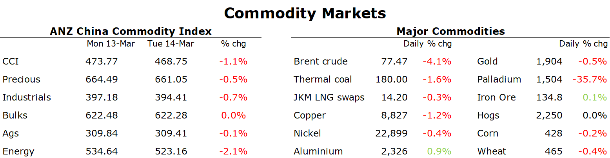

# Crude oil extends losses amid a risk-off tone across markets

**Date:** March 15, 2023  
**Publisher:** Breakwave Advisors | **Category:** Market Insights  
**Original URL:** [https://www.breakwaveadvisors.com/insights/2023/3/15/crude-oil-extends-losses-amid-a-risk-off-tone-across-markets](https://www.breakwaveadvisors.com/insights/2023/3/15/crude-oil-extends-losses-amid-a-risk-off-tone-across-markets)  

---

*By*[*Daniel Hynes*](https://www.linkedin.com/in/dahynes/)

Flight to safety was the dominant theme, although panic selling of risk assets eased. Commodities remained under pressure amid concerns of further economic weakness.

> **Figure 1: 1678828663758 (1)**  
> **Interactive Data & Source:** [Linkedin](https://www.linkedin.com/newsletters/commodities-wrap-6692196755876012032/?fbclid=IwAR3kiXJqZdxmp9ZcRwBNI7FsBySI-XSC0pfPur1qzjt7OZp7PTE59Tsl1QI) | [Local Asset](file:///C:/Users/Dell/Github/Shipping/corpus/03-breakwave/insights/2023/assets/2023-03-15_crude-oil-extends-losses-amid-a-risk-off-tone-across-markets_img_167882866375828129_82acbdd88043.png)

**Gold**was steady as investor demand eased back following a surge yesterday amid the US banking ructions. Treasury yields rebounded slightly, while the USD was mixed. The market’s expectation of a smaller Fed rate hike was supported by inflation data that came in as expected at 0.5% m/m for June. Nevertheless, demand for the safe haven asset remained strong. State Street’s SPDR Gold Shares, the biggest precious metals EFET, saw its holdings rise by more than 381koz yesterday. Even with these gains, investor allocation to gold remains low. We expect this banking turmoil to reinvigorate investor demand over the longer term.

**Copper**struggled to hold onto yesterday’s gains as the flight to safety continued. The impact of inflation data was unclear. The Fed is likely to maintain its tough position on inflation, but it won’t want to add further turmoil to the banking sector. The impact of recent supply disruptions was revealed by Peru’s sharp fall in exports. January volumes were 25% lower year-on-year, while output slipped just 0.3%, according to data from the mining industry chamber and the energy and mines ministry.

**Crude oil**remained under pressure as concerns of weaker economic activity sparked by SVB’s failure reverberated through the market. The negative sentiment was aided by OPEC forecasting a modest surplus to remain in place during Q2. The producer group said it will pump around 28.92mb/d, or about 300kb/d more than it expects will be needed. It blamed the adjustment on a continued soft patch in demand and warned that the surplus could be even larger if Russian produce remains resilient to international sanctions. OPEC is currently assuming a sharp drop in output next quarter. Key members are due to hold an online meeting to review market conditions early next month. At this stage it expects to keep its production levels unchanged.

**European gas**extended Monday’s selloff, as forecasts for the final two weeks of March turned milder. Dutch front month futures fell nearly 11% to trade at EUR44.15/MWh, while European power prices also tracked lower. Attention on strikes in France remain. LNG imports remain halted, with the strike extended until 21 March. Issues with nuclear energy also remain high. The recent fall in**North Asian LNG**prices continued to attract interest from buyers in Southeast Asia. Two companies in the Philippines are racing to import the nation’s first LNG shipments, highlighting the renewed interest.

**Iron ore**futures were steady as traders take stock amid signs of stronger demand in China. The country is heading towards its peak construction period, which has drawn on inventories of both iron ore an steel in recent weeks.

Data source:[Commodities Wrap](https://www.linkedin.com/newsletters/commodities-wrap-6692196755876012032/?fbclid=IwAR3kiXJqZdxmp9ZcRwBNI7FsBySI-XSC0pfPur1qzjt7OZp7PTE59Tsl1QI)
