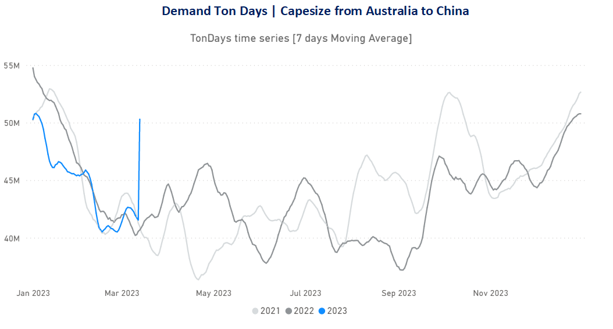
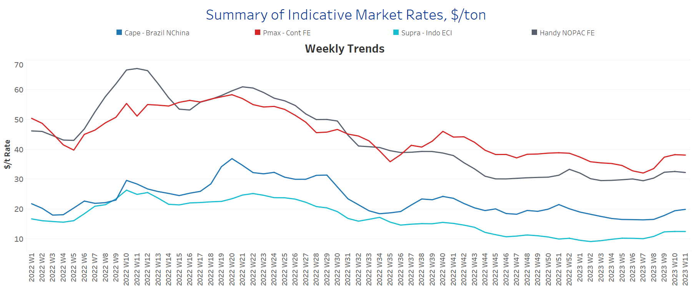
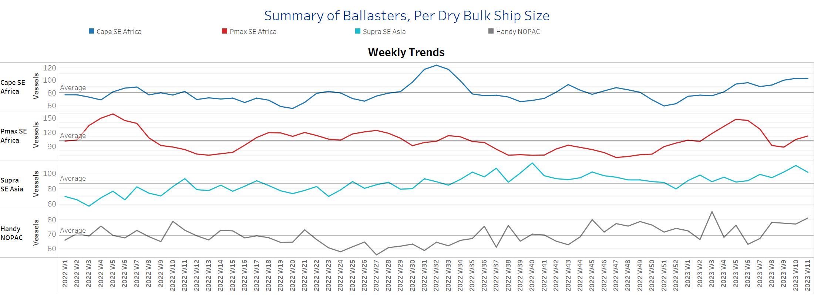
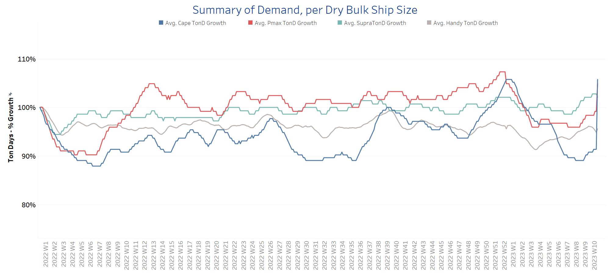
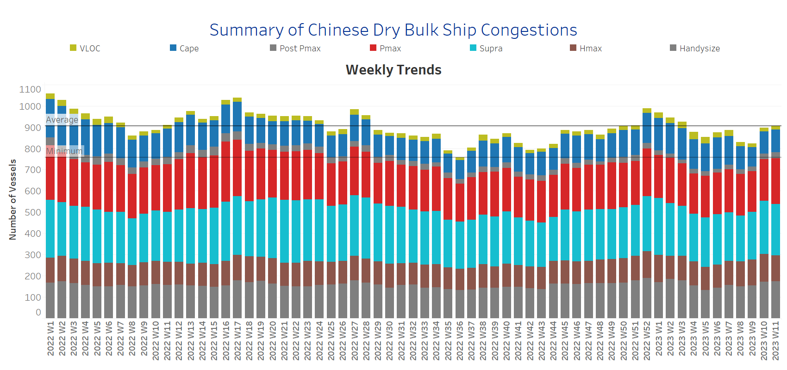

# Signal Dry Bulk Weekly Report

**Date:** March 16, 2023  
**Publisher:** Breakwave Advisors | **Category:** Market Insights  
**Original URL:** [https://www.breakwaveadvisors.com/insights/2023/3/16/signal-dry-bulk-weekly-report](https://www.breakwaveadvisors.com/insights/2023/3/16/signal-dry-bulk-weekly-report)  

---

## Chart of the Week Dry Bulk: Capesize Demand Ton Charts

*Remarkable increase of ton days and miles from Australia to China in the 1h of March*

> **Figure 1: Market Chart 1**  
> **Interactive Data & Source:** [Signal Ocean Platform](https://go.signalocean.com/e/983831/dry-reports-ton-charts-dry/2nqvh7/307767933?h=jlHAaj_BLZ8Rg2nGXAKidQPHOmN-K45Rk-fluYEKa24) | [Local Asset](file:///C:/Users/Dell/Github/Shipping/corpus/03-breakwave/insights/2023/assets/2023-03-16_signal-dry-bulk-weekly-report_img_unnamed-2023-03-16t122131256_fe9f96328853.png)

## Data Source: The Signal Ocean Platform, Demandhttps://go.signalocean.com/e/983831/dry-Reports-Ton-Charts-Dry/2nqvh7/307767933?h=jlhaajblz8rg2ngxakidqphomn-K45rk-Fluyeka24

The second week of March fueled optimism for a month of higher rates, as demand for Capesize vessels surprisingly increased in the face of increased Chinese demand for iron ore. Looking at the trend in demand growth (ton-days) from Australia to China (see chart above), we can see an upturn not seen in a similar period in the previous two years. It remains to be seen whether this upswing will continue at a similarly high level in the next few days of March. In the meantime, it is interesting to note that the cargo list is still insufficient to cover the number of vessels immediately available on the spot market, with the supply of ballast vessels showing an upward trend in March.

For more information on this week's trends, see the analysis sections below: Freight Market, Supply, Demand and Port Congestion

## Section 1/ Freight -Market Rates ($/T) Firmer

‘The Big Picture’ - Capesize and Panamax Bulkers and Smaller Ship Sizes

> **Figure 2: Market Chart 2**  
> **Interactive Data & Source:** [Signal Ocean Platform](https://www.thesignalgroup.com/signal-ocean-platform) | [Local Asset](file:///C:/Users/Dell/Github/Shipping/corpus/03-breakwave/insights/2023/assets/2023-03-16_signal-dry-bulk-weekly-report_img_unnamed-2023-03-16t122225571_5824c86ad1e7.png)

Strength continued across all vessel size categories during the second week of March, and further upside is expected in the coming days based on increasing growth in ton-days demand.

- **Capesize**vessel freight rates are now approaching the $20/tonne mark, nearly $3.5/tonne higher than 5 weeks ago.
- **Panamax**vessel freight rates fromtheContinent to the Far East peaked at $38/tonne last week and held at that level, up $6/tonne from the week 7 low.
- **Supramax**freight rates for the Indo-ECI route rose nearly $12.5/tonne, with signs of further firming in the second half of March.
- **Handysize**freight rates for the NOPAC Far East route are now at $32/tonne, up $3/tonne from week 7, and continue to show signs of a slow recovery in March.

## Section 2/ Supply -Ballasters (# Vessels) Increasing

> **Figure 3: Supply Trend Lines for Key Load Areas**  
> **Interactive Data & Source:** [Signal Ocean Platform](https://www.thesignalgroup.com/signal-ocean-platform) | [Local Asset](file:///C:/Users/Dell/Github/Shipping/corpus/03-breakwave/insights/2023/assets/2023-03-16_signal-dry-bulk-weekly-report_img_unnamed-2023-03-16t122402018_cfa71ec8e16e.png)

The number of ballast ships has increased in all size classes, with only supramax ships showing a slowdown.

- **Capesize**SE Africa: The number of vessels now stands at 103, which is 16% more than in week 7 and 29% more than the annual average.
- **Panamax**SE Africa: The number of vessels increased to 113, 26 more than two weeks ago, with a tendency to increase further in the second half of March.
- **Supramax**SE Asia: The number of vessels decreased to 100, 10 less than a week ago and 15% above the year-end 2022 low.
- **Handys**ize NOPAC: The number of vessels now stands at 88, which is 11 above the annual average and has been rising steadily since week 6.

## Section 3/ Demand -TonDays Increasing

> **Figure 4: TonDays Increasing**  
> **Interactive Data & Source:** [Signal Ocean Platform](https://www.thesignalgroup.com/signal-ocean-platform) | [Local Asset](file:///C:/Users/Dell/Github/Shipping/corpus/03-breakwave/insights/2023/assets/2023-03-16_signal-dry-bulk-weekly-report_img_unnamed-2023-03-16t122551371_63e20b846ce3.png)

The second week of March surprised with the strong upward trend observed in the Capesize segment.

- **Capesize**demand ton-days: The upward trend has now reached the growth level of the end of last year, and it remains to be seen whether this momentum will continue in the coming days.
- **Panamax**demand ton-days: The level of growth is continuously higher than in the previous weeks of February, while sentiment is increasing, even if the latest level is still well below the peak of the end of last year.
- **Supramax**demand ton-days: The upward trend continued with the same strength as the previous week, reaching the highest level with the recovery of freight rates in the last three weeks.
- **Handysize**demand ton-days: Similar to Supramax tonnage, the growth trend continued, with signs of a further increase by the end of March.

## Section 4/ Port Congestion -No of Vesselsincreasingdry Bulk Ships Congested at Chinese Ports

> **Figure 5: Increasing**  
> **Interactive Data & Source:** [Signal Ocean Platform](https://www.thesignalgroup.com/signal-ocean-platform) | [Local Asset](file:///C:/Users/Dell/Github/Shipping/corpus/03-breakwave/insights/2023/assets/2023-03-16_signal-dry-bulk-weekly-report_img_unnamed-2023-03-16t122627458_a3c5d2da5885.png)

In the second week of March, the highs of the first week were maintained, with volumes in the Panamax, Supramax and Handysize segments increasing significantly.

- **Capesize:**The number of vessels now stands at 108, up 3 from the previous week and up 15 from two weeks ago.
- **Panamax:**The number of vessels has exceeded 200 for the first time since the end of week 7, and there are indications that it will continue to increase in the coming days.​​​​​​
- **Supramax:**The number of vessels now stands at 244, up 13% from three weeks ago.
- **Handysize**: The number of congested vessels reached 180, 31 more than three weeks ago, with signs of increasing in consecutive weeks since the end of week 5.

Data Source:[Signal Ocean Platform](https://www.thesignalgroup.com/signal-ocean-platform)
