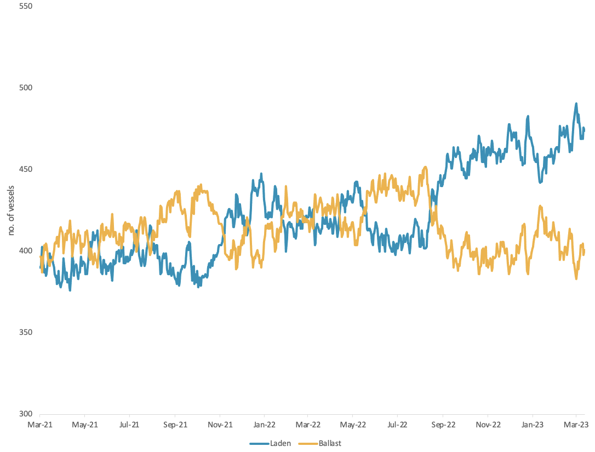
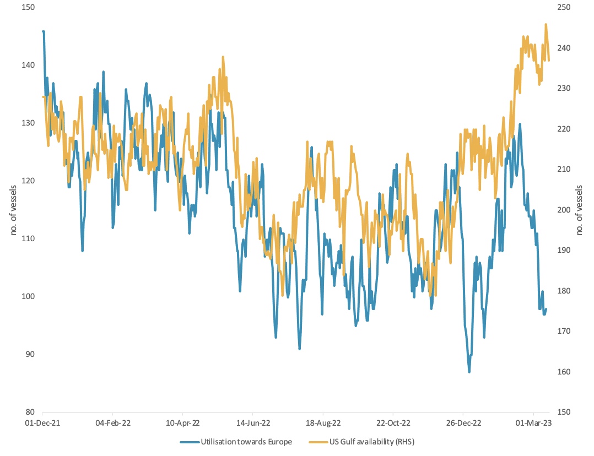

# Vortexa Freight Weekly

**Date:** March 16, 2023  
**Publisher:** Breakwave Advisors | **Category:** Market Insights  
**Original URL:** [https://www.breakwaveadvisors.com/insights/2023/3/16/vortexa-freight-weekly](https://www.breakwaveadvisors.com/insights/2023/3/16/vortexa-freight-weekly)  

---

This week, we look at how sustainable the recent rally in VLCC rates towards China is, and examine the drivers behind declining Pacific MR freight rates. In the West, Aframax rates have begun to cool, and freight fundamentals may not be there to catch them.

By[Dylan Simpson](https://www.linkedin.com/search/results/all/?fetchDeterministicClustersOnly=false&heroEntityKey=urn%3Ali%3Afsd_profile%3AACoAACDtdn0BzHNR8syu_G8WxL-JXL-9PRT5AP4&keywords=dylan%20simpson&origin=RICH_QUERY_SUGGESTION&position=0&searchId=55ecee69-a408-47b2-8686-68f172e21af1&sid=mVl)

## Analysis / East of Suez / Dirty

> **Figure 1: VLCC Utilisation by Voyage Status**  
> *VLCC utilisation by voyage status*  
> **Interactive Data & Source:** [Vortexa](https://www.vortexa.com//oil-gas-data-traders-analysts-data-scientists?gclid=Cj0KCQjw8_qRBhCXARIsAE2AtRZKOvMnbilZ_6_91d7huSFFy71pWLrnPwGwOHVzXsmsG-1a1mZnQw8aAt89EALw_wcB&hsa_acc=1782073842&hsa_ad=548425387665&hsa_cam=14746637662&hsa_grp=125038601902&hsa_kw=&hsa_mt=&hsa_net=adwords&hsa_src=g&hsa_tgt=dsa-1431852288425&hsa_ver=3&utm_campaign=%5BCD%5D%20-%20DSA%20-%20EMEA&utm_medium=cpc&utm_medium=ppc&utm_source=google&utm_source=adwords&utm_term=) | [Local Asset](file:///C:/Users/Dell/Github/Shipping/corpus/03-breakwave/insights/2023/assets/2023-03-16_vortexa-freight-weekly_img_unnamed-2023-03-16t122855851_666d88e81a9e.png)

VLCC freight rates performed a mini-rally, with a 33% and a 12% w-o-w increase on the Middle East-to-China (TD3C) and US Gulf-to-China (TD22) respectively.

- While a flurry of fixtures from both regions was observed, this increase in rates might not be sustained. Looking at VLCC utilisation over the past year, laden vessels have been consistently higher than the ballast ones since September 2022, indicating overall tightness in VLCC tanker supply.
- This tightness causes higher sensitivity of freight rates to demand swings. Focusing on the demand side, early indications show that Chinese crude purchasing potentially will not follow the same pace. Trading activities for May loadings appear low amidst oil price volatility, following a new wave of financial turmoil. At the same time, run rates are slow in picking up and as the spring refinery maintenance kicks in in Asia, expectations of further support in domestic demand might not materialise in the short-term. As such, VLCC fixtures could fall sharply, with freight rates following suit.

## Analysis / West of Suez / Dirty

> **Figure 2: Aframaxes Hesitate As European Crude Demand Falters**  
> **Interactive Data & Source:** [Vortexa](https://www.vortexa.com//oil-gas-data-traders-analysts-data-scientists?gclid=Cj0KCQjw8_qRBhCXARIsAE2AtRZKOvMnbilZ_6_91d7huSFFy71pWLrnPwGwOHVzXsmsG-1a1mZnQw8aAt89EALw_wcB&hsa_acc=1782073842&hsa_ad=548425387665&hsa_cam=14746637662&hsa_grp=125038601902&hsa_kw=&hsa_mt=&hsa_net=adwords&hsa_src=g&hsa_tgt=dsa-1431852288425&hsa_ver=3&utm_campaign=%5BCD%5D%20-%20DSA%20-%20EMEA&utm_medium=cpc&utm_medium=ppc&utm_source=google&utm_source=adwords&utm_term=) | [Local Asset](file:///C:/Users/Dell/Github/Shipping/corpus/03-breakwave/insights/2023/assets/2023-03-16_vortexa-freight-weekly_img_unnamed-2023-03-16t123147621_c8f91cd3d0ac.png)

Aframax utilisation towards Europe vs. availability in the US Gulf (RHS)

- Aframax freight rates from the US Gulf-to-Europe (TD25) have slumped this month after picking up over 50% in February. This is despite increasing tanker demand out of the US Gulf towards Europe as well as high levels of sustained tonne-miles coming out of the Baltic.
- On the demand side, overall Aframax utilisation towards Europe is on a downward trajectory, despite the increases seen out of the US. Furthermore, there is a build up of tanker availability in the US Gulf. These factors are likely contributing to the current hesitation in freight rates.
- Going forward, European crude demand is likely to remain low in the short to medium term. This is a function of the high diesel supply in Europe, which is keeping domestic refining demand at bay. This development may see Aframax rates move lower.

Data Source:[Vortexa](https://www.vortexa.com//oil-gas-data-traders-analysts-data-scientists?gclid=Cj0KCQjw8_qRBhCXARIsAE2AtRZKOvMnbilZ_6_91d7huSFFy71pWLrnPwGwOHVzXsmsG-1a1mZnQw8aAt89EALw_wcB&hsa_acc=1782073842&hsa_ad=548425387665&hsa_cam=14746637662&hsa_grp=125038601902&hsa_kw=&hsa_mt=&hsa_net=adwords&hsa_src=g&hsa_tgt=dsa-1431852288425&hsa_ver=3&utm_campaign=%5BCD%5D%20-%20DSA%20-%20EMEA&utm_medium=cpc&utm_medium=ppc&utm_source=google&utm_source=adwords&utm_term=)
