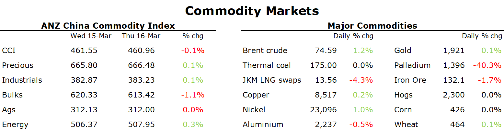

# Oil steadies amid opportunistic buying

**Date:** March 17, 2023  
**Publisher:** Breakwave Advisors | **Category:** Market Insights  
**Original URL:** [https://www.breakwaveadvisors.com/insights/2023/3/17/oil-steadies-amid-opportunistic-buying](https://www.breakwaveadvisors.com/insights/2023/3/17/oil-steadies-amid-opportunistic-buying)  

---

*By*[*Daniel Hynes*](https://www.linkedin.com/in/dahynes/)

Heavy selling seen in commodity markets over the past few days eased as traders took stock of market fundamentals.

> **Figure 1: 1678993021055**  
> [Local Asset](file:///C:/Users/Dell/Github/Shipping/corpus/03-breakwave/insights/2023/assets/2023-03-17_oil-steadies-amid-opportunistic-buying_img_1678993021055_856a69343b07.png)

**Crude oil**found some support late in the session following a three-day selloff as technical selling eased. However, risks remain to the downside amid the worsening banking crisis. Russia’s Deputy Prime Minister Alexander Novak meet with Saudi Arabia’s Energy Minister Prince Abdulaziz bin Salman to discuss oil markets and efforts by OPEC+ to promote market balance and stability. Recent events have created further uncertainty about the US Fed’s next move. This is pitted against various signals suggesting continued improvement in demand. Road traffic and air travel in China are growing strongly while signs of improvement have emerged in developed economies. With all this uncertainty, we expect OPEC to keep the production cuts announced in late 2022 in place. The banking turmoil could also further inhibit growth in US supply. Lower prices may induce further demand, with the US to refill its strategic reserve. As macro issues subside,[we expect crude oil prices to push above USD100/bbl](../pdfs/2023-03-17_oil-steadies-amid-opportunistic-buying_commodity-call-hitting-turbulence_06723b550e7b.pdf)in the second half of the year.

**European gas**futures pushed higher as traders eye risks to refilling storage facilities. While inventories are higher than normal at the moment, recent disruptions to LNG imports highlight the risks for the upcoming injection season. Sentiment was further weakened amid forecasts of lower wind power generation over coming days. This also pushed power prices up sharply.**North Asian LNG**fell below USD13/MMBtu amid the lower demand from Europe. Nevertheless, threats to supply remain a focus. Australia’s energy market operator, AEMO, warned that the country may be forced to curb contracted LNG exports if it doesn’t increase supply into the domestic market.

**Gold**inched higher as traders continued to seek safety in haven assets. Fresh concerns emerged about the financial sector as Frist Republic Bank plunged, with the lender said to be exploring a sale. Investors got a preview of how the Fed may progress at next week’s meeting, with the ECB keeping its hawkish stance by raising rates by 50bp.

**Copper**was steady following heavy selling yesterday, while other base metals were flat to lower amid uncertainty over the macro backdrop. Economic data was largely supportive. US housing starts in February jumped 9.8% to an annualised 1.45m units as building permits surged 13.8%. This follows data earlier this week showing growth in fixed asset investment in China picked up as a projects commenced in the New Year following policy support. Property investment also rose more than expected in the first two months of the year.

**Iron ore**futures fell despite signs of stabilisation in China’s property sector. Home prices rose in February for the first time in 18 months. Sentiment was weakened further on fears that cuts to Chinese steel production would curb demand.

Data source:[Commodities Wrap](https://www.linkedin.com/newsletters/commodities-wrap-6692196755876012032/?fbclid=IwAR3kiXJqZdxmp9ZcRwBNI7FsBySI-XSC0pfPur1qzjt7OZp7PTE59Tsl1QI)
