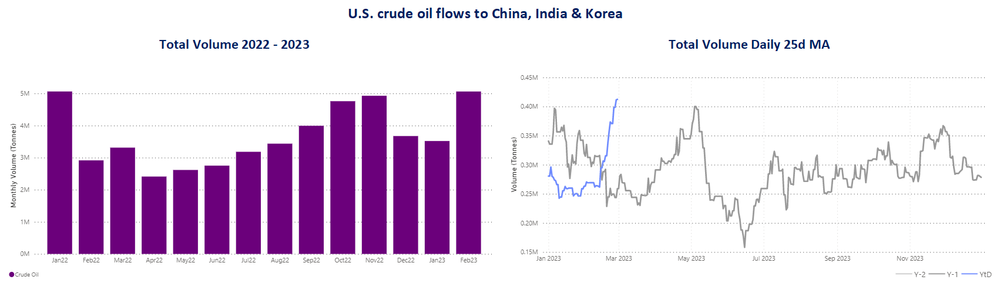
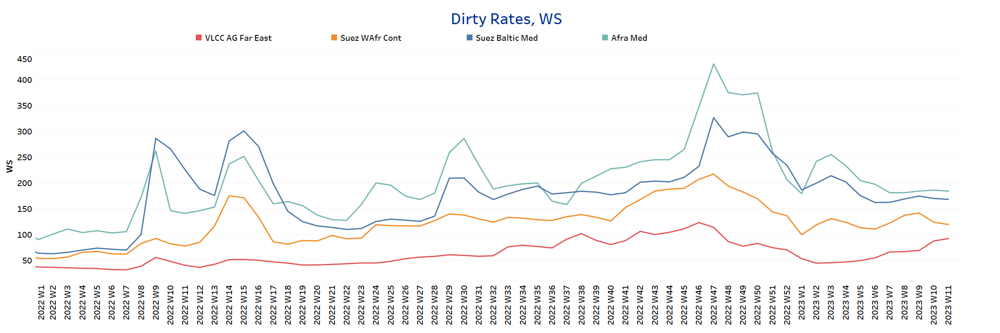
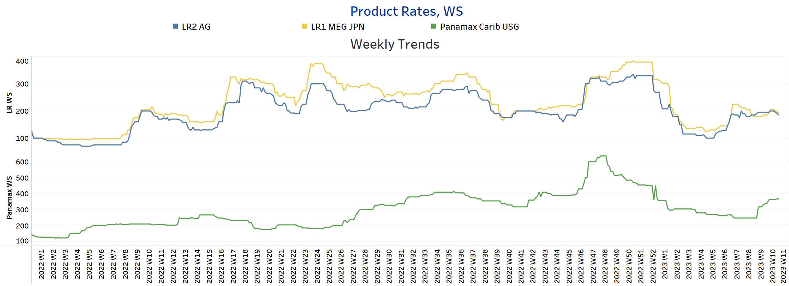
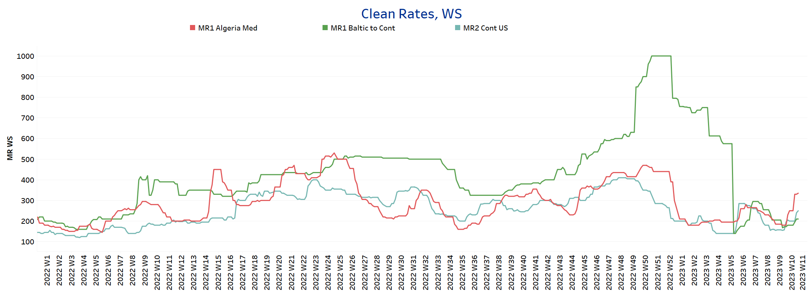
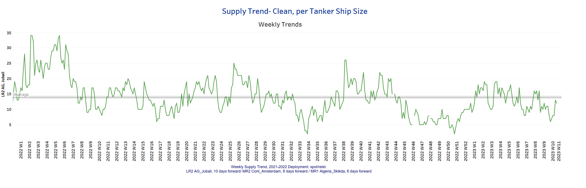
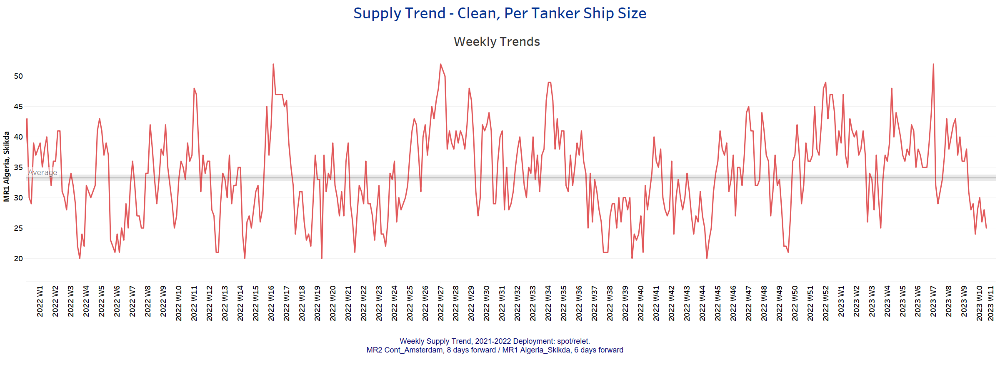
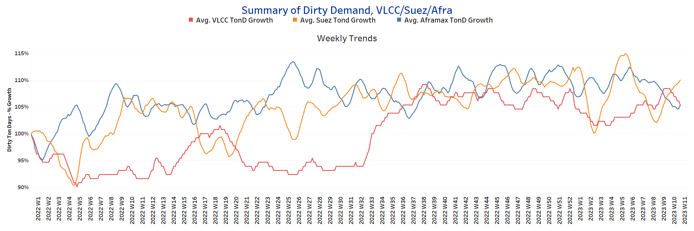
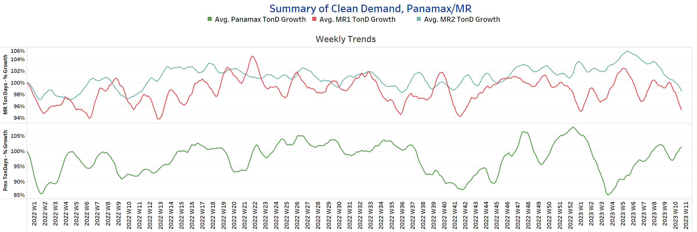

# Signal Tanker Weekly Report

**Date:** March 17, 2023  
**Publisher:** Breakwave Advisors | **Category:** Market Insights  
**Original URL:** [https://www.breakwaveadvisors.com/insights/2023/3/17/signal-tanker-weekly-report](https://www.breakwaveadvisors.com/insights/2023/3/17/signal-tanker-weekly-report)  

---

## Chart of the Week: Crude Oil Flows From the U.s. to Asia Reach a Peak in March

> **Figure 1: Market Chart 1**  
> **Interactive Data & Source:** [Signal Ocean Platform](https://go.signalocean.com/e/983831/tanker-dynamic-oilflows/2nr2jx/308109267?h=p1xmSLqTiy2avUK-112PL1_Kghc4XUSNUuNqwTqVMIw) | [Local Asset](file:///C:/Users/Dell/Github/Shipping/corpus/03-breakwave/insights/2023/assets/2023-03-17_signal-tanker-weekly-report_img_unnamed-2023-03-17t124141652_cd68b8124bb3.png)

Data Source: The Signal Ocean Platform, Toncharts - Oil Flows
[Signal Ocean Platform](https://go.signalocean.com/e/983831/tanker-dynamic-oilflows/2nr2jx/308109267?h=p1xmSLqTiy2avUK-112PL1_Kghc4XUSNUuNqwTqVMIw)​​​​​

Crude oil freight rates continue higher, as crude oil tanker supply declines in the first half of March. Interestingly, there is an upward trend in the clean segment for product and MR tankers, which is expected to continue in the coming days of March. Demand for crude oil from Asian countries surprisingly increased in February, with the U.S. playing a key role in imports to Korea, China and India (see image above). The recent trend fuels optimism for further firming of crude oil freight rates as oil demand remains persistently higher and the U.S. plays a critical role in displacing Russian oil exports toward European and non-European countries.

Meanwhile, Reuters news agency reported that oil prices plunged nearly 5% on Wednesday, settling at their lowest level in more than a year on fears that a crisis of confidence in the banking sector could trigger a recession and reduce demand. However, crude oil prices, along with benchmark stock indexes, recovered from their earlier losses after Swiss regulators agreed to provide liquidity assistance to Credit Suisse (CSGN.S), whose shares had earlier fallen as much as 30%. Brent crude oil closed $3.76, or 4.9%, lower at $73.69 a barrel. U.S. West Texas Intermediate (WTI) crude closed $3.72, or 5.2%, lower at $67.61.

For more information on this week's trends, see the analysis sections below:
Freight Market, Supply and Demand

## Section 1/ Freight - Market Rates (WS)

## ‘Dirty’ VLCC , Suezmax, Aframax-Firmer

> **Figure 2: Firmer**  
> **Interactive Data & Source:** [Signal Ocean Platform](https://www.thesignalgroup.com/signal-ocean-platform) | [Local Asset](file:///C:/Users/Dell/Github/Shipping/corpus/03-breakwave/insights/2023/assets/2023-03-17_signal-tanker-weekly-report_img_unnamed-2023-03-17t125256272_4148eeab5188.png)

Crude oil freight rate sentiment continued to improve with a steady increase in the VLCC segment and consistent momentum for Aframax vessels.

- **VLCC**AG-FE freight rates were at WS92, almost 20 points higher than two weeks ago.​​​​
- **Suezmax**freight rates from West Africa to continental Europe fell to WS 120, almost 20 points lower than two weeks ago, with a trend of weakness for the next few days.​​​​​
- **Aframax**Med freight rates remained above WS 180 with similar strength over the last four weeks.

## ‘Product’ LR2 - LR1 |Softening

> **Figure 3: Softening**  
> **Interactive Data & Source:** [Signal Ocean Platform](https://www.thesignalgroup.com/signal-ocean-platform) | [Local Asset](file:///C:/Users/Dell/Github/Shipping/corpus/03-breakwave/insights/2023/assets/2023-03-17_signal-tanker-weekly-report_img_unnamed-2023-03-17t125357189_df74f3bd21e5.png)

- **LR2**AG freight rates saw a slowdown in momentum, falling to WS 185, almost 10 points lower than a week ago.

- **LR1**MEG -to-Japan freight rates posted a similar weakening to LR2, falling 10 points to WS195, with signs of a possible further decline in the coming days.

## ‘Product’ Panamax -Firmer

- **Panamax**Carib-to-USG rates continued the upward trend of the previous March days, rising to around 368 WS, almost 50% higher than two weeks ago, with a tendency to continue rising in the second half of March.

## ‘Clean’ MR2, MR1 - Firmer

> **Figure 4: Clean**  
> **Interactive Data & Source:** [Signal Ocean Platform](https://www.thesignalgroup.com/signal-ocean-platform) | [Local Asset](file:///C:/Users/Dell/Github/Shipping/corpus/03-breakwave/insights/2023/assets/2023-03-17_signal-tanker-weekly-report_img_unnamed-2023-03-17t125524132_8765d1b92b57.png)

- **MR1**rates Algeria-to-Med are now at WS335, almost 86% higher than a week ago.

- **MR1**rates Baltic-to-Cont are now at WS210, 42 points higher than a week earlier.
- **MR2**rates Cont-to-US are now at WS250, indicating stronger momentum over the past two weeks, with signs of steady strength in the week ahead.

## Section 2/ Supply -(# Vessels)'dirty'supply Trend Lines for Key Load Areasvlcc - Aframax -Decreasing| Suezmax -Increasing

The supply of crude oil tankers has increased significantly in the Suezmax, while the number of vessels in the VLCC segment is still below the annual average.

- **VLCC Ras Tanura**: The number of vessels is now around 48, 28 less than the annual average.
- **Suezmax Wafr Bonny**: The number of vessels is now 68, 60% higher than in week 8.
- ​​​​​​**Aframax Primorsk**: The number of vessels is now 27, which is 8 below the annual average.
- **Aframax Med Novo**: The number of ships has approached the annual average of 12, with a steady increase since the end of week 7.

## ‘Clean’ Supply Trend Lines for Key Load Areas |LR2| Increasing

> **Figure 5: Market Chart 5**  
> **Interactive Data & Source:** [Signal Ocean Platform](https://www.thesignalgroup.com/signal-ocean-platform) | [Local Asset](file:///C:/Users/Dell/Github/Shipping/corpus/03-breakwave/insights/2023/assets/2023-03-17_signal-tanker-weekly-report_img_unnamed-2023-03-17t125635435_3149d655f934.png)

## ‘Clean’ Supply Trend Lines for Key Load Areas |MR1| Decreasing

> **Figure 6: Market Chart 6**  
> **Interactive Data & Source:** [Signal Ocean Platform](https://www.thesignalgroup.com/signal-ocean-platform) | [Local Asset](file:///C:/Users/Dell/Github/Shipping/corpus/03-breakwave/insights/2023/assets/2023-03-17_signal-tanker-weekly-report_img_unnamed-2023-03-17t125704358_ce4825267d7b.png)

- **Clean LR2 AG Jubail:**The number of vessels held at a level of about 12, with an increasing trend in the third week of March, approaching the annual average.

- **Clean MR1 Algeria Skikda:**The number of vessels decreased to 25, 5 less than the previous week and 7 below the average for the year.

## Section 3 - Demand - Ton Days

## ‘Dirty’ |VLCC - Suezmax - Increasing | Aframax -Decreasing

> **Figure 7: Decreasing**  
> **Interactive Data & Source:** [Signal Ocean Platform](https://www.thesignalgroup.com/signal-ocean-platform) | [Local Asset](file:///C:/Users/Dell/Github/Shipping/corpus/03-breakwave/insights/2023/assets/2023-03-17_signal-tanker-weekly-report_img_unnamed-2023-03-17t125739483_b75f0659b896.png)

## ‘Clean’ |Panamax - Increasing | MR2 - MR1 -Decreasing

> **Figure 8: Market Chart 8**  
> **Interactive Data & Source:** [Signal Ocean Platform](https://www.thesignalgroup.com/signal-ocean-platform) | [Local Asset](file:///C:/Users/Dell/Github/Shipping/corpus/03-breakwave/insights/2023/assets/2023-03-17_signal-tanker-weekly-report_img_unnamed-2023-03-17t125806720_cef79539dbab.png)

- Dirty demand ton-days: The significant strength in the VLCC segment is keeping up in March, while the slowing momentum in the Suezmax is still there with a soft gradual upward trend seen in the Aframax.
- Clean demand ton-days / Panamax demand: The previous week's decline reversed into a positive trend, and it remains to be seen whether this will also be the case in the second half of March.
- Clean MR: The growth of MR shows a downward trend in the last three weeks and there are no signs yet of an upward trend for the rest of March.

Data Source:[Signal Ocean Platform](https://www.thesignalgroup.com/signal-ocean-platform)
