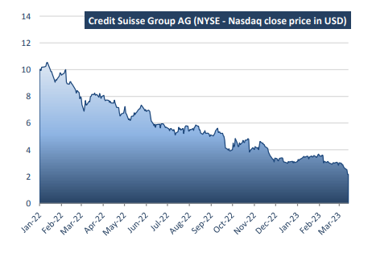
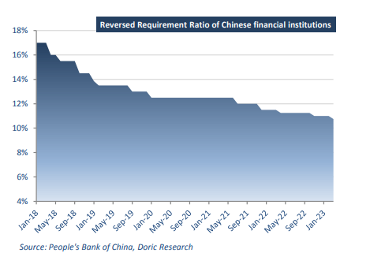

# Doric Weekly Market Insight

**Date:** March 20, 2023  
**Publisher:** Breakwave Advisors | **Category:** Market Insights  
**Original URL:** [https://www.breakwaveadvisors.com/insights/2023/3/20/0he0ethr650zwmdmrunqtg4ur0e6cd](https://www.breakwaveadvisors.com/insights/2023/3/20/0he0ethr650zwmdmrunqtg4ur0e6cd)  

---

## “Amidst This Tumultuous Backdrop, Baltic Dry Indices Concluded This Week on a Flattish Tone. Neither the Banking Industry Turbulence of Late Nor the Modest Fresh Chinese Stimulus Was Able to Have a Bearing on Their Mood, at Least Up to Now.”

*By*[*Michalis Voutsinas*](https://www.linkedin.com/in/michalis-voutsinas-587544163/)

In an eventful week, the Baltic Dry Index managed to stay on an upward trajectory, concluding today at 1535 points. The last couple of trading days, the spot market of the gearless segments was rather lukewarm, dragging the general index down from its intra-week, current year highs of 1603 points. In a torrid week for banking stocks, and for stock markets in general, Baltic indices showed their mettle, being one of the least volatile asset classes in the eleventh trading week!

On Sunday, the following statement was released by Secretary of the Treasury Janet L. Yellen, Federal Reserve Board Chair Jerome H. Powell, and FDIC Chairman Martin J. Gruenberg: “Today we are taking decisive actions to protect the US economy by strengthening public confidence in our banking system. This step will ensure that the US banking system continues to perform its vital roles of protecting deposits and providing access to credit to households and businesses in a manner that promotes strong and sustainable economic growth. After receiving a recommendation from the boards of the FDIC and the Federal Reserve, and consulting with the President, Secretary Yellen approved actions enabling the FDIC to complete its resolution of Silicon Valley Bank, Santa Clara, California, in a manner that fully protects all depositors…We are also announcing a similar systemic risk exception for Signature Bank, New York, New York, which was closed today by its state chartering authority. All depositors of this institution will be made whole. As with the resolution of Silicon Valley Bank, no losses will be borne by the taxpayer.”

The Federal Reserve Board further stressed that it will make available additional funding to eligible depository institutions to reassure that banks have the ability to meet the needs of all their depositors. US bank stocks took a dive and traders flocked to the safety of government bonds on Monday after regulators moved to prevent the collapse of Silicon Valley Bank from spreading into the wider economy. On Tuesday, US stocks covered some of losses and bonds retreated as the market was reassessing the underlying risks. On Wednesday, however, Credit Suisse shares tumbled by as much as 30 percent to an all-time low, following comments from its largest shareholder that it would not provide the bank with any additional capital. One day earlier, the Zurich-based bank said it had identified “material weaknesses” in its internal controls over financial reporting. On Wednesday evening, the Swiss central bank tried to tame the growing concerns, by stressing that it would provide a liquidity backstop to Credit Suisse. Credit Suisse shares rallied on Thursday, following the central bank’s USD 54 billion lifeline.

> **Figure 1: 1 (5)**  
> **Interactive Data & Source:** [Doric](https://www.doric.gr/) | [Local Asset](file:///C:/Users/Dell/Github/Shipping/corpus/03-breakwave/insights/2023/assets/2023-03-20_0he0ethr650zwmdmrunqtg4ur0e6cd_img_128529_120f8d1f1150.png)

In sync, a consortium of US banks threw a USD 30 billion lifeline to San Francisco-based First Republic Bank, which has been in the spotlight since two other mid-size US banks collapsed.

In sharp contrast to the aforementioned, China's central bank stressed on Friday that it would cut the amount of cash that banks must hold as reserves for the first time this year. By cutting the reserve requirement ratio for all banks by 25 basis points, the People's Bank of China (PBOC) reaffirmed its commitment to support the world's second-largest economy, which is gradually rebounding from a pandemic-induced slump. The cut, effective March 27, is expected to inject 500 billion yuan (USD 72.6 billion) worth of liquidity into the market, while the average reserve requirement ratio of Chinese financial institutions will be lowered to 7.6 percent. “The PBOC will keep monetary policy targeted and powerful,” the central bank said in a statement. “We’ll provide better support for key areas and weak links, refrain from a big stimulus…and concentrate on pushing for high-quality development” the Bank added.

> **Figure 2: 1 (6)**  
> **Interactive Data & Source:** [Doric](https://www.doric.gr/) | [Local Asset](file:///C:/Users/Dell/Github/Shipping/corpus/03-breakwave/insights/2023/assets/2023-03-20_0he0ethr650zwmdmrunqtg4ur0e6cd_img_128629_b94f79ab3646.png)

Amidst this tumultuous backdrop, Baltic Dry Indices concluded this week on a flattish tone. Neither the banking industry turbulence of late nor the modest fresh Chinese stimulus was able to have a bearing on their mood, at least up to now.

Data source:[Doric](https://www.doric.gr/)
