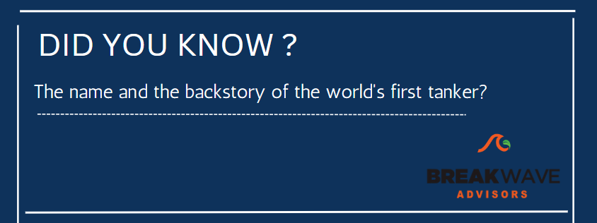
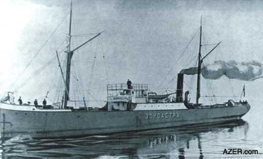
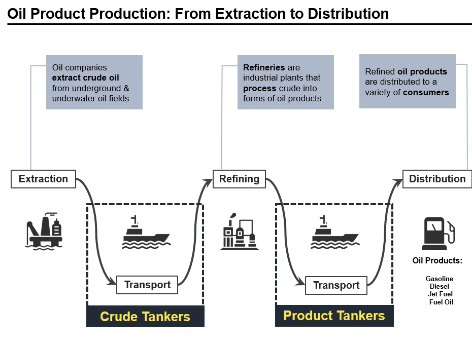

# Did you know?

**Date:** March 20, 2023  
**Publisher:** Breakwave Advisors | **Category:** Market Insights  
**Original URL:** [https://www.breakwaveadvisors.com/insights/2023/3/20/did-you-know](https://www.breakwaveadvisors.com/insights/2023/3/20/did-you-know)  

---

> **Figure 1: 1 (4)**  
> [Local Asset](file:///C:/Users/Dell/Github/Shipping/corpus/03-breakwave/insights/2023/assets/2023-03-20_did-you-know_img_128429_ee65bb836fa8.png)

Named for the Persian prophet Zarathustra, the world’s first tanker ship – the Zoroaster tanker was put into operation in the year 1878. The tanker ship was built with steel while its oil tanker holds were built of iron.

> **Figure 2: 142 235 Nobel Zoraster**  
> [Local Asset](file:///C:/Users/Dell/Github/Shipping/corpus/03-breakwave/insights/2023/assets/2023-03-20_did-you-know_img_142-235-nobel-zoraster_50a295df9c29.jpg)

Prior to the use of tanker ships, oil was transported by a crude method across water channels, which caused problems, and that’s why it was essential the creation of a new, fast and safe way of transport.

## Since Then, Till Today, Tankers Transport 2/3 of All Crude:

• The crude tanker market exists due to the geographic distances between oil fields and refining capacity.

• Oil fields that are economically viable to extract are geographically concentrated.

• Refineries are expensive, complex assets that are most often built close to where oil products are consumed in the highest quantities.

> **Figure 3: 1 (2)**  
> [Local Asset](file:///C:/Users/Dell/Github/Shipping/corpus/03-breakwave/insights/2023/assets/2023-03-20_did-you-know_img_128229_c08440bac04e.png)
