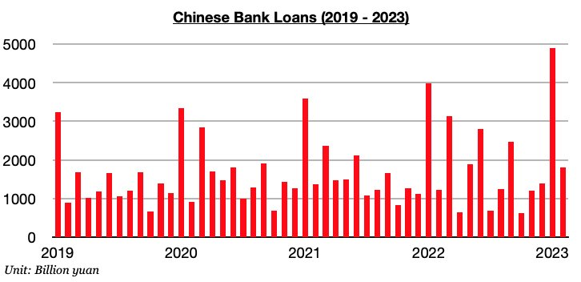
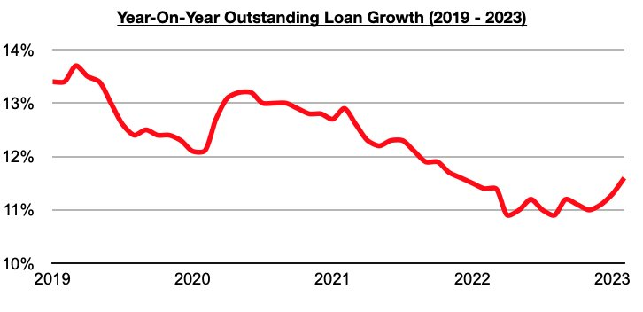

# Lending in China Remains Strong

**Date:** March 21, 2023  
**Publisher:** Breakwave Advisors | **Category:** Market Insights  
**Original URL:** [https://www.breakwaveadvisors.com/insights/2023/3/21/lending-in-china-remains-strong](https://www.breakwaveadvisors.com/insights/2023/3/21/lending-in-china-remains-strong)  

---

*By*[*Jeffrey Landsberg*](https://www.linkedin.com/in/jeffrey-landsberg-70ab957/)

Chinese banks issued 1.8 trillion yuan in new loans in February. This marks a month-on-month decline of 3.1 trillion yuan (-63%) but a year-on-year increase of 600 billion yuan (47%). The month-on-month decline is normal and occurs every February (loans surge in January of every year). Much more significant is that new loans have now increased on a year-on-year basis for three straight months.

> **Figure 1: Chart 1 (74)**  
> [Local Asset](file:///C:/Users/Dell/Github/Shipping/corpus/03-breakwave/insights/2023/assets/2023-03-21_lending-in-china-remains-strong_img_chart1287429_4091c03fe723.jpg)

Overall, it is encouraging that lending has continued to grow. Also remaining noteworthy is that just a few months ago, new loans came in at the lowest level in over five years. As we discussed in Commodore's earlier Weekly China Reports this year, new loans totaled only 615 billion yuan in October, which marked the lowest monthly total seen during any month since December 2017. The central government is continuing to work to support the economy and lending has continued to increase. It still is unlikely, though, that any large stimulus packages will be announced this year. We remain of our view that consumers being able to go out and spend and travel on their own is a natural stimulus of sorts that is already baked into China reopening.

> **Figure 2: Chart 2 (63)**  
> [Local Asset](file:///C:/Users/Dell/Github/Shipping/corpus/03-breakwave/insights/2023/assets/2023-03-21_lending-in-china-remains-strong_img_chart2286329_71203dcea613.jpg)

Also of note is that outstanding loan growth has increased further. Outstanding loan growth last month came in at 11.6%. Growth has now increased during each of the last three months and has now climbed to the highest level seen since December 2021.
