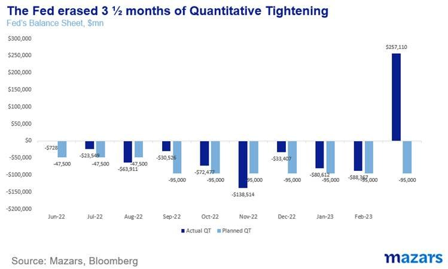

# Mazars Comment: How the central banks finally pivoted

**Date:** March 21, 2023  
**Publisher:** Breakwave Advisors | **Category:** Market Insights  
**Original URL:** [https://www.breakwaveadvisors.com/insights/2023/3/21/mazars-comment-how-the-central-banks-finally-pivoted](https://www.breakwaveadvisors.com/insights/2023/3/21/mazars-comment-how-the-central-banks-finally-pivoted)  

---

*By*[*George Lagarias*](https://www.linkedin.com/in/george-lagarias-mba-3baa769/)

Last week, the ECB hiked twice, defiant of the Credit Suisse debacle. In her initial speech, Christine Lagarde focused solely on inflation, refusing to acknowledge rising financial risks. During the Q&A, where she appeared somewhat less certain, she declined that interest rate tightening has led to a financial accident, citing idiosyncratic issues in the banks that went under. She went on to say that the central bank remains data-driven, with data cut-off up to 15-30 days before. And, most importantly, she denied that financial stability and inflation-fighting are competing targets. She stated, very clearly, that they would utilise different sets of tools to fight inflation and prevent a financial domino. Higher interest rates for the economy and, at the same time, monetary easing and credit lines for banks in distress.

Milton Friedman, who asserted that inflation is always a phenomenon linked to the supply of money, will be spinning in his grave.

Simultaneously, reports surfaced that the Fed had suppressed language in a common statement with the US Treasury, which cited regulatory failures in SVB’s collapse. Meanwhile, it allowed its balance sheet to rise by 300b, instantly cancelling half a year’s effort in quantitative tightening.

> **Figure 1: Market Chart 1**  
> [Local Asset](file:///C:/Users/Dell/Github/Shipping/corpus/03-breakwave/insights/2023/assets/2023-03-21_mazars-comment-how-the-central-banks-finally-pivoted_img_image00228429_6eeca5e441e3.jpg)

The best news of all week didn’t come from regulators but from the banks themselves. Major US banks deposited $30bn with the almost-bust First Republic. This is the world’s most cutthroat and realistic market trying to self-regulate.

There are some important takeaways from last week.

1. **The next crisis -probably- won’t be a banking one:**Central banks are indeed pivoting. They are simultaneously hiking rates to curtail aggregated demand and printing money. This is very good news for investors. Not only are markets getting their monetary fix, but central banks are finally acknowledging that extra money supply is not inherently inflationary, as long as it is contained within the financial system. Friedman was, officially, wrong. The iconic Chicago School professor is posthumously facing a more negative revision of his theories.
2. **Policy error risks are rising**: Central banks are claiming immunity as a result of their independence. Simply put, they have focused so much on repairing their reputations as inflation fighters, their primary mandate, that they can acknowledge no wrong. If money printing is not inherently inflationary, then why have central bankers been so aggressive to reduce their balance sheet, causing market stress, in the past few months? Couldn’t they have just stopped expanding their balance sheets? It's easy to avoid blame if you are the regulator and not the “regulated”. But it is also inherently dangerous. Central banks insisting that they are data-driven means that they are limiting themselves to whatever the data says. In a post-Great Moderation world, with economic data so volatile, being data-driven can be dangerous. Religiously sticking to a 2% inflation target can also be dangerous. While the probability of a financial accident is greatly reduced after last week, the probability of policy errors (interest rate overtightening) is rising quickly. This is also important to investors. It tells them where their risks lie, and what they should pay attention to.
3. **We have come a long way from Lehman.**In 2008, Lehman’s competitors forced it towards bankruptcy. In 2023, they banded together to save a failing -regional- competitor.
