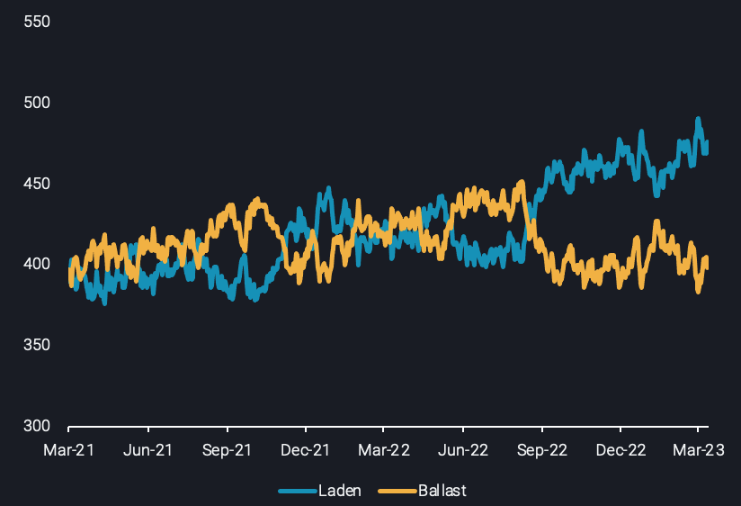

# Is the VLCC freight rate rebound here to stay?

**Date:** March 22, 2023  
**Publisher:** Breakwave Advisors | **Category:** Market Insights  
**Original URL:** [https://www.breakwaveadvisors.com/insights/2023/3/22/is-the-vlcc-freight-rate-rebound-here-to-stay](https://www.breakwaveadvisors.com/insights/2023/3/22/is-the-vlcc-freight-rate-rebound-here-to-stay)  

---

On the back of the recent VLCC rally, Vortexa summarises the key reasons led to this uptick in rates, and provides an outlook on how the fundamentals will unfold for the remainder of 2023.

*By*[*Ioannis Papadimitriou*](https://www.linkedin.com/search/results/all/?fetchDeterministicClustersOnly=false&heroEntityKey=urn%3Ali%3Afsd_profile%3AACoAAB3dQrYBbffaDWLWh_dRcHGHYBOwNhhatgs&keywords=ioannis%20papadimitriou&origin=RICH_QUERY_SUGGESTION&position=0&searchId=1bc9b4c8-4b42-437c-bc98-9f116d156f47&sid=CHA)

VLCC rates have performed another comeback in recent days across routes. Main trade mark routes of Middle East-to-East Asia ([TD3C](https://analytics.vortexa.com/?availabilitySplit=none&dateRange=last-12-months&outlook=outlook_1d&page=FreightPricing&pastDate=last_month&preset=TD3C&ratesBreakdownProperty=cost&tabId=7e1bd36f-8302-43a0-9c31-ccab7d8b3bde)), West Africa-to-East Asia ([TD15](https://analytics.vortexa.com/?availabilitySplit=none&dateRange=last-12-months&outlook=outlook_1d&page=FreightPricing&pastDate=last_month&preset=TD15&ratesBreakdownProperty=cost&tabId=7e1bd36f-8302-43a0-9c31-ccab7d8b3bde)) and US Gulf-to-East Asia ([TD22](https://analytics.vortexa.com/?availabilitySplit=none&dateRange=last-12-months&outlook=outlook_1d&page=FreightPricing&pastDate=last_month&preset=TD22&ratesBreakdownProperty=cost&tabId=7e1bd36f-8302-43a0-9c31-ccab7d8b3bde)) have recorded m-o-m increase in the range of 30-45%.

Focusing on[VLCC utilisation](https://analytics.vortexa.com/?dateRange=last-24-months&frequency1=week&frequency2=week&geoBreakdownDestinationGlobal=destination_shipping_region&latestProducts=%5B%2254af755a090118dcf9b0724c9a4e9f14745c26165385ffa7f1445bc768f06f11%22%5D&page=FleetUtilisation&primarySplitProperty1=vessel_class&primarySplitProperty2=product_group_product&secondaryTimeSeries1=hide&tabId=5b56a377-fa58-4934-b6a4-fdcef57d398f&v=3&vesselClasses=%5B%22vlcc_plus%22%5D)over the past year, laden vessels have been consistently higher than the ballast ones since September 2022, indicating an overall tightness in VLCC tanker supply.

> **Figure 1: Screenshot 2023 03 15 at 18.46.52**  
> **Interactive Data & Source:** [Analytics Vortexa](https://analytics.vortexa.com/?dateRange=last-24-months&frequency1=week&frequency2=week&from=%5B%22b996521be9c996db3560ca234a56286ac38f798d34be229437555fab4f12a6a5%22%5D&geoBreakdownDestinationGlobal=destination_shipping_region&latestProducts=%5B%225de0b00094e0fd7542c10f9f8a71b4008d55750f21dc905cda9b0f7f5f76bc08%22,%2254af755a090118dcf9b0724c9a4e9f14745c26165385ffa7f1445bc768f06f11%22%5D&latestProductsExcluded=%5B%22578b0722570521d64e6a1527e1fb88ddb1a064cc15afe1d6023d2a0b6d66be6b%22,%22bb70cf56200f5b72ba69a90bda2c6b47ba29da23945c6f1994cfd4c2ef2fe0ff%22%5D&page=FleetUtilisation&primaryHiddenSeries1=%5B%22primary_past-panamax-%22%5D&primarySplitProperty1=vessel_class&primarySplitProperty2=product_group_product&secondaryHiddenSeries1=%5B%22primary_past-panamax-%22%5D&secondaryTimeSeries1=hide&tabId=5b56a377-fa58-4934-b6a4-fdcef57d398f&v=3&vesselClasses=%5B%22aframax%22,%22suezmax%22,%22vlcc_plus%22,%22panamax%22%5D&voyageStatus=%5B%22laden%22%5D) | [Local Asset](file:///C:/Users/Dell/Github/Shipping/corpus/03-breakwave/insights/2023/assets/2023-03-22_is-the-vlcc-freight-rate-rebound-here-to-stay_img_screenshot-2023-03-15-at-184652_3e5077959974.png)

### VLCC Utilisation by Voyage Status (No. of Vessels)

This has been a product of lengthier voyages performed on VLCCs, since the Chinese buyers turned their attention to Atlantic Basin crude, thus considerably boosting tonne-mile demand for the segment. Additionally, the longer voyage patterns emerging as a consequence of EU sanctions have driven the[Aframax and Suezmax employment in Russian crude trade](https://analytics.vortexa.com/?dateRange=last-24-months&frequency1=week&frequency2=week&from=%5B%22b996521be9c996db3560ca234a56286ac38f798d34be229437555fab4f12a6a5%22%5D&geoBreakdownDestinationGlobal=destination_shipping_region&latestProducts=%5B%225de0b00094e0fd7542c10f9f8a71b4008d55750f21dc905cda9b0f7f5f76bc08%22,%2254af755a090118dcf9b0724c9a4e9f14745c26165385ffa7f1445bc768f06f11%22%5D&latestProductsExcluded=%5B%22578b0722570521d64e6a1527e1fb88ddb1a064cc15afe1d6023d2a0b6d66be6b%22,%22bb70cf56200f5b72ba69a90bda2c6b47ba29da23945c6f1994cfd4c2ef2fe0ff%22%5D&page=FleetUtilisation&primaryHiddenSeries1=%5B%22primary_past-panamax-%22%5D&primarySplitProperty1=vessel_class&primarySplitProperty2=product_group_product&secondaryHiddenSeries1=%5B%22primary_past-panamax-%22%5D&secondaryTimeSeries1=hide&tabId=5b56a377-fa58-4934-b6a4-fdcef57d398f&v=3&vesselClasses=%5B%22aframax%22,%22suezmax%22,%22vlcc_plus%22,%22panamax%22%5D&voyageStatus=%5B%22laden%22%5D)to record highs. This in turn has paved the way for VLCCs to also be employed on routes traditionally used by these smaller vessels classes such as US Gulf-to-Europe. As a result, this VLCC supply tightness evidently triggers a higher sensitivity of freight rates to demand swings and the recent flurry of fixtures towards China which caused this recent rally is a testament to this development.

## Short-Term Woes, Long-Term Gains for Owners

There are indications, however, that this rally is likely to come to a halt. Chinese crude purchasing potentially will not follow the same pace as the past few weeks – at least in the short term. Trading activities for May loadings appear low amidst oil price volatility, upon renewed fears of a financial turmoil. At the same time, refinery run rates are not picking up and as the spring refinery maintenance kicks in Asia, expectations of further support in long-haul demand might not materialise in the short term. As such, VLCC fixing activity towards China will potentially fall, with freight rates following suit.

Nonetheless, this does not necessarily point to a sustained shortfall in VLCC rates on a longer time horizon. The rebound of the Chinese economy might not be as pronounced as initially expected, but will likely gain speed in H2 2023, running along with higher refinery operations. Similarly, there are no indications[of a disruption in Russian crude volumes](https://www.linkedin.com/feed/update/urn:li:activity:7041519659208069120?updateEntityUrn=urn%3Ali%3Afs_feedUpdate%3A%28V2%2Curn%3Ali%3Aactivity%3A7041519659208069120%29)flowing on lengthier routes. Thus Aframax and Suezmax utilisation will likely be kept at high levels, thus sustaining the opportunities for VLCCs in alternative routes, as mentioned beforehand.

As higher trade demand requirements continue to absorb the already outstretched tanker supply side, a considerable fleet growth is not in the cards within 2023. According to figures from Braemar, 23 newbuild VLCCs are expected to hit the water this year, markedly down 45% from 2022, which is the lowest number of deliveries since 2015. A similar pattern is followed for Suezmaxes as only 6 units will likely enter the market, down from 34 last year. Ultimately, the underlying supply and demand fundamentals signal a supportive environment for shipowners and operators for the remainder of the year.

Data Source:[Vortexa](https://www.vortexa.com//oil-gas-data-traders-analysts-data-scientists?gclid=Cj0KCQjw8_qRBhCXARIsAE2AtRZKOvMnbilZ_6_91d7huSFFy71pWLrnPwGwOHVzXsmsG-1a1mZnQw8aAt89EALw_wcB&hsa_acc=1782073842&hsa_ad=548425387665&hsa_cam=14746637662&hsa_grp=125038601902&hsa_kw=&hsa_mt=&hsa_net=adwords&hsa_src=g&hsa_tgt=dsa-1431852288425&hsa_ver=3&utm_campaign=%5BCD%5D%20-%20DSA%20-%20EMEA&utm_medium=cpc&utm_medium=ppc&utm_source=google&utm_source=adwords&utm_term=)
