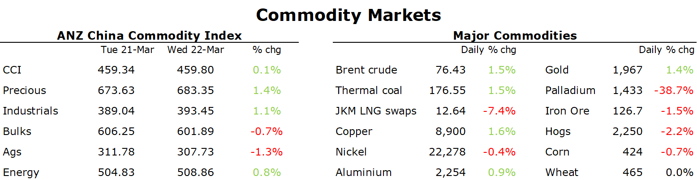

# Gold gains amid dovish tones from Fed

**Date:** March 23, 2023  
**Publisher:** Breakwave Advisors | **Category:** Market Insights  
**Original URL:** [https://www.breakwaveadvisors.com/insights/2023/3/23/gold-gains-amid-dovish-tones-from-fed](https://www.breakwaveadvisors.com/insights/2023/3/23/gold-gains-amid-dovish-tones-from-fed)  

---

*By*[*Daniel Hynes*](https://www.linkedin.com/in/dahynes/)

The prospect of an end to the tightening cycle boosted sentiment across commodity markets. This was supported by a weaker USD.

> **Figure 1: 1679521457487**  
> [Local Asset](file:///C:/Users/Dell/Github/Shipping/corpus/03-breakwave/insights/2023/assets/2023-03-23_gold-gains-amid-dovish-tones-from-fed_img_1679521457487_86e2116ff388.png)

**Crude oil**gained early in the session after positive signs of demand. The Energy Information Association’s weekly report highlighted strong exports, while domestic fuel stockpiles declined. Gasoline inventories fell 6,399kbbl last week, in a sign consumer demand is rising strongly. This was despite a rise in commercial crude oil inventories by 1,117kbbl. Asian demand is also showing signs of strength. The closely watched gauge of the Brent-Dubai spread fell to USD1.54/bbl, the lowest level since February 2021. Crude oil held onto these gains following the FOMC’s decision to hike rates by 25bp. While Fed Chair Powell called the banking system strong and resilient, he warned that recent developments could create tighter credit conditions. This saw further gains in crude oil on the prospect of a pause in rate hikes later this year.

**Gold**finished higher as a weaker USD and lower Treasury yields boosted investor demand. Gold’s price action following the FOMC meeting suggests the market had largely priced-in the 25bp hike. Powell also suggested the Fed believes the economic outlook is weaker today than at the beginning of the year. That is likely to have provided further support to gold, as investors try to shield themselves from weaker growth and a depreciating USD.

**Copper**led the base metals higher amid the broader risk-on tone. The focus is now likely to return to fundamentals. Sentiment was supported by signs of stronger demand in China early this week. Inventories at Shanghai Exchange warehouses fell 15% last week. Stockpiles immediately available for delivery at LME warehouses also fell 17% this week.**Lithium**prices remained under pressure despite Chile requiring all new projects to use an untried process in a bid to reduce water losses. The requirement may constrain future production from the world’s biggest holder of reserves just as demand is picking up.

**Iron ore**futures fell sharply amid a weakening backdrop in China. Ten Chinese steel mills lowered their prices of steel products, according to Mysteel. At the same time, spot prices for rebar used in construction have slumped sharply. The impact of China’s reopening may be short lived amid ongoing underlying issues in China’s property market. This could lead to[**further weakness in the iron ore price**](../pdfs/2023-03-23_gold-gains-amid-dovish-tones-from-fed_commodity-call-steel-trap-1_f2e9c890fe24.pdf)this year.

The rollercoaster ride in**European gas**prices continued overnight, with Tuesday’s gains wiped out by the prospect of weaker demand. Strong electricity generation from wind power is expected in coming days, just as demand subsides as the heating season ends. Recent supply issues did little to support**North Asian LNG**prices. Disruptions at an LNG facility in Angola and technical issues at the Freeport LNG export terminal are expected to be short lived.

Data source:[Commodities Wrap](https://www.linkedin.com/newsletters/commodities-wrap-6692196755876012032/?fbclid=IwAR3kiXJqZdxmp9ZcRwBNI7FsBySI-XSC0pfPur1qzjt7OZp7PTE59Tsl1QI)
