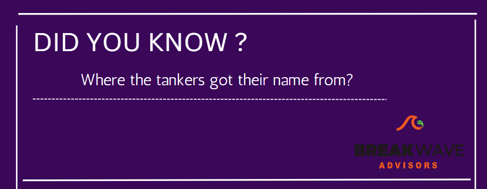
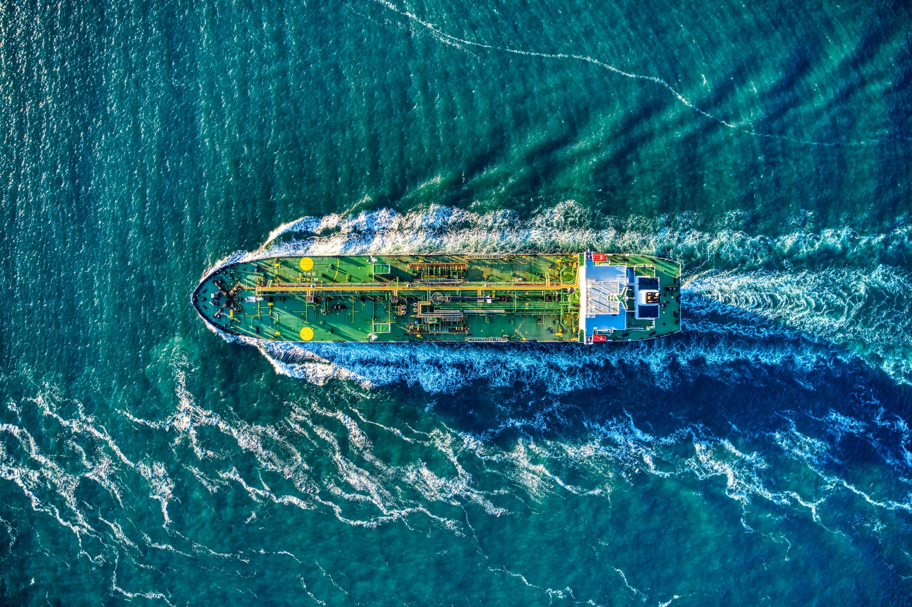

# Did you know?

**Date:** March 23, 2023  
**Publisher:** Breakwave Advisors | **Category:** Market Insights  
**Original URL:** [https://www.breakwaveadvisors.com/insights/2023/3/23/jsg1mnc919cdlntpj81a1ciys1ak34](https://www.breakwaveadvisors.com/insights/2023/3/23/jsg1mnc919cdlntpj81a1ciys1ak34)  

---

> **Figure 1: 2 (4)**  
> [Local Asset](file:///C:/Users/Dell/Github/Shipping/corpus/03-breakwave/insights/2023/assets/2023-03-23_jsg1mnc919cdlntpj81a1ciys1ak34_img_228429_003cfb21b631.png)

Tankers from the word tank, as these ships were created to transport liquids such as crude oil and petroleum products.

During their creation, large capacity tanks were envisioned, which could safely and quickly transport liquids

> **Figure 2: Unsplash Image Tm Pbz5uhiu**  
> [Local Asset](file:///C:/Users/Dell/Github/Shipping/corpus/03-breakwave/insights/2023/assets/2023-03-23_jsg1mnc919cdlntpj81a1ciys1ak34_img_unsplash-image-tm-pbz5uhiu_9fbace35a6fa.jpg)

## Tankers Transport 2/3 of All Crude

- The crude tanker market exists due to the geographic distances between oil fields and refining capacity.

- Oil fields that are economically viable to extract are geographically concentrated.
- Refineries are expensive, complex assets that are most often built close to where oil products are consumed in the highest quantities.
