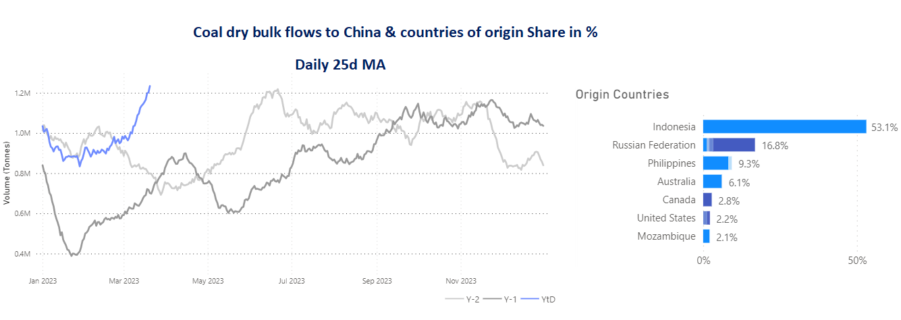
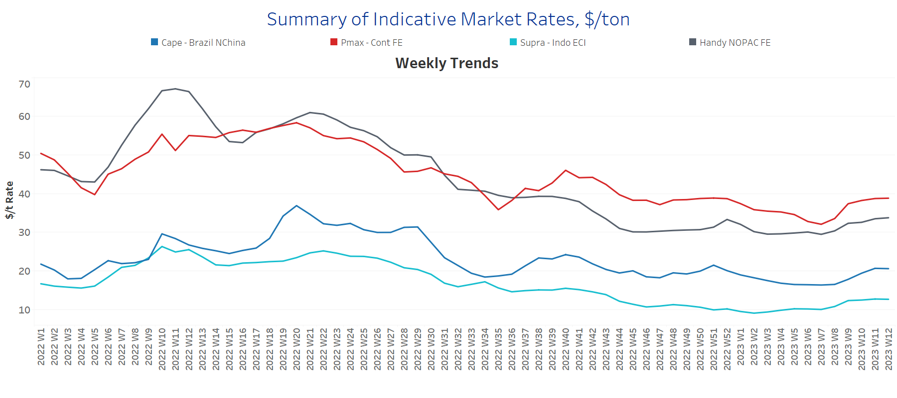
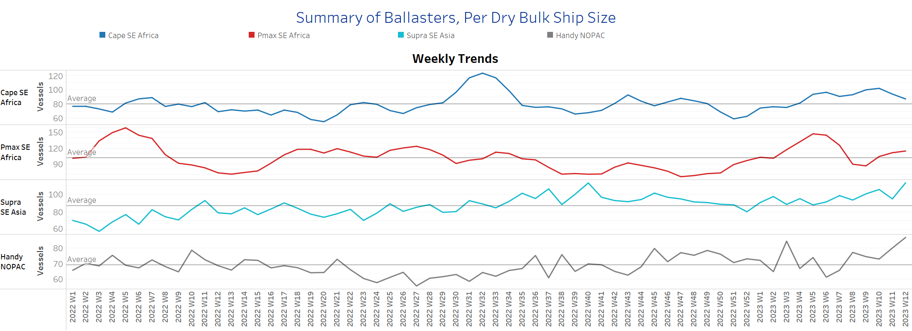
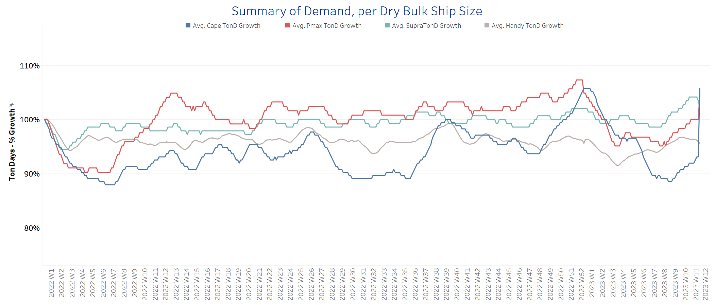
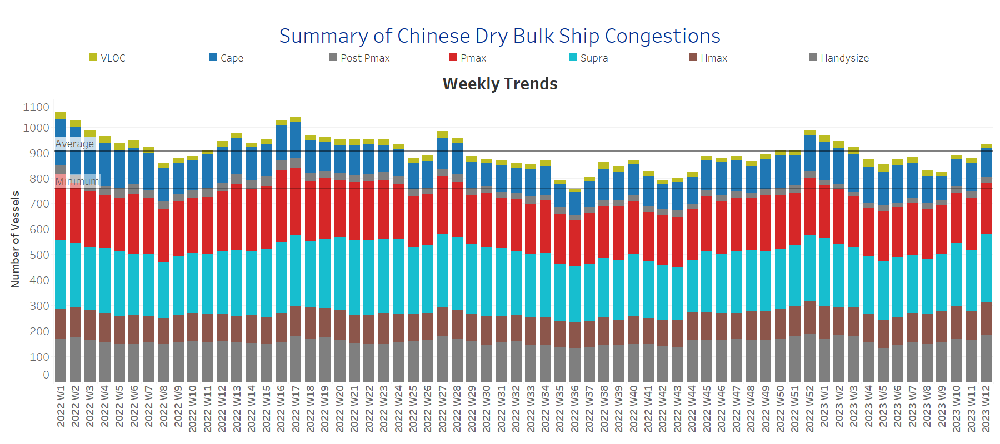

# Signal Dry Bulk Weekly Report

**Date:** March 23, 2023  
**Publisher:** Breakwave Advisors | **Category:** Market Insights  
**Original URL:** [https://www.breakwaveadvisors.com/insights/2023/3/23/signal-dry-bulk-weekly-report](https://www.breakwaveadvisors.com/insights/2023/3/23/signal-dry-bulk-weekly-report)  

---

[

> **Figure 1: 2 (4)**  
> **Interactive Data & Source:** [Signal Ocean Platform](https://go.signalocean.com/e/983831/dry-dynamic-drybulkflows/2nrkrx/308838003?h=ZzvUkgvtI8mqyaWhTXd4jCrE9jXzBeCh34a6H8uK5OM) | [Local Asset](file:///C:/Users/Dell/Github/Shipping/corpus/03-breakwave/insights/2023/assets/2023-03-23_signal-dry-bulk-weekly-report_img_228429_003cfb21b631.png)](https://www.breakwaveadvisors.com/insights/2023/3/23/jsg1mnc919cdlntpj81a1ciys1ak34)

## Chart of the Week Dry Bulk: Coal to Chinaincrease in the Volume of Tonnes in the First Quarter of the Year to a New High, with Russia Taking Second Place Among the Countries of Origin

> **Figure 2: Data Source: The Signal Ocean Platform**  
> *Data Source: The Signal Ocean Platform, Dry Bulk Flowshttps://go.signalocean.com/e/983831/dry-dynamic-drybulkflows/2nrkrx/308838003?h=ZzvUkgvtI8mqyaWhTXd4jCrE9jXzBeCh34a6H8uK5OM*  
> **Interactive Data & Source:** [Signal Ocean Platform](https://go.signalocean.com/e/983831/dry-dynamic-drybulkflows/2nrkrx/308838003?h=ZzvUkgvtI8mqyaWhTXd4jCrE9jXzBeCh34a6H8uK5OM) | [Local Asset](file:///C:/Users/Dell/Github/Shipping/corpus/03-breakwave/insights/2023/assets/2023-03-23_signal-dry-bulk-weekly-report_img_unnamed-2023-03-23t135055271_787dc3184bcd.png)

The third week of March has confirmed that the first quarter is ending with positive momentum for higher rates as demand growth recovers, especially for the larger ship categories. The supply of ballast vessels in the Capesize segment is now gradually decreasing, and demand growth is higher than ever before this year, reaching its final peak at the end of 2022.

In the coal segment, imports to China are now rising to the highest level compared to a similar period in the previous two years (see image above - the 25 days moving average), with Russia taking second place among source countries. This firmness in Chinese coal imports suggests that the recent upward trend in freight rates and demand will continue, providing more employment opportunities for prompt vessels.

Meanwhile, the smaller vessel categories will continue to face challenges as tensions between Russia and Ukraine continue to impede the flow of grain and increase congestion at Black Sea ports. However, it has been interesting to read in recent days about the extension of the grain agreement that will allow Ukraine to export millions of tonnes of grain across the Black Sea. It is unclear how long the agreement will last. Ukraine is pushing for 120 days, while Russia is asking for 60 days. Russia has already warned that it will not allow the agreement to be extended unless sanctions against Moscow are eased.

For more information on this week's trends, see the analysis sections below: Freight Market, Supply, Demand and Port Congestion

## Section 1/ Freight -Market Rates ($/T) Firmer

‘The Big Picture’ - Capesize and Panamax Bulkers and Smaller Ship Sizes

> **Figure 3: Market Chart 3**  
> **Interactive Data & Source:** [Signal Ocean Platform](https://www.thesignalgroup.com/signal-ocean-platform) | [Local Asset](file:///C:/Users/Dell/Github/Shipping/corpus/03-breakwave/insights/2023/assets/2023-03-23_signal-dry-bulk-weekly-report_img_unnamed-2023-03-23t135218423_23b4ef19982f.png)

The third week of March confirmed the upward trend of the previous days, with the major ship categories, Capesize and Panamax, showing an even stronger performance than at the beginning of the month.

- **Capesize**vessel freight rates are now approaching the $21/tonne mark, nearly $4.5/tonne higher than 5 weeks ago.
- **Panamax**vessel freight rates fromtheContinent to the Far East peaked at $39/tonne, and as we approach the end of the third week of March, further increases are expected. Current rates are now $7/tonne above the week 7 low.
- **Supramax**freight rates for the Indo-ECI route rose nearly $12.7/tonne, and there are signs of continued momentum in the days ahead.
- **Handysize**freight rates for the NOPAC Far East route are now at $34/tonne, up $4.5/tonne from week 7, with four straight weeks of a significant upward trend.

## Section 2/ Supply -Ballasters (# Vessels) Increasing

> **Figure 4: Supply Trend Lines for Key Load Areas**  
> **Interactive Data & Source:** [Signal Ocean Platform](https://www.thesignalgroup.com/signal-ocean-platform) | [Local Asset](file:///C:/Users/Dell/Github/Shipping/corpus/03-breakwave/insights/2023/assets/2023-03-23_signal-dry-bulk-weekly-report_img_unnamed-2023-03-23t135316360_498d58a22ce4.png)

The number of ballast ships has increased in all size classes, with only Capesize ships showing a slowdown.

- **Capesize**SE Africa: The number of vessels is now 87, down 15 from week 10 and up 7 from the annual average.
- **Panamax**SE Africa: The number of vessels maintained increased to 113, 27 more than three weeks ago, with a tendency to decrease towards the end of the third week of March.
- **Supramax**SE Asia: The number of vessels increased to 112, 18 more than the previous week and 29% above the annual average.
- **Handys**i**ze**NOPAC: The number of vessels now stands at 80, 11 above the annual average and steadily increasing since week 6.

## Section 3/ Demand -TonDays Increasing

> **Figure 5: TonDays Increasing**  
> **Interactive Data & Source:** [Signal Ocean Platform](https://www.thesignalgroup.com/signal-ocean-platform) | [Local Asset](file:///C:/Users/Dell/Github/Shipping/corpus/03-breakwave/insights/2023/assets/2023-03-23_signal-dry-bulk-weekly-report_img_unnamed-2023-03-23t135354300_03d2d58c0365.png)

The third week of March continues to surprise with a strong upward trend in the Capesize segment, while Panamax and Supramax show a notable increase.

- **Capesize**demand ton-days: The upward trend has now reached the growth level of the peak at the end of last year, and it seems that March will end as the highest of the first quarter.
- **Panamax**demand ton-days: Growth has increased for four consecutive weeks, but is still well below the peak of late last year.
- **Supramax**demand ton-days: The upward trend seems to have reached the highest level of the first quarter, and it remains to be seen whether the trend will consolidate in the last week of March.
- **Handysize**demand ton-days: Signs of stronger momentum remained positive compared to the low in the second week of the year.

## Section 4/ Port Congestion -No of Vesselsincreasingdry Bulk Ships Congested at Chinese Ports

> **Figure 6: Increasing**  
> **Interactive Data & Source:** [Signal Ocean Platform](https://www.thesignalgroup.com/signal-ocean-platform) | [Local Asset](file:///C:/Users/Dell/Github/Shipping/corpus/03-breakwave/insights/2023/assets/2023-03-23_signal-dry-bulk-weekly-report_img_unnamed-2023-03-23t135437269_cbd001f17ec3.png)

In the third week of March, volumes in the Supramax and Handysize segments continued to rise, and it looks like the increase will continue for another week. In the last three weeks, the increase has accelerated.

- **Capesize:**The number of vessels now stands at 112, 8 more than two weeks ago and 19 more than in week 9.
- **Panamax:**The number of vessels is now at 196, down almost 9 from the previous week, but still too high as we have not seen a count of less than 190 since the end of Week 4.
- **Supramax:**The number of vessels is now at 270, up 30 from a week ago and up 27% from the end of week 8.
- **Handysize**: The number of congested vessels reached 187, 21 more than a week ago, with signs of increasing in consecutive weeks since the end of week 5 (~133 vessels).

Data Source:[Signal Ocean Platform](https://www.thesignalgroup.com/signal-ocean-platform)
