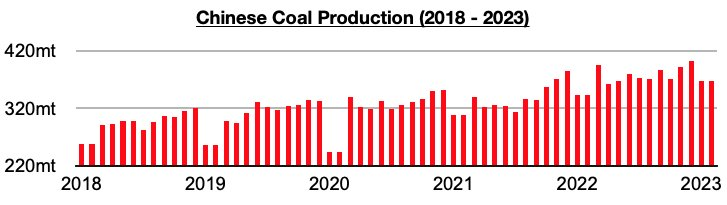
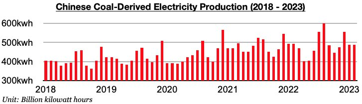
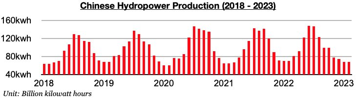

# China's Coal Production Remains Strongest

**Date:** March 24, 2023  
**Publisher:** Breakwave Advisors | **Category:** Market Insights  
**Original URL:** [https://www.breakwaveadvisors.com/insights/2023/3/24/chinas-coal-production-remains-strongest](https://www.breakwaveadvisors.com/insights/2023/3/24/chinas-coal-production-remains-strongest)  

---

[

> **Figure 1: Byjeffrey Landsberg**  
> *ByJeffrey Landsberg*  
> **Interactive Data & Source:** [Linkedin](https://www.linkedin.com/in/jeffrey-landsberg-70ab957/) | [Local Asset](file:///C:/Users/Dell/Github/Shipping/corpus/03-breakwave/insights/2023/assets/2023-03-24_chinas-coal-production-remains-strongest_img_128729_6ae82f1f92f6.png)](https://www.breakwaveadvisors.com/insights/2023/3/24/did-you-know)

China’s coal production averaged 367.1 million tons in January/February. This marks a decline of 35.6 million tons (-9%) from December's record production but is up year-on-year by 23.8 million tons (7%). As we have been stressing in our work, the government last year shifted its focus to ensuring robust coal production rather than focusing on mine safety. This led to a very significant change, and coal production now routinely fares better than coal-derived electricity generation. This was not always the case.

> **Figure 2: Chart 1 (75)**  
> [Local Asset](file:///C:/Users/Dell/Github/Shipping/corpus/03-breakwave/insights/2023/assets/2023-03-24_chinas-coal-production-remains-strongest_img_chart1287529_a32ac60c8277.jpg)

China's electricity production averaged 674.9 billion kilowatt hours. This marks a decline of 83 billion kilowatt hours (-11%) from December but is up year-on-year by 17.7 billion kilowatt hours (3%). Overall, it is normal for both coal and electricity production to decline on a month-on-month basis at the start of every year in China. Year-on-year growth metrics remain more significant for analyzing how these markets are faring.

Coal-derived electricity generation averaged 487.9 billion kilowatt hours. This marks a decline of 67 billion kilowatt hours (-12%) from December and is down year-on-year by 5.1 billion kilowatt hours (-1%). Coal-derived electricity generation has fared worse than coal production during fourteen of the last sixteen months.

> **Figure 3: Chart 2 (64)**  
> [Local Asset](file:///C:/Users/Dell/Github/Shipping/corpus/03-breakwave/insights/2023/assets/2023-03-24_chinas-coal-production-remains-strongest_img_chart2286429_a888f170dd3c.jpg)

Hydropower production averaged 68.4 billion kilowatt hours. This marks a decline of 6.3 billion kilowatt hours (-9%) from December and is down year-on-year by 1.6 billion kilowatt hours (-2%).

> **Figure 4: Chart 3 (45)**  
> [Local Asset](file:///C:/Users/Dell/Github/Shipping/corpus/03-breakwave/insights/2023/assets/2023-03-24_chinas-coal-production-remains-strongest_img_chart3284529_ad6f9345c9d3.jpg)
