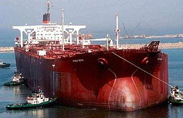
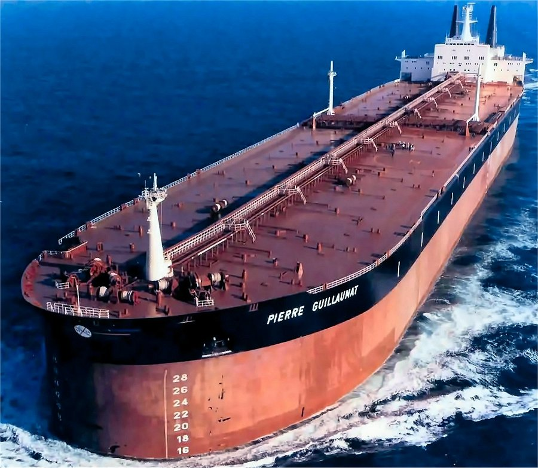
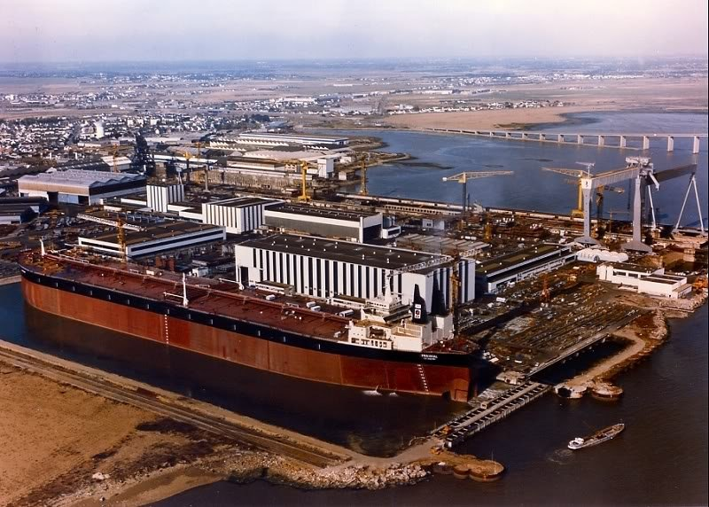

# Did you Know?

**Date:** March 24, 2023  
**Publisher:** Breakwave Advisors | **Category:** Market Insights  
**Original URL:** [https://www.breakwaveadvisors.com/insights/2023/3/24/did-you-know](https://www.breakwaveadvisors.com/insights/2023/3/24/did-you-know)  

---

> **Figure 1: 1 (7)**  
> [Local Asset](file:///C:/Users/Dell/Github/Shipping/corpus/03-breakwave/insights/2023/assets/2023-03-24_did-you-know_img_128729_6ae82f1f92f6.png)

## 1.seawise Giant

> **Figure 2: Knock Nevis**  
> [Local Asset](file:///C:/Users/Dell/Github/Shipping/corpus/03-breakwave/insights/2023/assets/2023-03-24_did-you-know_img_knock-nevis_0d2ff2ee967c.jpg)

Seawise Giant was the longest self-propelled ship in history, built in 1974–1979. The heaviest self-propelled ship of any kind, and with a laden draft of 24.6 m (81 ft), she was incapable of navigating the English Channel,[5] the Suez Canal or the Panama Canal. She was sunk in 1988 during the Iran–Iraq War, but was later salvaged and restored to service.

## 2.pierre Guillaumat

Built in 1977, Pierre Guillaumat was one of four Batillus class supertankers. It had a length of 414.23 m (1,359 ft), a deadweight tonnage of 555,051, a gross tonnage of 274,837 and was named after the French politician.

> **Figure 3: 1**  
> [Local Asset](file:///C:/Users/Dell/Github/Shipping/corpus/03-breakwave/insights/2023/assets/2023-03-24_did-you-know_img_1_a8cc668552a5.png)

## 3.prairial

Similar to the other Batillus class oil tankers, Prairial was built in the Chantiers de l’Atlantique shipyard located in Saint-Nazaire, France. It measures an impressive 414.22 m or 1,359.0 feet in length. Its deadweight tonnage was 555,046 and its gross tonnage was 274,825.

> **Figure 4: 13c7203c0**  
> [Local Asset](file:///C:/Users/Dell/Github/Shipping/corpus/03-breakwave/insights/2023/assets/2023-03-24_did-you-know_img_13c7203c0_b01fa54d42bb.jpg)
