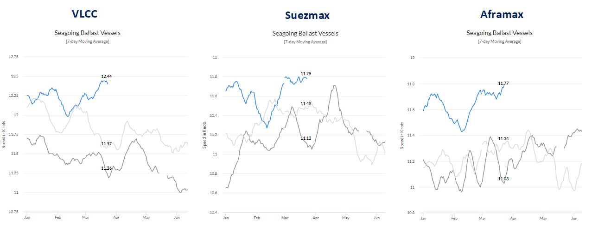
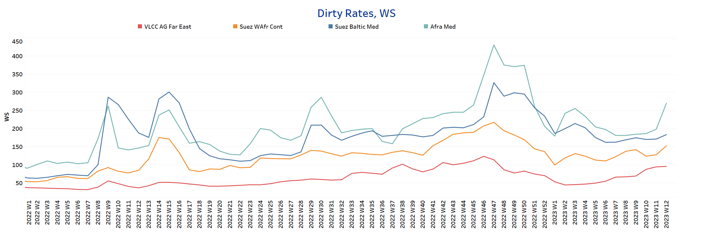
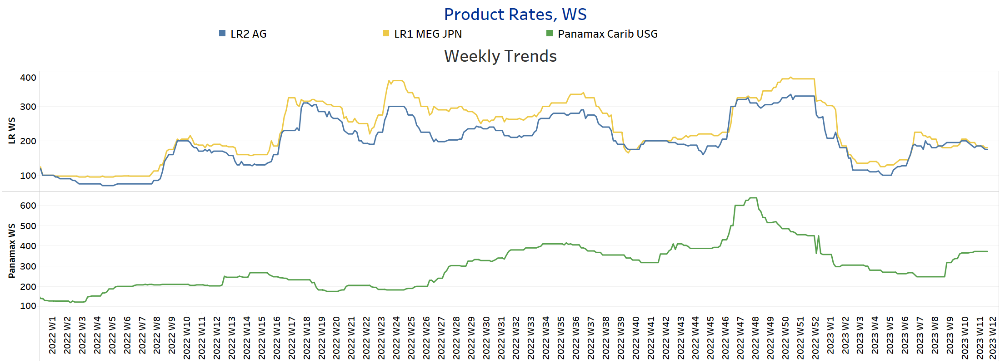
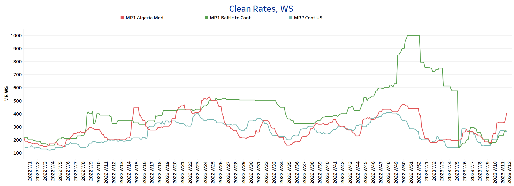
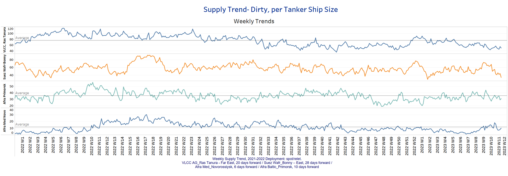
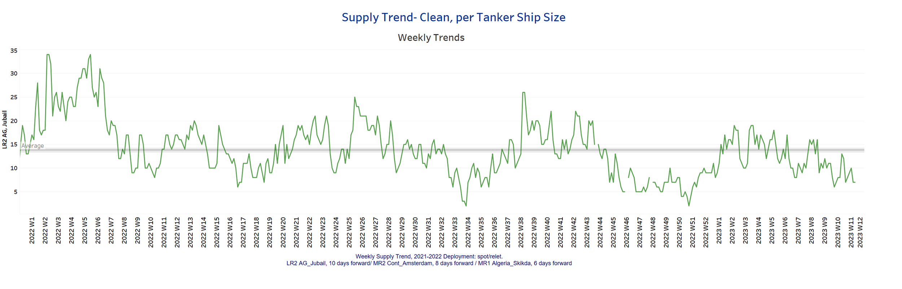
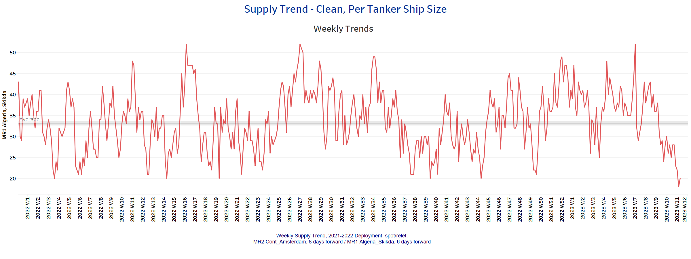
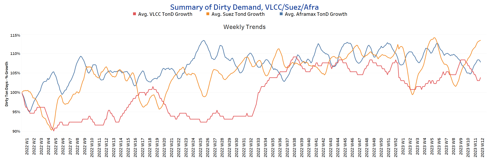
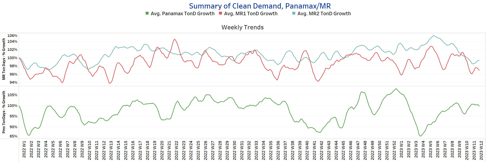

# Signal Tanker Weekly Report

**Date:** March 24, 2023  
**Publisher:** Breakwave Advisors | **Category:** Market Insights  
**Original URL:** [https://www.breakwaveadvisors.com/insights/2023/3/24/signal-tanker-weekly-report](https://www.breakwaveadvisors.com/insights/2023/3/24/signal-tanker-weekly-report)  

---

[

> **Figure 1: 1 (7)**  
> **Interactive Data & Source:** [Signal Ocean Platform](https://go.signalocean.com/e/983831/tanker-reports-vesselSpeeds/2nrrfb/308951187?h=nsVKyXtPOhFKdGqf1wf8uuL0wXygghrKTH87E2s_HF0) | [Local Asset](file:///C:/Users/Dell/Github/Shipping/corpus/03-breakwave/insights/2023/assets/2023-03-24_signal-tanker-weekly-report_img_128729_6ae82f1f92f6.png)](https://www.breakwaveadvisors.com/insights/2023/3/24/did-you-know)

## Chart of the Week: Increased Ballast Speed in the Crude Oil Tanker Segment

> **Figure 2: Market Chart 2**  
> **Interactive Data & Source:** [Signal Ocean Platform](https://go.signalocean.com/e/983831/tanker-reports-vesselSpeeds/2nrrfb/308951187?h=nsVKyXtPOhFKdGqf1wf8uuL0wXygghrKTH87E2s_HF0) | [Local Asset](file:///C:/Users/Dell/Github/Shipping/corpus/03-breakwave/insights/2023/assets/2023-03-24_signal-tanker-weekly-report_img_unnamed-2023-03-24t120956729_1b6a554549a4.png)

Data Source: The Signal Ocean Platform, Toncharts - Vessel Speeds
[Signal Ocean Platform](https://go.signalocean.com/e/983831/tanker-reports-vesselSpeeds/2nrrfb/308951187?h=nsVKyXtPOhFKdGqf1wf8uuL0wXygghrKTH87E2s_HF0)

Euphoria appears to be unabated, particularly in the crude tanker segment, with demand growth at Suezmax and Aframax showing clear signs of firmness. Meanwhile, the first quarter upturn is intensely reflected in crude oil tanker seagoing ballast speed, with owners willing to run even higher ballast speeds to take advantage of profitable rate employment opportunities in the physical market. As the first quarter of the year draws to a close, crude oil tanker ballast speeds are now marking the highest level not only for this year but also for 2022 and 2021 in a similar time frame (see chart above).

Meanwhile, oil prices have shown an upward trend on Wednesday after the Federal Reserve raised the short-term interest rate by 25 basis points and emphasized that the "U.S. banking system is sound and resilient."[Oil.Price.com](http://oil.price.com/)news reports that Goldman Sachs expects oil prices to be higher in 12 months, analysts at the investment bank said in a note, citing a projected increase in demand in China to more than 16 million barrels a day during that period.

For more information on this week's trends, see the analysis sections below:

Freight Market, Supply and Demand

## Section 1/ Freight - Market Rates (WS)

## ‘Dirty’ VLCC - Suezmax - Aframax-Firmer

> **Figure 3: Firmer**  
> **Interactive Data & Source:** [Signal Ocean Platform](https://www.thesignalgroup.com/signal-ocean-platform) | [Local Asset](file:///C:/Users/Dell/Github/Shipping/corpus/03-breakwave/insights/2023/assets/2023-03-24_signal-tanker-weekly-report_img_unnamed-2023-03-24t121059461_ed2ac1ddbed2.png)

Crude oil freight rate sentiment improved across all size classes, with the Aframax-Med route showing a notable increase.

- **VLCC**AG-FE freight rates were at WS96, up nearly 40 points from earlier in the year.​​​​​​
- **Suezmax**freight rates from West Africa to continental Europe rose to WS 153, nearly 30 points higher than three weeks ago, with a firm trend emerging for the next few days.
- **Aframax**Med freight rates rose to WS 270, 70 points higher than a week ago and the highest level since the end of week 4.

## ‘Product’ LR2 - LR1 |Softening

> **Figure 4: Softening**  
> **Interactive Data & Source:** [Signal Ocean Platform](https://www.thesignalgroup.com/signal-ocean-platform) | [Local Asset](file:///C:/Users/Dell/Github/Shipping/corpus/03-breakwave/insights/2023/assets/2023-03-24_signal-tanker-weekly-report_img_unnamed-2023-03-24t121155222_46cf2e2b42a6.png)

- **LR2**AG freight rates continued to lose momentum, falling to WS 175, down nearly 10 points from a week ago.

- **LR1**MEG -to-Japan freight rates continued a similar weakening as LR2 freight rates, falling 10 points to WS180, with signs of a possible further decline by the end of March.

## ‘Product’ Panamax - Steady

- **Panamax**Carib-to-USG rates showed relevant, steady dynamics and held at the previous week 11 level ~ around WS370, with a tendency to remain the same for till the end March.

## ‘Clean’ MR2 - MR1 - Firmer

> **Figure 5: Clean**  
> **Interactive Data & Source:** [Signal Ocean Platform](https://www.thesignalgroup.com/signal-ocean-platform) | [Local Asset](file:///C:/Users/Dell/Github/Shipping/corpus/03-breakwave/insights/2023/assets/2023-03-24_signal-tanker-weekly-report_img_unnamed-2023-03-24t121344572_ab070f0e6abd.png)

- **MR1**rates Algeria-to-Med are now at WS405, almost 20% higher than a week ago.

- **MR1**rates Baltic-to-Cont are now at WS275, 40 points higher than a week earlier.
- **MR2**rates Cont-to-US are now at WS265, indicating steadily stronger momentum in March and improved sentiment over the past four weeks.

## Section 2/ Supply -(# Vessels)'dirty'supply Trend Lines for Key Load Areasvlcc - Aframax - Suezmaxdecreasing

> **Figure 6: VLCC - Aframax - Suezmax**  
> **Interactive Data & Source:** [Signal Ocean Platform](https://www.thesignalgroup.com/signal-ocean-platform) | [Local Asset](file:///C:/Users/Dell/Github/Shipping/corpus/03-breakwave/insights/2023/assets/2023-03-24_signal-tanker-weekly-report_img_unnamed-2023-03-24t121420502_7aa16397a5bb.png)

The supply of crude oil tankers has decreased significantly for the VLCC and Suezmax, and there is also a downward trend for Aframax.

- **VLCC Ras Tanura**: The number of vessels is now around 50, 26 less than the annual average.
- **Suezmax Wafr Bonny**: The number of vessels is now 34, 50% lower than in week 9.
- **Aframax Primorsk**: The number of vessels is now 31, which is 4 below the annual average.
- **Aframax Med Novo**: The number of ships is now slightly below the annual average of 12, with a possible downward trend in the last days of March.

## ‘Clean’ Supply Trend Lines for Key Load Areas |LR2| Decreasing

> **Figure 7: Market Chart 7**  
> **Interactive Data & Source:** [Signal Ocean Platform](https://www.thesignalgroup.com/signal-ocean-platform) | [Local Asset](file:///C:/Users/Dell/Github/Shipping/corpus/03-breakwave/insights/2023/assets/2023-03-24_signal-tanker-weekly-report_img_unnamed-2023-03-24t121500153_1caebc53dbf1.png)

## ‘Clean’ Supply Trend Lines for Key Load Areas |MR1| Decreasing

> **Figure 8: Market Chart 8**  
> **Interactive Data & Source:** [Signal Ocean Platform](https://www.thesignalgroup.com/signal-ocean-platform) | [Local Asset](file:///C:/Users/Dell/Github/Shipping/corpus/03-breakwave/insights/2023/assets/2023-03-24_signal-tanker-weekly-report_img_unnamed-2023-03-24t121539342_fa6f5d24875a.png)

- **Clean LR2 AG Jubail:**The number of vessels is currently 7, with a decreasing trend in the last days of March and below the annual average of 13.

- **Clean MR1 Algeria Skikda:**The number of vessels has fallen to a record low of 20 since the previous week and is 7 below the annual average.

## Section 3 - Demand - Ton Days

## ‘Dirty’ |VLCC - Decreasing | Suezmax - Aframax -Increasing

> **Figure 9: Increasing**  
> **Interactive Data & Source:** [Signal Ocean Platform](https://www.thesignalgroup.com/signal-ocean-platform) | [Local Asset](file:///C:/Users/Dell/Github/Shipping/corpus/03-breakwave/insights/2023/assets/2023-03-24_signal-tanker-weekly-report_img_unnamed-2023-03-24t121615737_0f53fb621752.png)

## ‘Clean’ |Panamax - Increasing | MR2 - MR1 -Decreasing

> **Figure 10: Decreasing**  
> **Interactive Data & Source:** [Signal Ocean Platform](https://www.thesignalgroup.com/signal-ocean-platform) | [Local Asset](file:///C:/Users/Dell/Github/Shipping/corpus/03-breakwave/insights/2023/assets/2023-03-24_signal-tanker-weekly-report_img_unnamed-2023-03-24t121700847_a65cc1f8ed61.png)

- **Dirty**demand ton-days: Suezmax vessel demand is now posting its strongest growth since the end of week 4, while Aframax vessel sentiment is improving and VLCC vessels are seeing a downward correction.

- demand ton-days / Panamax demand: The upward trend of the previous week has now been confirmed in the last week of March and reached the highest level after the low of week 10.
- MR: The growth of MR maintained the downward trend observed since the last peak almost four weeks ago, and it seems to continue until the end of the month.

Data Source:[Signal Ocean Platform](https://www.thesignalgroup.com/signal-ocean-platform)
