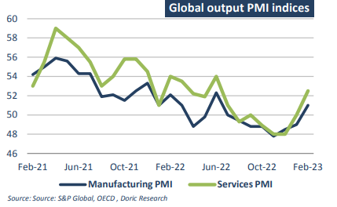
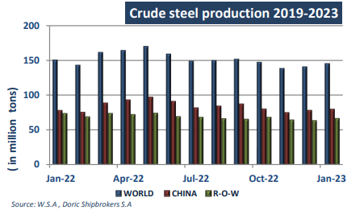

# Doric Weekly Market Insight

**Date:** March 27, 2023  
**Publisher:** Breakwave Advisors | **Category:** Market Insights  
**Original URL:** [https://www.breakwaveadvisors.com/insights/2023/3/27/doric-weekly-market-insight](https://www.breakwaveadvisors.com/insights/2023/3/27/doric-weekly-market-insight)  

---

## “Dalian and Singapore Iron Ore Futures Rebounded During Friday Afternoon Trading , Helped by Data Showing That Inventories at Chinese Ports Continued to Fall”

*By*[*Michalis Voutsinas*](https://www.linkedin.com/in/michalis-voutsinas-587544163/)

Global growth in 2022 came at 3.2 percent, some 1.3 percentage points weaker than expected in the December 2021 OECD Economic Outlook, reflecting the effects of Russo-Ukrainian conflict, the drag on household incomes from high inflation, rising interest rates and continued disruptions in China. In the fourth quarter of last year, global trade declined, with a continued recovery in international tourism offset by a drop in merchandise trade volumes. Outcomes were particularly soft in the Asia-Pacific region in the last few months of 2022, with output stagnating in Japan, activity in China held back by continued lockdowns and a wave of infections, and a downturn in the tech sector hitting exports in Korea, according to the OECD. With global growth softening and the Asia-Pacific region in the doldrums, Baltic indices didn't have any other choice but to lose value.

In early 2023, monthly data pointed to a near-term improvement in growth prospects in the largest economies, according to the Parisbased intergovernmental organisation. Consumer confidence started to improve, and enterprise survey indicators stabilised or rebounded in all major regions. In February, more firms reported rising output than falling output in all major economies, with substantial improvement in the US, the euro area, China and the UK. Behind this improvement in activity and sentiment in the main G20 economies, OECD sees a decline in global energy and food prices, which boosts purchasing power as well as the expected positive impact of China’s reopening on global activity. Baltic indices remained cautious observers of the latest developments in China for a good part of February, but they finally mirrored this underlying positive feeling on their March daily closings.

> **Figure 1: 1 (8)**  
> **Interactive Data & Source:** [Doric](https://www.doric.gr/) | [Local Asset](file:///C:/Users/Dell/Github/Shipping/corpus/03-breakwave/insights/2023/assets/2023-03-27_doric-weekly-market-insight_img_128829_aca1df036622.png)

Looking forward, global growth is projected to remain at a belowtrend rate in 2023-24, with inflation moderating gradually as the quick and synchronised monetary policy tightening over the past year takes full effect, according to the OECD. In fact, average annual growth of global GDP in 2023 is projected to be 2.6 percent, recovering to 2.9 percent in 2024, a rate close to the pre-pandemic trend, but sub-par compared to earlier decades. All but two G20 economies are projected to have slower growth in 2023 than in 2022, with China being a bold exception due to the easing of anti-Covid restrictions.

However, signals from the world’s second largest economy have been rather mixed lately, with its vast steel industry being under the spotlight. On the one hand, expectations from the bearing of China’s reopening on steel production are quite high. On the other hand, the initial boost of this reopening may be short lived amid ongoing underlying issues in China’s property market. Nevertheless, February’s official data were pointing to a strong recovery. In particular, the Brussels-based World Steel Association stressed this week that the total crude steel production for the 63 countries reporting to it checked in at 142.4 million metric tonnes this February. The aforementioned figure represents a one-percent decrease compared with February of last year. However, the world’s leading steel producing nation, China, reported a solid rebound compared with one year ago, with its output this February rising by some 5.6 percent. In sharp contrast, India, Japan and the US saw their steel production outputs decreasing

> **Figure 2: 1 (9)**  
> **Interactive Data & Source:** [Doric](https://www.doric.gr/) | [Local Asset](file:///C:/Users/Dell/Github/Shipping/corpus/03-breakwave/insights/2023/assets/2023-03-27_doric-weekly-market-insight_img_128929_e714363aa590.png)

Concerns that China may cut crude steel output for the remainder of the year pressured the iron ore and Capesize markets early last week. But sentiment picked up on Friday. Dalian and Singapore iron ore futures rebounded during afternoon trading today, helped by data showing that inventories at Chinese ports continued to fall. Iron ore inventories at major Chinese ports fell for the fourth week in a row by a total of 4.3 percent to 136.05 million tonnes as of March 24, according to Mysteel. Against this backdrop, Baltic Dry Index concluded Friday in the green, with Capesizes in the front seat.

Data source:[Doric](https://www.doric.gr/)
