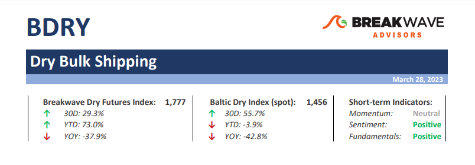
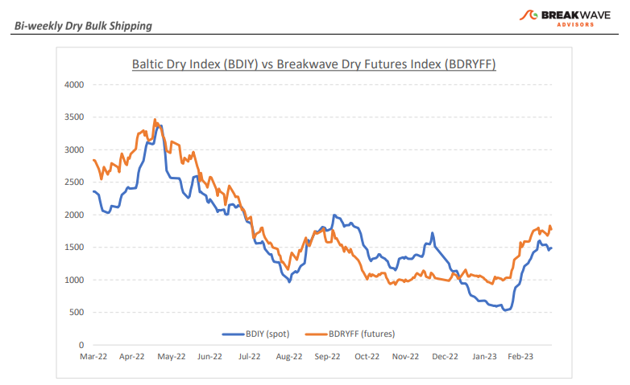
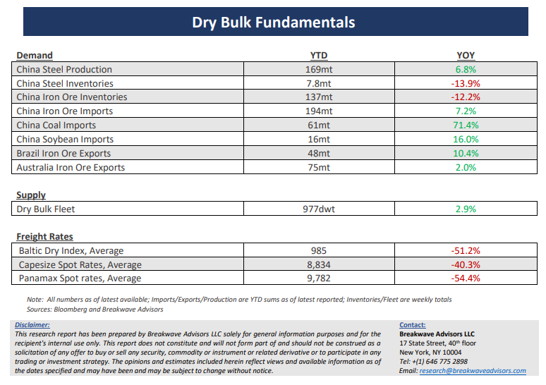

# Breakwave Bi-Weekly Dry Bulk Report - March 28, 2023

**Date:** March 28, 2023  
**Publisher:** Breakwave Advisors | **Category:** Market Insights  
**Original URL:** [https://www.breakwaveadvisors.com/insights/2023/3/27/breakwave-bi-weekly-dry-bulk-report-march-28-2023](https://www.breakwaveadvisors.com/insights/2023/3/27/breakwave-bi-weekly-dry-bulk-report-march-28-2023)  

---

> **Figure 1: Dbreporttop**  
> **Interactive Data & Source:** [Breakwave Advisors Market Insights](https://www.breakwaveadvisors.com/publications) | [Local Asset](file:///C:/Users/Dell/Github/Shipping/corpus/03-breakwave/insights/2023/assets/2023-03-28_breakwave-bi-weekly-dry-bulk-report-march-28-2023_img_dbreporttop_cfc6f7db626c.png)

**•Patience is a virtue: consolidation underway in a rather supportive backdrop**– With freight rates back to their historical range for this time of the year and futures remaining quite optimistic about the prospects, attention now turns to the next meaningful move for a spot market, which, especially on the Capesize sector, looks well supported. However, we presently don’t anticipate any imminent major move either way: It is still early in the year, the macro environment remains challenging, headline risk has been elevated, and commodity prices have seen wild swings because of broader economic risks. Yet, the backdrop remains quite supportive for dry bulk. Absent a major global economic crisis, something that nowadays seems just a headline away, we see continuing strength on the demand side for bulk commodities led by a Chinese economy that is in a gradual healing with lots of room to “catch up” on lost trade volumes from last year. The futures curve remains in a contango but in a flatter shape than before, leaving room for potential gains if indeed such a scenario plays out. In such an environment, patience is a virtue, and although we remain optimistic for the development of freight rates going forward, we would wait for a few more weeks before there is an all-clear signal from the various external factors affecting the global markets prior to reengaging our bullish view without necessarily expressing a bearish stance on existing positions.

**•Inventory replenishment should aid Chinese bulk imports**– The two main bulk commodities that have a meaningful impact on dry bulk volumes seem quite ripe for some stock replenishment following months of relative quietness. Iron ore inventories in China remain low versus expected consumption, while Chinese coal imports should experience continuing benefit from the implementation of zero tariffs for the rest of the year. Although Chinese steel production has recovered, there remains considerable room for further improvement, while exports out of Brazil, the main contributor to the distance-adjusted dry bulk demand, should start to increase seasonally as the rain season comes to an end. The China reopening trade will be lengthier and stretched out over a longer period of time, but that is a good thing for dry bulk shipping. With vessel supply growth remaining well below historical norms, the global fleet utilization should continue to steadily increase, putting upward pressure on freight rates and potentially providing the necessary setup up for spikes similar to the ones we have experienced over the past few years.

**•Dry bulk focus shifts back to fundamentals**– Following a period of high uncertainty and significant disruptions across the commodity spectrum, the gradual normalization of trade is shifting the market’s attention back to the traditional demand and supply dynamics that have shaped dry bulk profitability for decades. As effective fleet supply growth for the next few years looks marginal, demand will be the main determinant of spot freight rates with China returning back to the driver’s seat as the dominant force of bulk imports and thus shipping demand.

[Subscribe: Bi-Weekly Dry Bulk Report](https://www.breakwaveadvisors.com/publications)

> **Figure 2: Dbreportchart**  
> [Local Asset](file:///C:/Users/Dell/Github/Shipping/corpus/03-breakwave/insights/2023/assets/2023-03-28_breakwave-bi-weekly-dry-bulk-report-march-28-2023_img_dbreportchart_1ab84d02d7ff.png)

> **Figure 3: Dbreportbottom**  
> [Local Asset](file:///C:/Users/Dell/Github/Shipping/corpus/03-breakwave/insights/2023/assets/2023-03-28_breakwave-bi-weekly-dry-bulk-report-march-28-2023_img_dbreportbottom_a42f0da05514.png)
