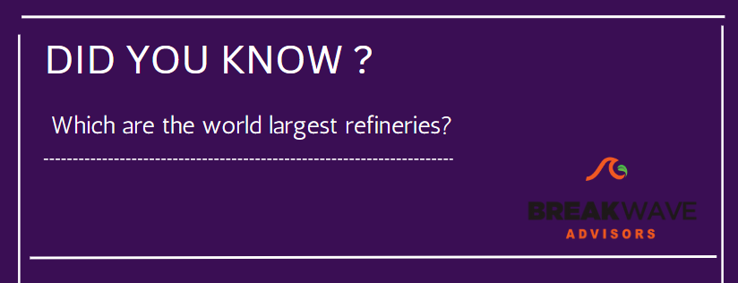
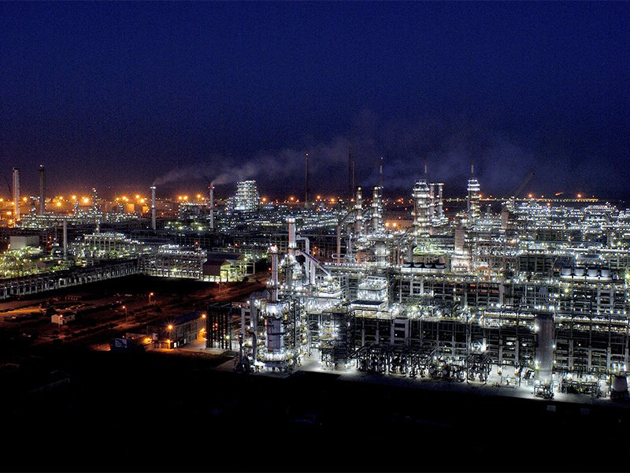
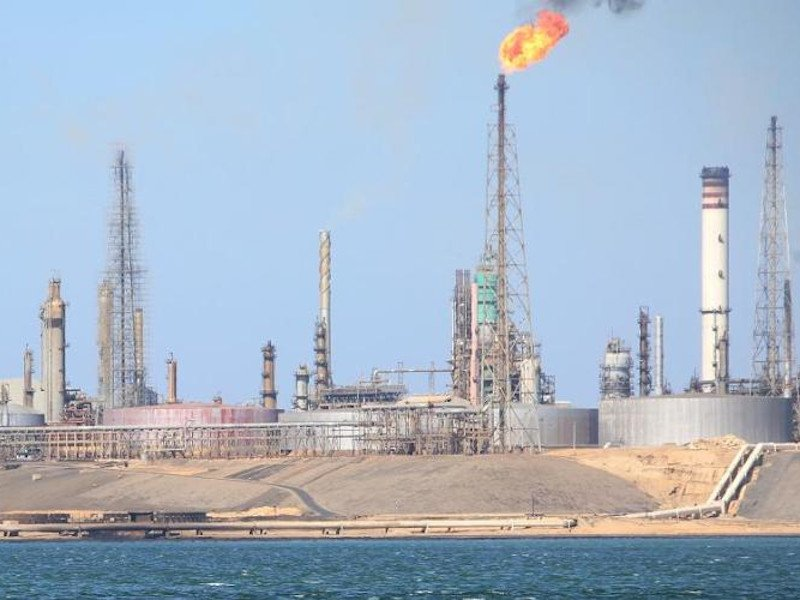
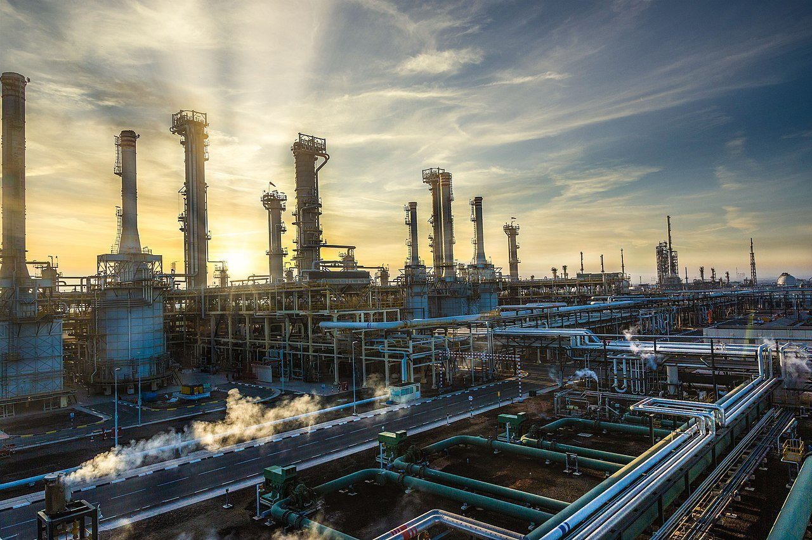

# Did you know?

**Date:** March 29, 2023  
**Publisher:** Breakwave Advisors | **Category:** Market Insights  
**Original URL:** [https://www.breakwaveadvisors.com/insights/2023/3/29/did-you-know](https://www.breakwaveadvisors.com/insights/2023/3/29/did-you-know)  

---

> **Figure 1: 1 (11)**  
> [Local Asset](file:///C:/Users/Dell/Github/Shipping/corpus/03-breakwave/insights/2023/assets/2023-03-29_did-you-know_img_1281129_6b3edcdadb69.png)

### Jamnagar Refinery

The Jamnagar Refinery is the private sector crude oil refinery owned by Reliance Industries in Jamnagar, Gujarat, India. The refinery was commissioned on 14 July 1999 with an installed capacity of 668,000 barrels per day. Its current installed capacity is 1,240,000 barrels per day, and it is currently the largest refinery in the world.

> **Figure 2: Jamnagar Refinery**  
> [Local Asset](file:///C:/Users/Dell/Github/Shipping/corpus/03-breakwave/insights/2023/assets/2023-03-29_did-you-know_img_jamnagar-refinery_8b1634d9fb2b.jpg)

> **Figure 3: Market Chart 3**  
> [Local Asset](file:///C:/Users/Dell/Github/Shipping/corpus/03-breakwave/insights/2023/assets/2023-03-29_did-you-know_img_image-2-paraguana-refinery-complex_6e10e6a48ca1.jpg)

### Paraguaná Refinery

The Paraguaná Refinery is a crude oil refinery complex in Venezuela. It started operations in 1949 with capacity to refine 30 thousand barrels per day. The complex accounts for 71% of the refining capacity of Venezuela and it belongs to the state-owned company Petróleos de Venezuela (PDVSA).

### Ruwais Refinery

The Ruwais Refinery is operated by the Abu Dhabi National Oil Company. The complex can process up to 837,000 barrels of crude oil and condensate per day, making it the fourth-largest single-site oil refinery in the world and the biggest in the Middle East. The refinery is situated in the city of Ruwais, in Abu Dhabi’s western region.

> **Figure 4: Adnoc Refining Ruwais Site 187**  
> [Local Asset](file:///C:/Users/Dell/Github/Shipping/corpus/03-breakwave/insights/2023/assets/2023-03-29_did-you-know_img_adnoc-refining-ruwais-site-187_b9c1ef10ae37.jpg)
