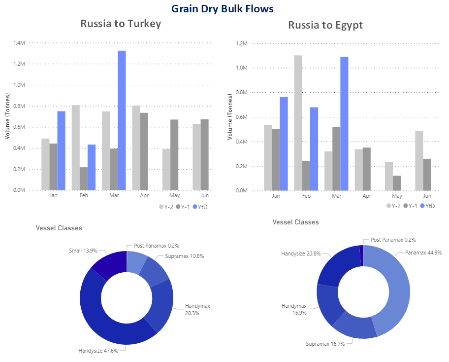
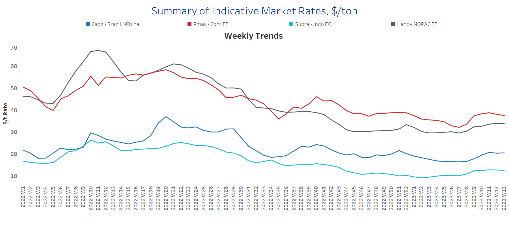
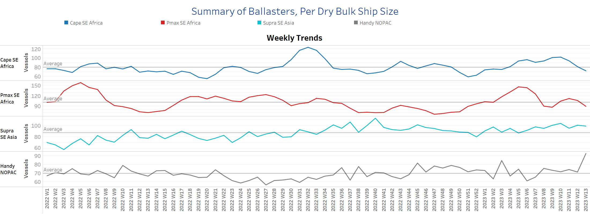
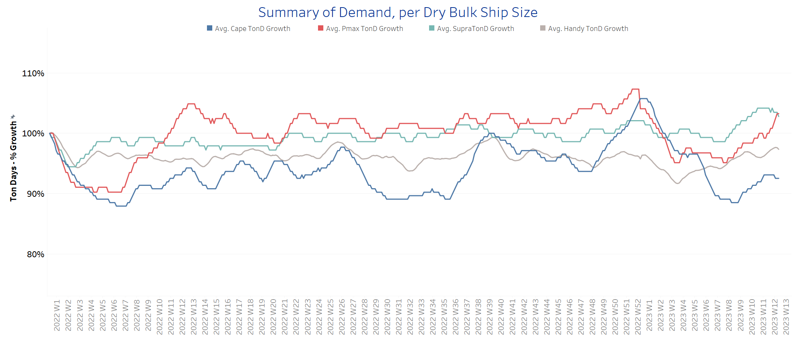
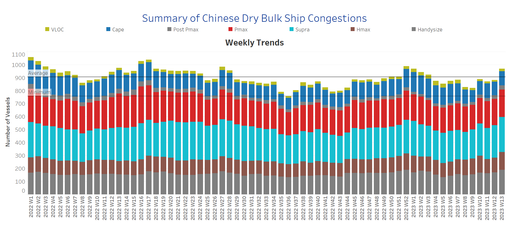

# Signal Dry Bulk Weekly Report

**Date:** March 29, 2023  
**Publisher:** Breakwave Advisors | **Category:** Market Insights  
**Original URL:** [https://www.breakwaveadvisors.com/insights/2023/3/29/signal-dry-bulk-weekly-report](https://www.breakwaveadvisors.com/insights/2023/3/29/signal-dry-bulk-weekly-report)  

---

[

> **Figure 1: Rise in the First Quarter of the Year to a New High**  
> *Rise in the first quarter of the year to a new high, with March recording the highest levels in the last two years*  
> **Interactive Data & Source:** [Signal Ocean Platform](https://go.signalocean.com/e/983831/dry-dynamic-drybulkflows/2ns4zj/310311216?h=dK61XiFkJ1HZh7nEatsGvRnM2ODFNDVsRo4yHjyhWjc) | [Local Asset](file:///C:/Users/Dell/Github/Shipping/corpus/03-breakwave/insights/2023/assets/2023-03-29_signal-dry-bulk-weekly-report_img_1281129_6b3edcdadb69.png)](https://www.breakwaveadvisors.com/insights/2023/3/29/did-you-know)

## Chart of the Week Dry Bulk: Grain Dry Bulk Flows From Russia to Turkey & Egypt

> **Figure 2: Market Chart 2**  
> **Interactive Data & Source:** [Signal Ocean Platform](https://go.signalocean.com/e/983831/dry-dynamic-drybulkflows/2ns4zj/310311216?h=dK61XiFkJ1HZh7nEatsGvRnM2ODFNDVsRo4yHjyhWjc) | [Local Asset](file:///C:/Users/Dell/Github/Shipping/corpus/03-breakwave/insights/2023/assets/2023-03-29_signal-dry-bulk-weekly-report_img_unnamed-2023-03-29t122925354_ae718f4a2140.png)

Data Source: The Signal Ocean Platform, Dry Bulk Flows
[Signal Ocean Platform](https://go.signalocean.com/e/983831/dry-dynamic-drybulkflows/2ns4zj/310311216?h=dK61XiFkJ1HZh7nEatsGvRnM2ODFNDVsRo4yHjyhWjc)

The last few days of March brought positive momentum for the smaller vessel categories as we have begun to see clearer signs of demand growth, with grain flows supporting firmness in the second quarter of the year. We have already indicated that the extension of the Black Sea grain trade for the next few days in April and May will boost demand-side sentiment. However, port congestion and vessel supply will challenge the euphoria, as the number of ballast vessels in the Handysize segment is still excessive. Interestingly, Russian grain exports to Egypt and Turkey recorded very high volumes in the first quarter of the year, especially in March when Handysize vessels reached a 48% share of Russian grain exports to Turkey and Panamax vessels reached a 45% share of exports to Egypt. (see image above)

Meanwhile, the earlier rise in Capesize rates is being threatened by news that China, the largest steel producer, is considering cutting its annual crude steel output by about 2.5% this year to reduce emissions. However, the China Iron and Steel Association (CISA) forecast in February that the steel sector will see an upward trend in 2023, supported by a stabilized property market and the recovery of other steel-consuming industries such as vehicles, ships and household appliances.

For more information on this week's trends, see the analysis sections below: Freight Market, Supply, Demand and Port Congestion

## Section 1/ Freight -Market Rates ($/T) Firmer

‘The Big Picture’ - Capesize and Panamax Bulkers and Smaller Ship Sizes

> **Figure 3: Market Chart 3**  
> **Interactive Data & Source:** [Signal Ocean Platform](https://www.thesignalgroup.com/signal-ocean-platform) | [Local Asset](file:///C:/Users/Dell/Github/Shipping/corpus/03-breakwave/insights/2023/assets/2023-03-29_signal-dry-bulk-weekly-report_img_unnamed-2023-03-29t123214574_01938bcc1f06.png)

At the end of March, the firmness of the previous days was confirmed with a weakening momentum in Capesize and Panamax.

- **Capesize**vessel freight rates are now $20.5/tonne mark, up almost $4/tonne from 5 weeks ago.
- **Panamax**vessel freight rates fromtheContinent to the Far East fell slightly below $38/tonne, while current rates are now $6/tonne above the week 7 low.
- **Supramax**freight rates for the Indo-ECI route remained around $12.5/tonne, and there are signs of continued momentum in April.
- **Handysize**freight rates for the NOPAC Far East route continue to hover around $34/tonne, up $4.5/tonne from week 7, with five consecutive weeks of a significant upward trend.

## Section 2/ Supply -Ballasters (# Vessels) Decreasing

> **Figure 4: Supply Trend Lines for Key Load Areas**  
> **Interactive Data & Source:** [Signal Ocean Platform](https://www.thesignalgroup.com/signal-ocean-platform) | [Local Asset](file:///C:/Users/Dell/Github/Shipping/corpus/03-breakwave/insights/2023/assets/2023-03-29_signal-dry-bulk-weekly-report_img_unnamed-2023-03-29t123305049_d88f51127dcc.png)

The number of ballast ships declined significantly in the major vessel categories, while Capesize ships maintained the accelerated pace of the previous week.

- **Capesize**SE Africa: The number of vessels now stands at 72, down 9 from the previous week and 8 below the annual average.
- **Panamax**SE Africa: The number of ships fell to 89, 23 fewer than three weeks ago, with a tendency to fall below the annual average of 100 in the coming few days.
- **Supramax**SE Asia: The number of vessels increased to 99, 4 more than two weeks ago and 12 above the annual average.
- **Handysize**NOPAC: The number of vessels is now 93, 30% above the annual average and the highest level in the last year.

## Section 3/ Demand -TonDays Increasing

> **Figure 5: TonDays Increasing**  
> **Interactive Data & Source:** [Signal Ocean Platform](https://www.thesignalgroup.com/signal-ocean-platform) | [Local Asset](file:///C:/Users/Dell/Github/Shipping/corpus/03-breakwave/insights/2023/assets/2023-03-29_signal-dry-bulk-weekly-report_img_unnamed-2023-03-29t123334756_67f409981d20.png)

Overall, March ends with a notable turnaround in the Panamax segment and improved sentiment in the smaller ship categories.

- **Capesize**demand ton-days: The upward trend of the previous three weeks slowed in the last days of March, and a loss of momentum is expected in the following days.
- **Panamax**demand ton-days: Growth reached a new high at the end of March, and the trend is expected to continue in a similar way in the first days of April.
- **Supramax**demand ton-days: The upward trend of the last four weeks seems to have peaked before the end of March, with signs of slowing momentum.
- **Handysize**demand ton-days: There continue to be positive signs of stronger momentum towards the end of the first quarter, and growth is well above the week 6 low.

## Section 4/ Port Congestion -No of Vesselsincreasingdry Bulk Ships Congested at Chinese Ports

> **Figure 6: Increasing**  
> **Interactive Data & Source:** [Signal Ocean Platform](https://www.thesignalgroup.com/signal-ocean-platform) | [Local Asset](file:///C:/Users/Dell/Github/Shipping/corpus/03-breakwave/insights/2023/assets/2023-03-29_signal-dry-bulk-weekly-report_img_unnamed-2023-03-29t123412415_4f2294f03e03.png)

Congestion continues to increase, with the Handysize, Supramax and Panamax segments taking the current upward trend to a new accelerated level before the end of March.

- **Capesize:**The number of vessels now stands at 107, 14 more than in week 9.
- **Panamax:**The ship count is now at 210, 8 more than the previous week and still too high as we have not seen a count of less than 190 since the end of week 4.
- **Supramax:**The number of ships is now 270, 20 more than the previous week and 30% more than the end of week 8.
- **Handysize**: The number of congested vessels reached 189, 2 more than a week ago, with signs of a record increase since the end of week 5 (~133 vessels).

Data Source:[Signal Ocean Platform](https://www.thesignalgroup.com/signal-ocean-platform)
