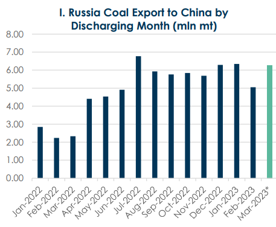
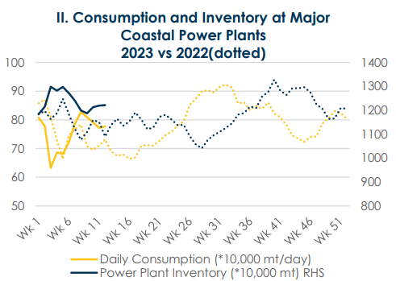
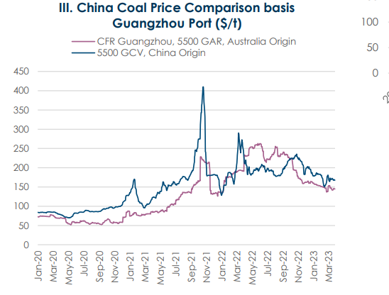
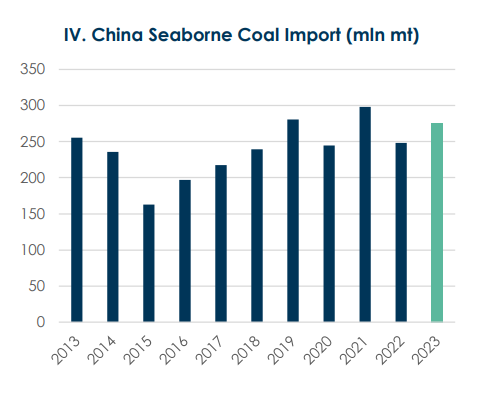

# BRS Dry Bulk Weekly Newsletter

**Date:** March 30, 2023  
**Publisher:** Breakwave Advisors | **Category:** Market Insights  
**Original URL:** [https://www.breakwaveadvisors.com/insights/2023/3/30/brs-dry-bulk-weekly-newsletter](https://www.breakwaveadvisors.com/insights/2023/3/30/brs-dry-bulk-weekly-newsletter)  

---

> **Figure 1: Brs Logo No Background**  
> [Local Asset](file:///C:/Users/Dell/Github/Shipping/corpus/03-breakwave/insights/2023/assets/2023-03-30_brs-dry-bulk-weekly-newsletter_img_brslogo-nobackground_f39a57dd6dc6.png)

China has been long considered as a policy maker, with every decision subsequently causing great impact (intended or unintended) on the shipping industry with respect to fluctuations in both trade flows and commodity prices. For instance, the restrictions implemented on steel output in November 2021 resulted in a sharp reduction of seaborne iron ore imports in China, the world’s largest consumer and importer of the steelmaking ingredient.

Not to be outdone, the coal market has been the center of attention for the past few years as environmental agendas gained political prominence. In addition, political tensions exert its imprint on it. Indeed, back in November 2020 China imposed an unofficial ban on Australian coal imports as trade volumes between the two countries descended into the abyss. Far from being the first time, the coal market is subject to many policies adjustments like the import quotas in 2017 or, more recently, tariffs on imports.

Late April 2022, fossil fuel prices skyrocketed due to tighter supply and uncertainties amid global disruptions and sanctions triggered by the Russia-Ukraine conflict, compelling Chinese authorities to revised their fuel import policies to lower import cost and cool inflation. Under this backdrop, China decisively cut import tariffs, initially set at 3-6% (depending on coal types and origins) to zero. This was intended to last between May 1, 2022, to March 31, 2023.

Yet once again, merely one week before the original expiration date at end March, the State Council Tariff Commission has decided to maintain provisional zero import tax rate on coal imports to support the safe and stable supply of domestic coal. The tariff policy is therefore expected to run from April 2023 to December 2023.

It is worth mentioning that Australia and Indonesia have already signed free trade agreement years ago with China implying no tariffs and suggesting that this new development should have no effect on those two major suppliers. Instead, in theory, Russia is expected to be the biggest beneficiary of this policy extension. Despite this probably offering some support to the Russia-China coal trade volumes, it would not sway the general dry shipping market in time to come. Prior to the extension, there’s been a certain increase (see chart I) in Russian coal volumes arriving in Chinese ports by the end of March-2023. According to AXS data, Russian coal arrivals for Mar-23 is expected to be on par with winter months (Nov-22 to Jan-23). Because of a delay in data update, China coal imports from Russia is expected to be hover around 7 million tons levels for the current month.

With a more flexible procurement plan, some cost-sensitive shippers aim to save on import tariff costs by pushing delivery schedule ahead before original expiration date. This is expected to sap some of the Russian coal imports from April onwards as volumes are expected fall back since part of the initial April laycan stems have been shipped in advance and are now waiting at Chinese ports.

> **Figure 2: 1 (2)**  
> [Local Asset](file:///C:/Users/Dell/Github/Shipping/corpus/03-breakwave/insights/2023/assets/2023-03-30_brs-dry-bulk-weekly-newsletter_img_128229_20b2fa4013bb.png)

When looking at China’s global supply side, the domestic coal production has been relatively high, with the latest data from the National Bureau of Statistics showing that the daily average coal production in the first two months of this year reached 12.44 million tons, up by 6.9% year-on-year. Moreover, data shows that the 2023 annual target of major coal producing provinces including Shanxi, Shaanxi, and Inner Mongolia will increase by 120 million tons compared to last year.

Therefore, we shall witness a further increment for domestic coal production at the end of this year. Meantime, inventories at various points of the supply chain are significantly higher than the same period last year. In fact, the six major power plants have an aggregate coal inventory of 12.22 million tons, a year-on-year increase of 12.1% as observed on chart II below. On the same fashion, coal inventory at major northern ports totaled 24.1 million tons, up by 38.6% on the year, while being the highest level in recent years.

> **Figure 3: 1 (3)**  
> [Local Asset](file:///C:/Users/Dell/Github/Shipping/corpus/03-breakwave/insights/2023/assets/2023-03-30_brs-dry-bulk-weekly-newsletter_img_128329_a37a97f372fd.png)

Although supply has been strengthening, the country’s demand is not expected to show a particularly rosy picture with consumption likely to drop in the coming months. First, the heating season that runs from November to March is ending in Northern China, meaning that most parts of the country will soon enter a warmer season. Residential electricity consumption will therefore gradually decrease, whereas industrial electricity consumption still requires a substantial amount of time to recover from the covidrestrictions lifted in December last year.

When thermal power consumption decrease, power plants usually commence their annual maintenance. This projection can be drawn quite intuitively from recent power plant data. As of now, the daily consumption of coastal power plants (see chart II) has decreased by more than 50,000 tons compared to the beginning of the month. In the non-electric sector, due to insufficient downstream demand, the increase in coal consumption is limited. In short, as the coal market enters the traditional low season, the fundamentals of the supply and demand of thermal coal are relatively loose, and prices may fall gradually.

However, due to factors such as the coming maintenance of the Daqin Railway, rising coastal shipping costs, and the steady supply under long term coal contract, the possibility of a significant decline of coal price is also small. It is expected that buyers and sellers will soon seek a new balance range for coal prices.

> **Figure 4: 1 (4)**  
> [Local Asset](file:///C:/Users/Dell/Github/Shipping/corpus/03-breakwave/insights/2023/assets/2023-03-30_brs-dry-bulk-weekly-newsletter_img_128429_d5f4d11f633e.png)

In the seaborne coal market, imported coal has remained strong since March. Although the import margin has narrowed recently with the weakening domestic coal market, high-calorific value thermal coal import margins now stand at about 100 yuan/t (see chart III on the bottom left), an acceptable price margin for shippers.

For the shipping market in April, with Indonesia entering the Ramadan period on March 22 (see Page 7) and the excessive procurement of Russian coal by the market earlier, it is expected that the export volume will decrease slightly. However, market participants remain hopeful about China's annual seaborne coal imports, especially with Australian coal re-entering the Chinese market and the increasing coal demand for both power and non-electric in the postepidemic era.

According to the latest data from the General Administration of Customs, China imported 60.642 million tons of coal in the first two months of this year, the secondhighest level for the same period in history. However, whether such growth could persist for the Q2/Q3/Q4-23 remained to be seen. Based on incumbent market information & projections, we cautiously estimate that China's seaborne coal imports will increase to about 270-280 million tons (see chart IV below). A healthy improvement but still below peak 2021 levels.

> **Figure 5: 1 (5)**  
> [Local Asset](file:///C:/Users/Dell/Github/Shipping/corpus/03-breakwave/insights/2023/assets/2023-03-30_brs-dry-bulk-weekly-newsletter_img_128529_5dd25494002f.png)
