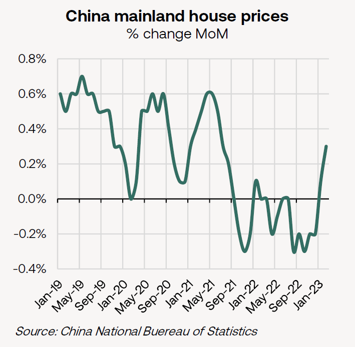
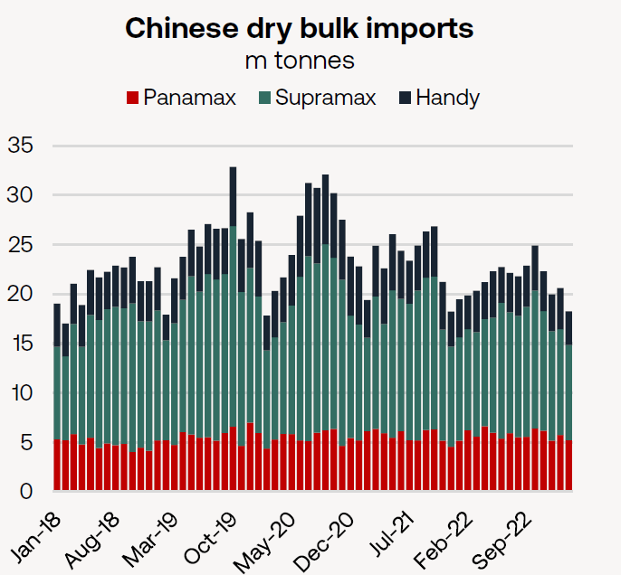
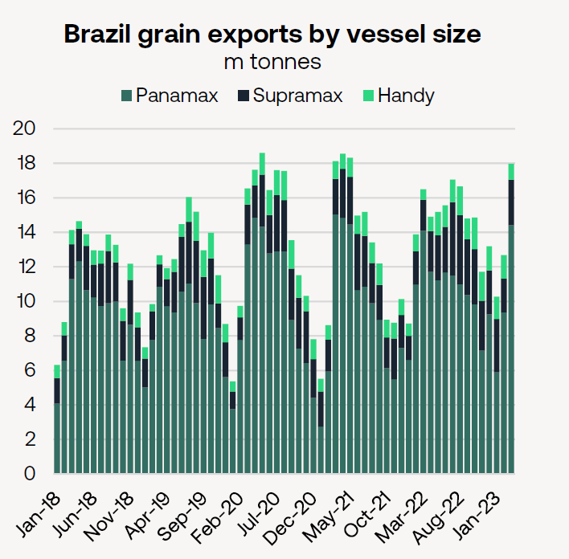
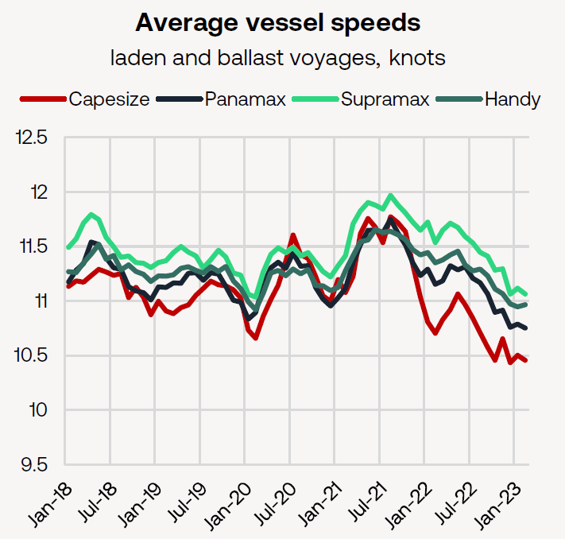

# Braemar Weekly Dry Market Report

**Date:** March 31, 2023  
**Publisher:** Breakwave Advisors | **Category:** Market Insights  
**Original URL:** [https://www.breakwaveadvisors.com/insights/2023/3/31/braemar-weekly-dry-market-report](https://www.breakwaveadvisors.com/insights/2023/3/31/braemar-weekly-dry-market-report)  

---

[

> **Figure 1: With the First Quarter Wrapping Up**  
> *With the first quarter wrapping up, sentiment has improved and expectations for the second quarter are even greater. We look at several factors we are watching that could drive momentum going forward.*  
> **Interactive Data & Source:** [Linkedin](https://www.linkedin.com/in/mark-nugent-3724a3192/) | [Local Asset](file:///C:/Users/Dell/Github/Shipping/corpus/03-breakwave/insights/2023/assets/2023-03-31_braemar-weekly-dry-market-report_img_128729_6a1eba4cf887.png)](https://www.breakwaveadvisors.com/insights/2023/3/31/did-you-know)

## The Big Picture: Looking to Q2

*By*[*Mark Nugent*](https://www.linkedin.com/in/mark-nugent-3724a3192/)

### What We’re Looking At

The recent surge in dry bulk rates off of the lows in February has driven quite a shift in market sentiment for the rest of the year. At the time of writing, the FFA market is pricing in a 45.7% increase in average Capesize 5TC rates in Q2 compared to $9,070/day in Q1 with one day of Q1 left to trade. A similar, but not as steep, incline is expected on the smaller sizes, with Q2 FFAs now pricing in a 11% and 6% improvement in the Panamax and Supramax markets respectively.

### China’s Demand Expected to Improve

Since the turn of the Chinese New Year holiday period, China’s appetite for bulk materials has certainly improved, which is one of the leading factors driving the forward curve’s elevated expectations. In February, Chinese steel production increased by 5.6% YoY to 80.1m tonnes according to Worldsteel, driving falling iron ore port inventories, which are currently at their lowest level since early February. Mainland house prices have also started to stabilise, in one of the more encouraging early signs China’s economy is recovering, after rising by 0.3% MoM in February, the highest growth level since June 2021.

> **Figure 2: Market Chart 2**  
> [Local Asset](file:///C:/Users/Dell/Github/Shipping/corpus/03-breakwave/insights/2023/assets/2023-03-31_braemar-weekly-dry-market-report_img_image0281229_16757a929fb0.png)

In Q1, the country’s dry bulk imports totalled 162m tonnes, rising by 8.7% YoY with one more day of discharging left to go. So far, the increase can largely be owed to the major bulks (iron ore, coal), which has been a step in the right direction for the bigger ships. Imports of iron ore in particular have increased by 3.8% YoY to 93.4m tonnes in Q1 at the time of writing.

Looking to Q2, we will be able to get a better gauge on a Chinese recovery by the country’s minor bulk demand, which would indicate a wider range of industries are on the road to recovery, similar to the surge in imports of these goods during China’s mass-stimulus period in 2020.

> **Figure 3: Market Chart 3**  
> [Local Asset](file:///C:/Users/Dell/Github/Shipping/corpus/03-breakwave/insights/2023/assets/2023-03-31_braemar-weekly-dry-market-report_img_image1281229_72ea34fb64d0.png)

Dry bulk imports (excl. iron ore, coal and grains) have totalled 94.3m tonnes so far in Q1, coming in flat YoY. Of course, this will be particularly important for the geared fleet which carry the majority of these other materials. In 2022, the geared ships discharged 188.8m tonnes of non-major bulk cargo in China, declining by 10.7% YoY. In Q1 so far, volumes have fallen by 1.8% YoY, totalling 41.5m tonnes. As we would typically expect industries such as steel to lead any type of recovery, as it has in the past, it does set a positive tone for other industrial sectors to follow in its path and should ultimately lead to improved imports of the minor bulks in the months to come.

### All Eyes on Ecsa

For the sub-Cape fleet, the start of the South American grain exporting season is now underway. The USDA has forecast record Brazilian soybean exports of 92.7m tonnes (though not all seaborne) after a large expansion in planting area propelled record production during this marketing year. The season got off to a slow start in February, with grain exports declining by 10.5% YoY to 12.5m tonnes. Shipments have bounced back in March, however, with 18.3m tonnes of grain shipped, already 10.7% above March last year. Though most volumes are heading back towards Asia, record grain volumes have been shipped to the Middle East in March, totalling 2.1m tonnes, compared to just 350k tonnes in March of last year. Exports were previously being disrupted by weather in the South of the country, though this has eased, visible in both the improvement in the country’s grain and iron ore exports in recent weeks.

> **Figure 4: Market Chart 4**  
> [Local Asset](file:///C:/Users/Dell/Github/Shipping/corpus/03-breakwave/insights/2023/assets/2023-03-31_braemar-weekly-dry-market-report_img_image2281129_933f6797d0cd.png)

Brazil and China have been working to improve trade relations in recent months, most recently agreeing to trade in their own currency and bypass the US dollar as an intermediary. China has also cleared Brazilian corn for import in recent months. The closer ties may signal more trade between the countries and more specifically soybeans, corn and iron ore. Given the distance, growth in these trades would be a positive development for the market. Though crush margins in China have dropped since the near-term highs in October, the Covid re-opening and food security objectives should support growth in this trade this marketing year, with the bulk of Brazilian soybeans historically shipped in Q2.

The situation in Argentina is still unfavourable as drought continues to affect production. Farmers in the country have delayed planting in order to maximise yield but production estimates have so far yet to improve.

> **Figure 5: Market Chart 5**  
> [Local Asset](file:///C:/Users/Dell/Github/Shipping/corpus/03-breakwave/insights/2023/assets/2023-03-31_braemar-weekly-dry-market-report_img_image3281029_aeb42924bbdf.png)

### Vessel Speeds

The downturn in the market, along with the introduction of new regulation, has incentivised a significant slowdown of the trading fleet. With one day to go in Q1, average vessel speeds of the Cape, Panamax and Supramax fleets were 2.3%, 3.6% and 4.1% lower YoY, with the Capes steaming at slower speeds than the rest of the market now for several months.

The question now is will the fleet speed up in order to take advantage of an improved market, and by how much, given the CII implications of a major speed increase. Given the continued uncertainty over regulation penalties, we see many vessels continuing to steam at these levels until more clarity is available which is supportive for the market heading into Q2 in which demand looks to be improving.

Overall, these are just several of a wide range of factors that will determine market direction in the coming months which ultimately we see giving freight rates momentum heading into Q2.
