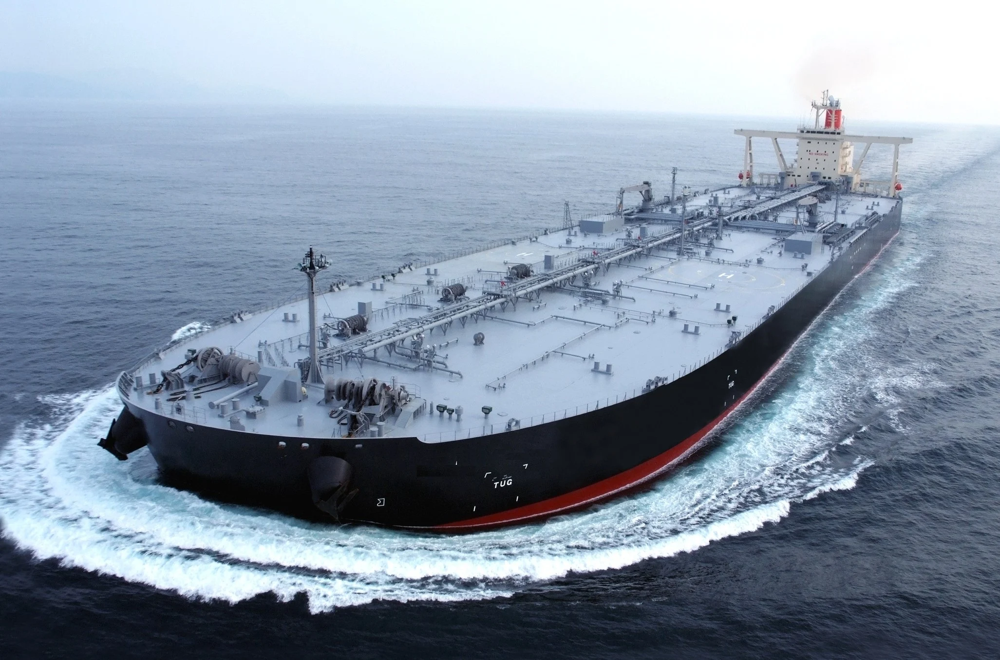
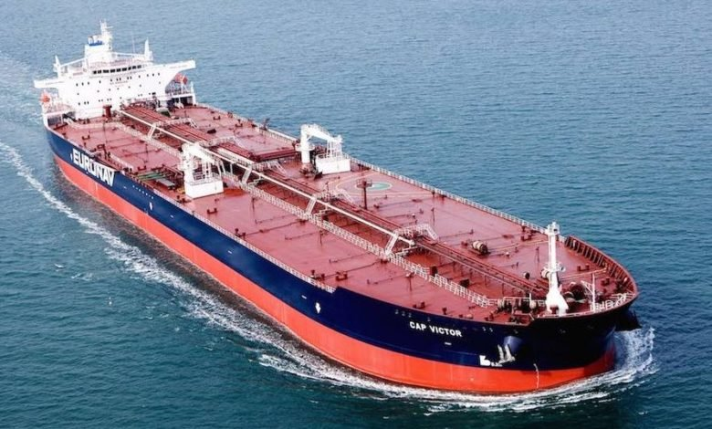
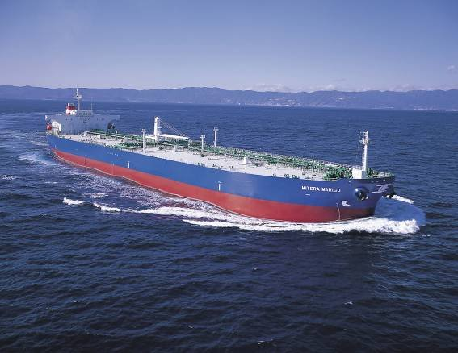
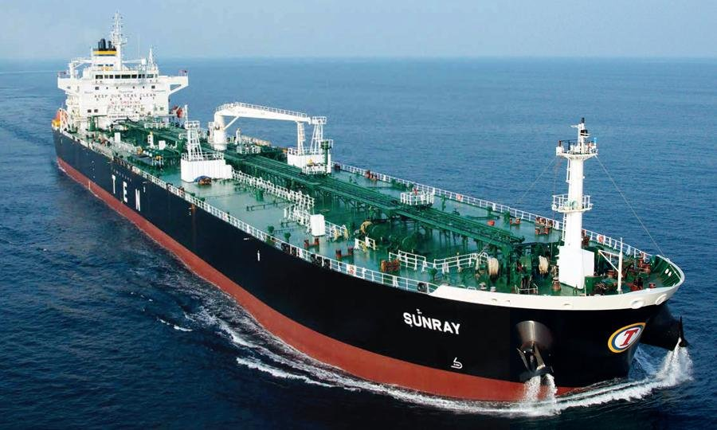

# Did you know?

**Date:** March 31, 2023  
**Publisher:** Breakwave Advisors | **Category:** Market Insights  
**Original URL:** [https://www.breakwaveadvisors.com/insights/2023/3/31/did-you-know](https://www.breakwaveadvisors.com/insights/2023/3/31/did-you-know)  

---

> **Figure 1: 1 (7)**  
> [Local Asset](file:///C:/Users/Dell/Github/Shipping/corpus/03-breakwave/insights/2023/assets/2023-03-31_did-you-know_img_128729_6a1eba4cf887.png)

> **Figure 2: VLCC: Very Large Crude Carrier**  
> **VLCC: Very Large Crude Carrier*  
> [Local Asset](file:///C:/Users/Dell/Github/Shipping/corpus/03-breakwave/insights/2023/assets/2023-03-31_did-you-know_img_1_067c05b5699c.png)

## Vlcc:~300,000 Tons

Largest cargo ship; Mainly used for transporting crude oil to US and Asia from Middle East

> **Figure 3: Euronav Cap Victor E1612077929227 780x470**  
> [Local Asset](file:///C:/Users/Dell/Github/Shipping/corpus/03-breakwave/insights/2023/assets/2023-03-31_did-you-know_img_euronav-cap-victor-e1612077929227-78_7f214c909242.jpg)

## Suezmax:~150,000 Tons

Half-size of VLCCs; Mainly used in the Atlantic; Largest tanker that can use the Suez Canal

> **Figure 4: Atlas Maritime's Mitera Marigo Aframax Oil Tanker**  
> [Local Asset](file:///C:/Users/Dell/Github/Shipping/corpus/03-breakwave/insights/2023/assets/2023-03-31_did-you-know_img_atlas-maritime27s-mitera-marigo-afra_713fd09b5830.jpg)

## Aframax:~105,000 Tons

Most versatile crude oil tanker; Can access most ports

> **Figure 5: Sunray Panamax Ten**  
> [Local Asset](file:///C:/Users/Dell/Github/Shipping/corpus/03-breakwave/insights/2023/assets/2023-03-31_did-you-know_img_sunray-panamax-ten_a701ea59b77e.jpg)

## Panamax:~80,000 Tons

Mainly used for refined oil product trading
